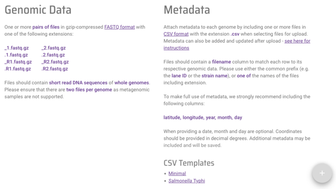
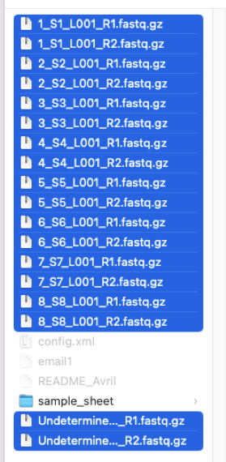
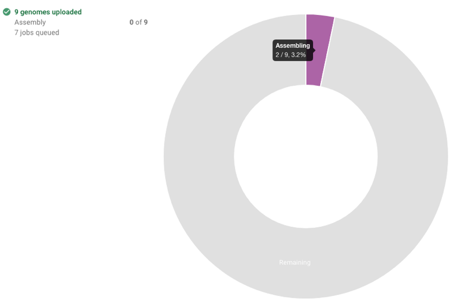
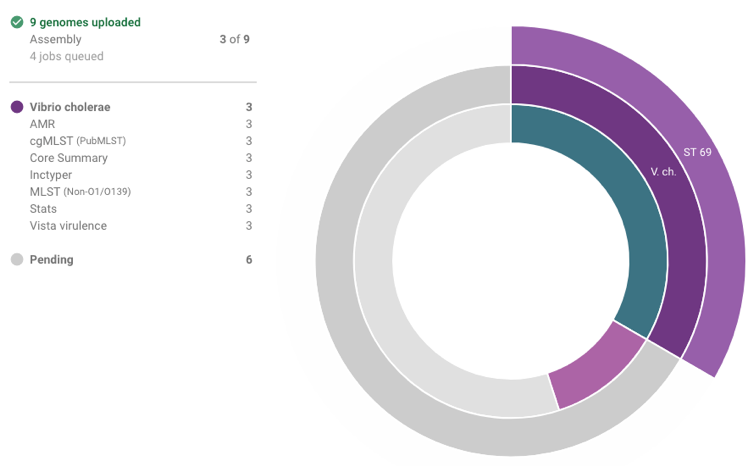
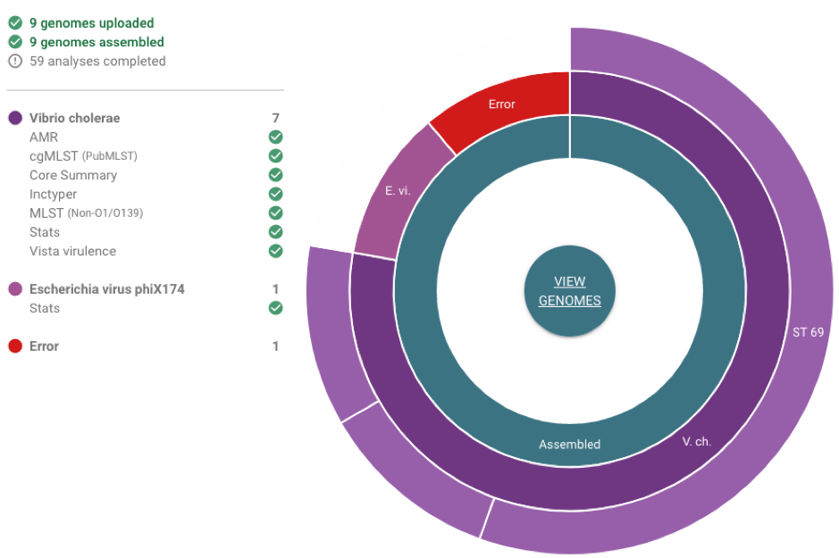
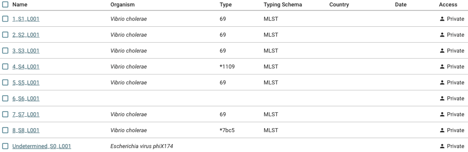
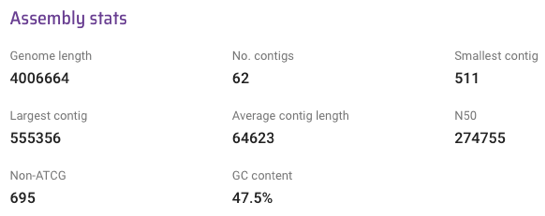

Assemblies and assembly quality
===============================

In this section, we will describe how you can:

* `Check if your fastq files of reads are suitable for Vibriowatch`_.
* `Upload reads to Vibriowatch, to make an assembly`_.
* `Upload an assembly for an isolate`_.
* `Verify that your isolate is *Vibrio cholerae*`_.
* `View the Vibriowatch report page for your isolate`_.
* `View the assembly statistics for your isolate`_.
* `Download the assembly for your isolate`_.
* `Run CheckM to check if the assembly for your isolated is contaminated`_.

If you have fastq files of reads for an isolate, you can upload them to Vibriowatch to make an assembly for your isolate.

Alternatively, if you already have an assembly for your isolate, you can upload the assembly to Vibriowatch.

When you upload fastq files or assemblies to Vibriowatch, they are stored in your private Vibriowatch account, and can only be viewed or analysed by you and nobody else.

Check if your fastq files of reads are suitable for Vibriowatch
---------------------------------------------------------------

If you have fastq files of reads for your isolate, you can upload the fastq files to Vibriowatch to make an assembly.

The maximum file size that Vibriowatch can accept for a zipped fastq file (that is, zipped with file names ending in .gz) is 500 Mbyte.

Usually you will have a pair of zipped fastq files for an isolate, with the forward and reverse reads respectively, called something like sample1_R1.fastq.gz and sample1_R2.fastq.gz.

If you have these files on a computer running Linux, you can find their sizes in Megabytes by typing in the terminal window:

.. code-block:: console

   $ du -h *fastq.gz
   
You will see something like this in your terminal window:

.. code-block:: console

   $ 160M    sample1_R1.fastq.gz
   $ 176M    sample1_R2.fastq.gz

The sizes of the files in Mbyte are given in the left column.

If the zipped fastq files are each :math:`<` 500 Mbyte in size, then they are fine for Vibriowatch to accept.

If your zipped fastq files of reads are :math:`>` 500 Mbyte in size, you could either (i) sample a smaller set of the reads in the files to give to Vibriowatch to make an assembly (the easier option), or (ii) alternatively you can make an assembly outside Vibriowatch using an assembly software (a more difficult option).

Upload reads to Vibriowatch, to make an assembly 
------------------------------------------------

To upload files to Vibriowatch, they need to have file-names ending in '_R1.fastq.gz' and '_R2.fastq.gz'.

If your files do not have file-names ending in '_R1.fastq.gz' and '_R2.fastq.gz', you will need to rename them using the Linux 'mv' command. For example, you can rename a file 'S1_R1_001.fastq.gz' to be called 'S1_R1.fastq.gz' by typing:

.. code-block:: console

   $ mv S1_R1_001.fastq.gz S1_R1.fastq.gz

Once your files have names ending in '_R1.fastq.gz' and '_R2.fastq.gz', you can upload them to Vibriowatch by going to the `Pathogenwatch`_ website.

.. _Pathogenwatch: https://pathogen.watch/

On the Pathogenwatch website, click on 'Upload' at the top right of the website:

  
You will need to now sign into the Pathogenwatch website. To upload data to the Pathogenwatch website, it's necessary
to make an account first, for example, using your email address as your login. 

This will bring you to a webpage saying 'What would you like to upload?', and you need to click on 'FASTQ':

You then need to click on the '+' button at the bottom right of the screen to upload your zipped fastq files:

  
Then select all the zipped fastq files that you want to upload, for example, if you want to upload fastq files for 9 isolates:

  
The Pathogenwatch website will then tell you that it is uploading your data, and when it has finished uploading it all, it will tell you that it is making assemblies for your isolates. The assembly process takes quite a while (e.g. roughly one hour for 10 isolates), and while it is running the website will give you a piechart showing its progress, for example:

  
As soon as some of the genomes have been assembled, the piechart will show which species they have been recognised to be, and also will show how many analyses have been carried out on the assemblies (see to the left of the piechart), for example:

  
We call the *Vibrio cholerae* component of Pathogenwatch 'Vibriowatch'. Vibriowatch carries out eight different analyses for each assembly:

#. Species identification (see :doc:`assemblies` section for further information).
#. AMR gene analysis.
#. cgMLST.
#. Core gene summary.
#. Inctyper (to find plasmids).
#. MLST (see :doc:`mlst` section for further information).
#. Assembly statistics (see :doc:`assemblies` section for further information).
#. Virulence gene identification using the 'Vista' software.

We will explain all of these analyses later in the tutorial.

When Pathogenwatch has finished the analyses on all the isolates that it has assembled genomes for, the piechart will look something like this:

  
The piechart above shows that one isolate had failed the assembly process (labelled 'Error'). This can happen if there is something wrong with the fastq files, for example, if they are empty files. 
  
Upload an assembly for an isolate
---------------------------------

If you already have an assembly for an isolate, you can upload your assembly to Vibriowatch.

The steps are very similar to uploading reads (see `Uploading reads to Vibriowatch, to make an assembly`_ above), except that on the webpage saying 'What would you like to upload?', you need to click on 'Single genome FASTAs' (instead of 'FASTQ').

Pathogenwatch will carry out eight different analyses for each assembly, as it does after making assemblies from reads (see `Uploading reads to Vibriowatch, to make an assembly`_ above).

Verify that your isolate is *Vibrio cholerae*
---------------------------------------------

It can sometimes happen that a researcher thinks they have isolated *Vibrio cholerae*, but the reads that they have sequenced come from another species, either due to mis-identification of *V. cholerae* or contamination of their sample. 

For example, the piechart below shows that one isolate was identified as phiX174 virus, a virus that infects *Escherichia coli*: 

  
In the example above, there were also seven isolates that were assembled that were identified by Pathogenwatch as *Vibrio cholerae*. 

View the Vibriowatch report page for your isolate
-------------------------------------------------

Once you have uploaded reads and Pathogenwatch has made an assembly for you (or once you have uploaded your own assembly to Pathogenwatch), the Pathogenwatch website will make a 'report page' for your isolate with more information on its genome. 

To view the report pages for your isolates, you need to click on the 'View genomes' link in the middle of the piechart:

  
This will bring up a list of the assemblies that have just been made for you in Vibriowatch, looking something like this:

  
You can see in the column on the far right that the 'Access' for each of the isolates is 'Private', which means that only you (and nobody else) can see or analyse these assemblies in Vibriowatch.

Note that you can also find the full list of genomes in your private Vibriowatch account by clicking on the three small horizontal bars at the top left of the Pathogenwatch website:

  
This will bring up a menu:

  
If you click on 'My Genomes' in this menu, it will give you the list of genomes that you have just uploaded (or have been assembled from fastq files that you just uploaded), as well as any genomes that you uploaded on previous days:

  
To see more information on a particular isolate's assembly, click on the link on the left in the 'Name' column, e.g. '1_S1_L001'. This will bring you to a Vibriowatch 'report page' for that genome, which will look something like this (just showing the top of the report page):

.. image:: Picture11.png
  :width: 650

View the assembly statistics for your isolate
---------------------------------------------

Once you have uploaded reads and Pathogenwatch has made an assembly for you (or once you have uploaded your own assembly to Pathogenwatch), it is a good idea to have a closer look at the assembly statistics for your isolates.

To find the assembly statistics for your isolate, you need to look at the bottom of the report page for that isolate (see `Viewing the Vibriowatch report page for your isolate`_ above for how to find the report page).

At the bottom of the report page for your isolate, you will see some assembly statistics, for example:

In the example above, the isolate has a genome size of about 4.0 Megabases, and GC content of 47.5%. This is consistent with the reference genome for *Vibrio cholerae* strain N16961, which has a genome size of about 4.0 Megabases and GC content of 47.5% (see  `Heidelberg et al 2000`_).

.. _Heidelberg et al 2000: https://pubmed.ncbi.nlm.nih.gov/10952301/

As a very rough 'rule of thumb', we would consider that an assembly size of between about 3.3 and 5.3 Megabase, and a GC content of between about 41.3% and 48.6%, is reasonable for a *Vibrio cholerae* genome. However, note that this an extremely rough rule of thumb, and may need to be revised in future when more is known about the diversity found in the species *Vibrio cholerae*.

If your assembly has a genome size or GC content far outside these ranges, it would probably be a good idea to investigate whether your assembly likely contains contamination from another species' DNA (see below).

Other commonly used measures of assembly quality are the number of contigs and the number of non-ATCG characters. We would usually consider that an assembly is of relatively good quality if it consists of :math:`<` 700 contigs, and contains :math:`<` 50,000 non-ATCG characters. If the assembly for your isolate has more contigs, or more ATCG characters, it is relatively poor quality and so this may introduce errors into further bioinformatic analyses that you carry out using Vibriowatch.

In the example above, the genome for the isolate has 62 contigs and 695 non-ATCG characters, so is relatively good quality.

Download the assembly for your isolate
--------------------------------------

Bla bla

Run CheckM to check if the assembly for your isolated is contaminated
---------------------------------------------------------------------

Bla bla

Contact
-------

I will be grateful if you will send me (Avril Coghlan) corrections or suggestions for improvements to my email address alc@sanger.ac.uk

