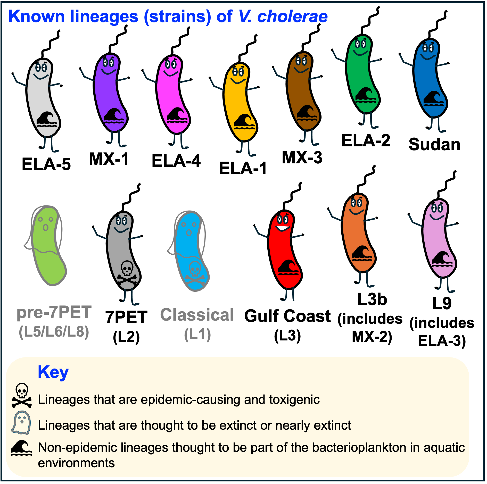

Module 1.1: Cholera: Disease and Epidemiology
=============================================

Introduction to Module 1.1
--------------------------

Welcome!
In Module 1.1, we will talk about the disease cholera; the species *Vibrio cholerae*; disease
caused by epidemic and non-epidemic lineages of *V. cholerae*; and briefly, mention vaccines for cholera.
This module may take you roughly one hour to work through (maybe a bit more or less than that, depending on your own pace).
While we will explain terms as we go along, we have also included a `glossary of key terms for Module 1`_.

.. _glossary of key terms for Module 1: https://cholerabook.readthedocs.io/en/latest/vibriogenomes_glossary.html

Acute Watery Diarrhoea, the Disease Cholera and its Epidemiology
----------------------------------------------------------------

Cholera is a disease characterised by acute watery diarrhoea (AWD), leading to rapidly progressing dehydration and shock (`Sack et al 2004`_).
A distinctive feature of cholera is painless purging of voluminous stools resembling rice-water, known as 'rice-water stool' (`Sack et al 2004`_).
If you are interested in how cholera is diagnosed, the World Health Organisation (WHO) provides guidance and 
precise definitions of what they consider 'a suspected cholera case' and 'a confirmed cholera case' (see `WHO 2023`_).

.. _Sack et al 2004: https://pubmed.ncbi.nlm.nih.gov/14738797/

.. _WHO 2023: https://www.gtfcc.org/wp-content/uploads/2023/02/gtfcc-public-health-surveillance-for-cholera-interim-guidance.pdf

Cholera is an infection caused by a bacterium called *Vibrio cholerae*, a curved Gram-negative rod-shaped bacterium (Figure 1).
It is often described as being 'comma-shaped' because of its curved shape. *V. cholerae* has a flagellum (a tail like structure) at one pole, which it uses
to swim through liquids.
The genus *Vibrio* belongs to the Vibrionaceae, a family in the class Gammaproteobacteria that includes many bacteria 
found in marine niches (`Boyd et al 2015`_).

.. _Boyd et al 2015: https://pubmed.ncbi.nlm.nih.gov/26542048/

.. figure:: Vibrio_cholerae.jpg
  :width: 350

  Figure 1. `Transmission electron microscope image of Vibrio cholerae that has been negatively stained`_. Image attribution: this image by Tom Kirn, Ron Taylor and Louisa Howard of `Dartmouth Electron Microscope Facility`_ is in the Public Domain. With kind permission of Maxime Guinel de France, Dartmouth Electron Microscope Facility.

.. _Transmission electron microscope image of Vibrio cholerae that has been negatively stained: https://en.wikipedia.org/wiki/Vibrio_cholerae#/media/File:Vibrio_cholerae.jpg

.. _Dartmouth Electron Microscope Facility: https://www.dartmouth.edu/emlab/

The *V. cholerae* bacterium is usually transmitted by the faecal-oral route, that is, 
people usually catch cholera by eating food or by drinking water that has been contaminated
with human faeces containing *V. cholerae* (`Sack et al 2004`_, `Nelson et al 2009`_). Barriers to disease transmission include
handwashing and hygiene, access to toilets, and clean drinking water (e.g. chlorination of stored water; `Sack et al 2004`_, `Nelson et al 2009`_). 
These barriers to transmission are often referred to as **WASH**, meaning 'water, sanitation and hygiene'. 
Figure 2 summarises what is known about the transmission routes for the current pandemic lineage of *V. cholerae*, the **7PET
lineage**, which is the lineage of *V. cholerae* responsible for all major outbreaks and epidemics of cholera since the 1960s (`Mutreja et al 2011`_, `Mutreja & Dougan 2020`_). 

.. _Sack et al 2004: https://pubmed.ncbi.nlm.nih.gov/14738797/

.. _Mutreja et al 2011: https://pubmed.ncbi.nlm.nih.gov/21866102/

.. _Mutreja & Dougan 2020: https://pubmed.ncbi.nlm.nih.gov/31345641/

.. _Nelson et al 2009: https://pubmed.ncbi.nlm.nih.gov/19756008/

.. figure:: 7PET_LifeCycle.png
  :width: 1350

  Figure 2. Amplification of transmission by human-to-human spread for the current pandemic lineage (7PET lineage) of *V. cholerae*. On ingestion of *V. cholerae* of the current pandemic lineage (7PET lineage) in contaminated food or water (1), the *V. cholerae* 7PET bacteria colonise the small intestine (2), multiply, secrete cholera toxin, and are then shed back into the environment by the host in diarrhoea (3). The *V. cholerae* 7PET bacteria shed in the stool are in a transient hyperinfectious state that serves to amplify the outbreak by promoting transmission to further human hosts (4). Some scientists have hypothesised that 7PET bacteria may persist for many months or even several years in aquatic environments (e.g. `Colwell 1996`_, `Alam et al 2007`_, `Islam et al 2020`_, `Mavian et al 2023`_) (5); however, the ability of 7PET to persist long-term in the environment (5) and to then seed new outbreaks (6) is still under scientific debate. VBNC: a 'viable but non-culturable' dormant state that many bacterial species enter under unfavourable conditions such as low temperature and low nutrient conditions (`Lutz et al 2013`_). Image attribution: this image by `Avril Coghlan`_ is licensed under `CC BY 4.0`_.

.. _Nelson et al 2009: https://pubmed.ncbi.nlm.nih.gov/19756008/

.. _Mavian et al 2023: https://pubmed.ncbi.nlm.nih.gov/37735743/

.. _Islam et al 2020: https://pubmed.ncbi.nlm.nih.gov/31285087/

.. _CC BY 4.0: https://creativecommons.org/licenses/by/4.0/

.. _Lutz et al 2013: https://pubmed.ncbi.nlm.nih.gov/24379807/

.. _Alam et al 2007: https://pubmed.ncbi.nlm.nih.gov/17968017/

.. _Colwell 1996: https://pubmed.ncbi.nlm.nih.gov/8953025/

.. _Avril Coghlan: https://www.linkedin.com/in/avril-coghlan-4409545/?originalSubdomain=uk

Cholera outbreaks typically occur in places where there is poor access
to clean water and poor sewage infrastructure (Figure 3). These include low-income settings in which there is poor water and sanitation infrastructure, 
or places in which there is a humanitarian crisis (e.g. an earthquake or war) that has disrupted the water and sanitation infrastructure.
Examples are Haiti, where there was a cholera epidemic from 2010-2019 which began shortly after a massive earthquake that occurred in 2010, 
and Yemen, which has suffered a cholera epidemic from 2016 up until the present during its ongoing civil war. 

.. figure:: ContaminatedWater.png
  :width: 350

  Figure 3. `Water-collection site X on the shore of Lake Edward, Katwe Village, south-western Uganda`_. Water from this lake in Uganda was implicated in a cholera outbreak during June–July 2015. Image attribution: this image by `Pande et al 2018`_ is licensed under `CC BY 4.0`_.

.. _Water-collection site X on the shore of Lake Edward, Katwe Village, south-western Uganda: https://journals.plos.org/plosone/article/figure?id=10.1371/journal.pone.0198431.g003

.. _Pande et al 2018: https://pubmed.ncbi.nlm.nih.gov/29949592/

.. _CC BY 4.0: https://creativecommons.org/licenses/by/4.0/

Once ingested by a human host, the *V. cholerae* bacteria multiply in the human intestine. The
bacteria attach to the epithelial cells of the intestine and release **cholera toxin** (abbreviated as Ctx, CTX, or CT; Figure 4). Cholera toxin 
binds to the intestinal epithelial cell surface, and stimulates the cells to secrete ions and water into
the intestinal lumen, resulting in acute watery diarrhoea. Cholera toxin is therefore the key **virulence factor** 
of *V. cholerae*, and *V. cholerae* isolates that have the cholera toxin genes (genes *ctxA* and *ctxB*
that encode the CtxA and CtxB proteins that make up the cholera toxin) and so produce cholera toxin are said to be **'toxigenic'**.
Isolates of the current pandemic lineage (**'7PET lineage'**) of *V. cholerae* are toxigenic.

.. figure:: CholeraToxin.jpg
  :width: 450

  Figure 4. `Cholera toxin B pentamer, Vibrio cholerae`_. Cholera toxin is a protein complex that consists of one CtxA protein bound to five CtxB proteins. This image shows the structure formed by the five CtxB proteins. Image attribution: this image was created by Wikipedia user Astrojan based on the `CtxB protein structure`_ deposited in the PDB database by E. A. Merritt & W. G. J. Hol, and is licensed under `CC BY 4.0`_.

.. _Cholera toxin B pentamer, Vibrio cholerae: https://en.wikipedia.org/wiki/File:1chq.jpg

.. _CtxB protein structure: https://www.rcsb.org/structure/1chq

.. __CC BY 4.0: https://creativecommons.org/licenses/by/4.0/

Note that *V. cholerae* is not the only pathogen that can cause acute watery diarrhoea (AWD); similar symptoms also be caused by other bacteria
such as enterotoxigenic *E. coli* (ETEC). 

.. image:: Activity.png
  :width: 1050

* Watch a `video giving an overview of cholera, its spread and history by Médecins Sans Frontières (MSF)`_ (15 minutes), and answer the questions below on the video.

.. _video giving an overview of cholera, its spread and history by Médecins Sans Frontières (MSF): https://www.youtube.com/watch?v=TzPXP1_eUzw

Now answer these questions:

* Q1. What percent of worldwide cholera cases are estimated to be reported by countries to the WHO each year? 
* Q2. Do most people who have been infected the currrent pandemic lineage of (7PET lineage) of *V. cholerae* show symptoms, or are most people asymptomatic? 

You can see the answers on the `Answers page for Module 1`_.

.. _Answers page for Module 1: https://cholerabook.readthedocs.io/en/latest/vibriogenomes_answers.html

Epidemic and Non-epidemic Lineages of *Vibrio cholerae* 
-------------------------------------------------------

What types of domestic animals do people keep in your country? Is it chickens, dogs, goats, pigs, horses, or something else?
You are probably familiar with the idea that each of these animals is just one species, but that there are many breeds of each of these animals.
For example, all chickens belong to the same species (*Gallus gallus*), and two chickens of the same breed are more similar to each other genetically, and share
a more recent common ancestor with each other, compared to two chickens of a different breed. In addition, two chickens of the same breed tend to share
particular characteristics (e.g. colouring, size), and be quite different in those respects to chickens from another breed (Figure 5).

.. figure:: Poultry_of_the_world.jpg
  :width: 500

  Figure 5. `The poultry of the world. Portraits of all known valuable breeds of fowl`_. Image attribution: This image by by L. Prang & Co., Boston, is in the Public Domain. 

.. _The poultry of the world. Portraits of all known valuable breeds of fowl: https://commons.wikimedia.org/wiki/File:Poultry_of_the_world.jpg

Similar to breeds of chicken, there can be many **lineages** within a particular bacterial species.
For a particular bacterial species, two isolates of one lineage are more similar to each other genetically, and share
a more recent common ancestor with each other, compared to two isolates of different lineages. Isolates of the same lineage
tend to share particular characteristics (e.g. ecological niche, metabolism, pathogenic potential). 

Note that some people refer to bacterial lineages as 'strains', but we prefer here to use the term 'lineages', 
because the term 'strain' is also commonly used to refer to a single bacterial isolate that has been cultured over time in a laboratory.
For example, for molecular biology studies of *V. cholerae* genetics and biochemistry in the laboratory, people often use
the laboratory strain N16961, which was derived from an isolate collected in Bangladesh in 1975 (`Heidelberg et al 2000`_).
The N16961 laboratory strain belongs to the 7PET lineage of *V. cholerae*.

.. _Heidelberg et al 2000: https://pubmed.ncbi.nlm.nih.gov/10952301/

*Vibrio cholerae* is a very diverse species with many different lineages. A small subset of the lineages have
been named, and are shown in Figure 6. There is only one lineage of *V. cholerae* which causes epidemic cholera at present, which is
known as the **'7PET'** lineage (Figure 6). 

  Figure 6. Some known lineages of *V. cholerae* that have been named. The current pandemic lineage of *V. cholerae* is the 7PET lineage, which has caused all the major outbreaks and epidemics of cholera since the 1960s. While this figure shows some named lineages of *V. cholerae*, is likely that there are many more lineages of *V. cholerae* that have not yet been named (`Domman et al 2017`_). *Vibrio paracholerae* was originally thought to be a very diverged lineage of *V. cholerae*, but has recently been proposed to be a separate, closely related, species (`Islam et al 2021`_). Image attribution: this image by `Avril Coghlan`_ is licensed under `CC BY 4.0`_.

.. _CC BY 4.0: https://creativecommons.org/licenses/by/4.0/

.. _Avril Coghlan: https://www.linkedin.com/in/avril-coghlan-4409545/?originalSubdomain=uk

.. _Domman et al 2017: https://pubmed.ncbi.nlm.nih.gov/29123068/

.. _Islam et al 2021: https://pubmed.ncbi.nlm.nih.gov/34132593/

What do we mean when we say 7PET causes **'epidemic cholera'**?
The word 'epidemic' is defined by the CDC (Centers for Disease Control and Prevention) as an unexpected increase in the number of disease cases in a specific geographical area;
they say that an outbreak is defined in the same way but for a more limited geographic area (see the `CDC website`_). In addition,
the CDC define a 'pandemic' as 'an epidemic that has spread over several countries or continents, usually affecting a large number of people'. 
Here, when we say 7PET causes **'epidemic cholera'** or is **'epidemic-causing'** or an **'epidemic lineage'**, 
we mean that 7PET can cause a very large increase in the number
of cases of diarrhoeal illness caused by *V. cholerae* in a particular town/city/region over a relatively short period of time. 
We also refer to 7PET as a **'pandemic lineage'** since it has caused all the major outbreaks and epidemics of cholera around
the world since the 1960s.

.. _CDC website: https://archive.cdc.gov/www_cdc_gov/csels/dsepd/ss1978/lesson1/section11.html

Note that we will not attempt here to define exactly how many cases of acute watery diarrhoea you can see
before you declare a cholera outbreak; for this we refer you to the WHO's detailed technical guidance,
in which they provide precise definitions of what they consider 'a suspected cholera case', 'a confirmed cholera case',
'a suspected cholera outbreak', 'a probable cholera outbreak', or 'a confirmed cholera outbreak' (see `WHO 2023`_).

.. _WHO 2023: https://www.gtfcc.org/wp-content/uploads/2023/02/gtfcc-public-health-surveillance-for-cholera-interim-guidance.pdf

The 7PET lineage is an extremely infectious and virulent lineage of *V. cholerae*, which is epidemic-causing and which produces
cholera toxin. 7PET appears to have evolved to become a 
human pathogen (`Feng et al 2008`_, `Chun et al 2009`_, `Hu et al 2016`_, `Mutreja & Dougan 2020`_).
Because of the highly infectious nature of 7PET, a 7PET outbreak requires a rapid and large public health response to 
halt/reduce it, e.g. WASH, treatment centres, vaccination.
Whole genome sequencing (WGS) can be a powerful tool to find out whether a new outbreak of diarrhoeal illness is caused by 7PET;
we will be discussing the *V. cholerae* genome and WGS in module 1.4.

.. _Chun et al 2009: https://pubmed.ncbi.nlm.nih.gov/19720995/

.. _Feng et al 2008: https://pubmed.ncbi.nlm.nih.gov/19115014/

.. _Hu et al 2016: https://pubmed.ncbi.nlm.nih.gov/27849586/

.. _Mutreja & Dougan 2020: https://pubmed.ncbi.nlm.nih.gov/31345641/

In addition to the epidemic-causing 7PET lineage, there are also many **non-epidemic lineages** of *V. cholerae* found around the world that do not cause epidemic
cholera, but sometimes cause small outbreaks of mild diarrhoea. An example is lineage MX-2 (this is actually part of the lineage named 'L3b' in Figure 6). 
The vast majority of the non-epidemic lineages of *V. cholerae* do not produce cholera toxin, but isolates of some
non-epidemic lineages, including some isolates of MX-2, have the genes encoding the cholera toxin (genes *ctxA* and *ctxB*, which we mentioned above)
and so are predicted to produce cholera toxin (`Domman et al 2017`_).

Over time, some lineages of *V. cholerae* have been named as they have been identified, but so far there is not a
standard naming system for *V. cholerae* lineages. Some lineages were named after the geographical
location where they were originally isolated, e.g. the MX-2 lineage was originally isolated in Mexico (`Domman et al 2017`_) and the Sudan
lineage was originally isolated in Sudan (`Dorman & Thomson 2023`_) but in fact neither are restricted to those countries (`Dorman & Thomson 2023`_; Figure 7 below).
Similarly, the ELA-5 lineage was first isolated in Latin America (its name derives from 'Endemic Latin American'). On the other hand, some lineages such
as 7PET and Classical are named after a phenotypic characteristic of those lineages called the biotype, which we will discuss in Module 1.2.
Note that, confusingly, in some cases there are alternative names for the same lineage given by different authors; `Mutreja et al 2011`_ assigned
L-numbers (e.g. L1, L2, L3, etc.) to lineages, while `Domman et al 2017`_ assigned names such as MX-1, MX-2 and ELA-5. We have
shown some of the correspondences between these alternative names in Figure 6. 
This course will mainly focus on the current pandemic lineage, the 7PET lineage, so you don't need to remember the names of
the non-epidemic *V. cholerae* lineages, but just be aware that they exist. 

.. _Dorman & Thomson 2023: https://pubmed.ncbi.nlm.nih.gov/37043377/

.. _Domman et al 2017: https://pubmed.ncbi.nlm.nih.gov/29123068/

.. _Mutreja et al 2011: https://pubmed.ncbi.nlm.nih.gov/21866102/

The Geographic Distribution of *V. cholerae* and the Ecological Niche of Non-epidemic Lineages of *V. cholerae*
---------------------------------------------------------------------------------------------------------------

The species *V. cholerae* is distributed globally and, as mentioned above, it is a very diverse species with many different lineages. Figure 7 shows what is known about the global distribution of just two of the many lineages of *V. cholerae*.

.. figure:: LineageDistributions.png
  :width: 1050

  Figure 7. The global distribution of the bacterium *V. cholerae*, for two of the many different lineages of *V. cholerae*, (a) the non-epidemic lineage MX-2, and (b) the current pandemic lineage (7PET lineage). The numbers in purple circles indicate the number of *V. cholerae* isolates collected in each country, whose whole genomes have been included in the `Vibriowatch`_ database, the *V. cholerae* part of `Pathogenwatch`_. The number of genomes for the 7PET lineage is far greater than that for MX-2, probably reflecting the fact that globally 7PET has caused a far greater number of outbreaks and far larger outbreaks than MX-2, which has led to relatively more sequencing of the 7PET lineage from the stool of sick people. Genomes were assigned to lineages using a software called `PopPUNK`_, which we will discuss later in this course. Image attribution: this image by `Avril Coghlan`_, based on a screenshot from the `Pathogenwatch website`_, is licensed under `CC BY 4.0`_. With kind permission of Corin Yeats of `Pathogenwatch`_.

.. _Pathogenwatch: https://pathogen.watch/

.. _Pathogenwatch website: https://pathogen.watch/

.. _Vibriowatch: https://vibriowatch.readthedocs.io

.. _PopPUNK: https://pubmed.ncbi.nlm.nih.gov/30679308/

.. _CC BY 4.0: https://creativecommons.org/licenses/by/4.0/

.. _Avril Coghlan: https://www.linkedin.com/in/avril-coghlan-4409545/?originalSubdomain=uk

The non-epidemic lineages of *V. cholerae* such as MX-2 (see above) are often found in brackish water or in saltwater (e.g. in coastal regions or estuaries) in association with shellfish 
such as crabs, oysters and shrimp (Figure 6 above; Figure 8; `Morris 1990`_; `Morris 2003`_; `Lutz et al 2013`_). However, non-epidemic lineages of *V. cholerae* have not only been found in
brackish water or saltwater; non-epidemic lineages of *V. cholerae* have also been found in freshwater in inland rivers or freshwater lakes (Figure 6 above; `Morris 1990`_; `Lepuschitz et al 2019`_). 

.. _Domman et al 2017: https://pubmed.ncbi.nlm.nih.gov/29123068/

.. _Lutz et al 2013: https://pubmed.ncbi.nlm.nih.gov/24379807/

.. _Morris 2003: https://pubmed.ncbi.nlm.nih.gov/12856219/

.. _Morris 1990: https://pubmed.ncbi.nlm.nih.gov/2286218/

.. _Lepuschitz et al 2019: https://pubmed.ncbi.nlm.nih.gov/31781080/

.. figure:: VibrioCholeraeInSea.jpg
  :width: 750

  Figure 8. `Vibrio cholerae interactions with other organisms and the environment`_. Non-epidemic lineages of *V. cholerae* such as the MX-2 lineage are part of the bacterioplankton in aquatic environments. The non-epidemic *V. cholerae* are under risk of predation by protozoa and bacteriophages (viruses). These non-epidemic *V. cholerae* can attach to other organisms such as phytoplankton, macroalgae, chitinous zooplankton, and gelatinous egg masses, which may provide sources of nutrients for the non-epidemic *V. cholerae*. Fish and birds feed on plankton and mussels that might harbour non-epidemic *V. cholerae*. Under unfavourable conditions, such as low temperature and low nutrient conditions, non-epidemic *V. cholerae* can enter a 'viable but non-culturable' (VBNC) dormant state. In contrast to the non-epidemic lineages of *V. cholerae*, as we mentioned above (see Figure 2 above), long-term persistance of 7PET in aquatic environments is a controversial scientific question and is still under active debate. Image attribution: this image by `Lutz et al 2013`_ is licensed under `CC BY 3.0`_.

.. _Vibrio cholerae interactions with other organisms and the environment: https://www.frontiersin.org/journals/microbiology/articles/10.3389/fmicb.2013.00375/full

.. _Lutz et al 2013: https://pubmed.ncbi.nlm.nih.gov/24379807/

.. _CC BY 3.0: https://creativecommons.org/licenses/by/3.0/

Because non-epidemic *V. cholerae* are often associated with shellfish such as crabs, oysters and shrimp, in many coastal regions around the world, 
occasional small outbreaks of mild diarrhoeal illness are caused by eating shellfish that contains non-epidemic *V. cholerae* (`Morris 1990`_; `Morris 2003`_). 
However, non-epidemic lineages *V. cholerae* are also found in freshwater lakes and rivers, and indeed some human infections 
have been linked to exposure to river or lake water containing non-epidemic *V. cholerae* (`Morris 1990`_; `Lepuschitz et al 2019`_).
As well as causing mild diarrhoeal illness, non-epidemic lineages of *V. cholerae* have also been isolated 
from a variety of extraintestinal infections, including wounds, ear, sputum,
urine, and cerebrospinal fluid (`Morris 1990`_; `Kaper et al 1995`_, `Morris 2003`_, `Lepuschitz et al 2019`_).

.. _Morris 2003: https://pubmed.ncbi.nlm.nih.gov/12856219/

.. _Morris 1990: https://pubmed.ncbi.nlm.nih.gov/2286218/

.. _Lepuschitz et al 2019: https://pubmed.ncbi.nlm.nih.gov/31781080/

.. _Kaper et al 1995: https://pubmed.ncbi.nlm.nih.gov/7704895/

.. image:: Activity.png
  :width: 1050

* Watch a `video on risks from Vibrio cholerae in contaminated food and water (IAQ Video Network)`_ (3 minutes), and answer the questions below on the video.

.. _video on risks from Vibrio cholerae in contaminated food and water (IAQ Video Network): https://www.youtube.com/watch?v=vose31FOeOo

Now answer these questions:

* Q3 In what part of the United States of America (USA) are there sometimes outbreaks of mild diarrhoeal illness caused by eating shellfish that contains non-epidemic lineages of *V. cholerae*? (Note that this video (unfortunately) does not distinguish between the epidemic and non-epidemic lineages of *V. cholerae*. It does however mention that consumption of shellfish containing *V. cholerae* can cause small outbreaks of diarrhoeal illness. These small outbreaks are almost always due to non-epidemic lineages of *V. cholerae*.)

You can see the answers on the `Answers page for Module 1`_.

.. _Answers page for Module 1: https://cholerabook.readthedocs.io/en/latest/vibriogenomes_answers.html

Diarrhoeal Illness Caused by Epidemic and Non-epidemic Lineages of *V. cholerae*
--------------------------------------------------------------------------------

Globally the 7PET lineage has caused a far greater number of outbreaks and far larger outbreaks than non-epidemic lineages of *V. cholerae*. 
The 7PET lineage, which has caused the current cholera pandemic, and the Classical lineage, which caused a cholera pandemic in the early 1900s but is now thought
to be extinct or almost extinct (`Ramamurthy et al 2019`_; Figure 6), are the only known epidemic lineages of *V. cholerae*.
The many other lineages of *V. cholerae* that we know about are not epidemic-causing, although they occasionally cause relatively small outbreaks of diarrhoeal illness in
tens or (at most) a hundred or so people (`Morris 1990`_). In contrast, 7PET is the only current *V. cholerae* lineage
that causes large epidemics or pandemics of many thousands of cases, or even millions of 
cases as seen in the Yemen cholera epidemic that began in 2016 and continues to the present (`Mutreja & Dougan 2020`_, `Lassalle et al 2023`_). 

.. _Mutreja & Dougan 2020: https://pubmed.ncbi.nlm.nih.gov/31345641/

.. _Morris 1990: https://pubmed.ncbi.nlm.nih.gov/2286218/

.. _Lassalle et al 2023: https://pubmed.ncbi.nlm.nih.gov/37770747/

.. _Ramamurthy et al 2019: https://pubmed.ncbi.nlm.nih.gov/31396501/

Of the non-epidemic *V. cholerae* lineages, the two lineages that have caused the most cases of diarrhoeal illness
since 2000 are thought to be lineages 'L3b' and 'L9' (Figure 6; `Hao et al 2023`_). For example, these two non-epidemic lineages
have caused several hundred cases of diarrhoeal illness in Hangzhou, China between 2001 and 2018 (`Hao et al 2023`_; Figure 9).
Lineage L3b has also been linked to relatively small outbreaks of diarrhoeal illness in South Africa (`Smith et al 2021`_).

.. _Hao et al 2023: https://pubmed.ncbi.nlm.nih.gov/37146742/

.. _Smith et al 2021: https://pubmed.ncbi.nlm.nih.gov/34670657/

.. figure:: L3b_Hangzhou.jpg
  :width: 750

  Figure 9. `The distribution of Vibrio cholerae isolates in different lineages in Hangzhou, China from 2000 to 2018`_. (a) Cases of diarrhoeal illness per year caused by the L3b and L9 lineages of *V. cholerae* in Hangzhou, China, between 2000 and 2018. The grey lines represent the total number of diarrhoeal cases caused by L3b and L9 together, the blue lines represent the number of cases caused by L3b, and the orange lines the number of cases caused by L9. (b) The number of *V. cholerae* isolates in Hangzhou, China belonging to the L3b, L9 and some other lineages (L2 is 7PET and 
L7 is Sudan lineage; Figure 6), in each year from 2000 to 2018. The sizes of circles indicate the number of isolates belonging to each lineage, in each year. Image attribution: this image by `Hao et al 2023`_ is licensed under `CC BY-NC-ND 4.0`_.

.. _CC BY-NC-ND 4.0: https://creativecommons.org/licenses/by-nc-nd/4.0/

.. _Hao et al 2023: https://pubmed.ncbi.nlm.nih.gov/37146742/

.. _The distribution of Vibrio cholerae isolates in different lineages in Hangzhou, China from 2000 to 2018: https://www.sciencedirect.com/science/article/pii/S1567134823000394?via%3Dihub

Note that L3b and L9 are alternative names for the lineages labelled MX-2 and ELA-3, respectively, in the tree in Figure 12 above
(strictly speaking, MX-2 is a part of L3b and ELA-3 is a part of L9). Don't worry about remembering the names of these non-epidemic
lineages; the key point here is that non-epidemic lineages of *V. cholerae* exist, but are of relatively minor public health importance
compared to 7PET. 

Indeed, compared to cholera outbreaks/epidemics caused by 7PET, outbreaks of L3b/L9 and other non-epidemic
*V. cholerae* lineages are far smaller and in general cause relatively milder diarrhoeal illness (`Morris 1990`_, `Morris 2003`_).
In contrast, the cholera epidemic in Yemen that began in 2016 (and is still continuing) caused
approximately 2.5 million suspected cholera cases and appproximately 4000 deaths from 2016-2020 (`Ng et al 2020`_, `WHO 2020`_; Figure 10).

.. _Morris 1990: https://pubmed.ncbi.nlm.nih.gov/2286218/

.. _Morris 2003: https://pubmed.ncbi.nlm.nih.gov/12856219/

.. _WHO 2020: https://applications.emro.who.int/docs/WHOEMCSR314E-eng.pdf

.. _Ng et al 2020: https://pubmed.ncbi.nlm.nih.gov/32752599/

.. figure:: YemenCholera2.png
  :width: 800

  Figure 10. `Total number of suspected cholera cases in Yemen and associated case-fatality rate (CFR) from 2009 to 2019`_. Whole-genome sequencing of isolates from the Yemen epidemic has revealed that the majority (92%) of clinical isolates in Yemen belonged to the 7PET lineage (`Lassalle et al 2023`_). Image attribution: this image by `Ng et al 2020`_ is licensed under `CC BY-NC 4.0`_.

.. _Total number of suspected cholera cases in Yemen and associated case-fatality rate (CFR) from 2009 to 2019: https://www.jpmph.org/journal/view.php?doi=10.3961/jpmph.20.154

.. _Ng et al 2020: https://pubmed.ncbi.nlm.nih.gov/32752599/

.. _CC BY-NC 4.0: https://creativecommons.org/licenses/by-nc/4.0/

.. _Lassalle et al 2023: https://pubmed.ncbi.nlm.nih.gov/37770747/

Due to its high virulence (ability to cause acute watery diarrhoea) and epidemic-causing potential, the 7PET lineage is of major public health concern,
while the other non-epidemic lineages of *V. cholerae* are in comparison currently only of relatively minor public health concern.
Therefore our focus in this course will be primarily on 7PET, and not the non-epidemic lineages of *V. cholerae*. 
However, some epidemiologists are monitoring these other non-epidemic lineages, in case at some point in future they 
do evolve to be become far more infectious and/or far more virulent (e.g. `Hao et al 2023`_, `Smith et al 2021`_).

.. _Hao et al 2023: https://pubmed.ncbi.nlm.nih.gov/37146742/

.. _Smith et al 2021: https://pubmed.ncbi.nlm.nih.gov/34670657/

Cholera Vaccines
----------------

Need to add material here.

.. image:: Activity.png
  :width: 1050

* Watch this `interview in 2021 with Dr Firdausi Qadri, a leading cholera researcher who works in the International Centre for Diarrhoeal Disease and Research, Bangladesh (ICDDR,B)`_  (24 minutes). 

.. _interview in 2021 with Dr Firdausi Qadri, a leading cholera researcher who works in the International Centre for Diarrhoeal Disease and Research, Bangladesh (ICDDR,B): https://www.youtube.com/watch?v=AmuXQzZW58M

Brief Summary
-------------

The key take-home messages of this chapter are:

* Cholera, a disease characterised by acute watery diarrhoea, is caused by ingestion of *Vibrio cholerae*
* Cholera toxin is the most important virulence factor of *V. cholerae*; cholera toxin triggers acute watery diarrhoea
* *V. cholerae* is distributed globally, and is a very diverse species with many different lineages 
* At present there is only one lineage that causes pandemic/epidemic cholera: 7PET, an extremely infectious and virulent lineage
* Practically all 7PET isolates have the genes that encode cholera toxin (genes *ctxA* and *ctxB*)
* A 7PET outbreak requires a rapid and large public health response to halt/reduce it, e.g. WASH, treatment centres, vaccination
* Whole genome sequencing (WGS) can be used to determine whether a new outbreak of diarrhoeal illness is caused by 7PET

Contact
-------

I will be grateful if you will send me (Avril Coghlan) corrections or suggestions for improvements to my email address alc@sanger.ac.uk

Acknowledgements
----------------

Contributors to this course: Avril Coghlan, Matt Dorman, Ismail Bashir, Anne Bishop, Amber Barton, Stephanie McGimpsey, Jolynne Mokaya, Nisha Singh, Nick Thomson. 

