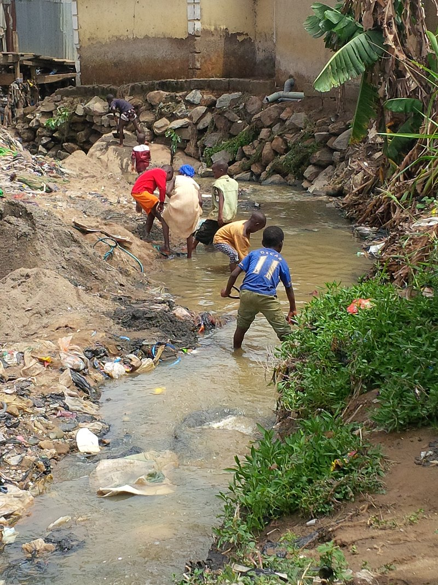
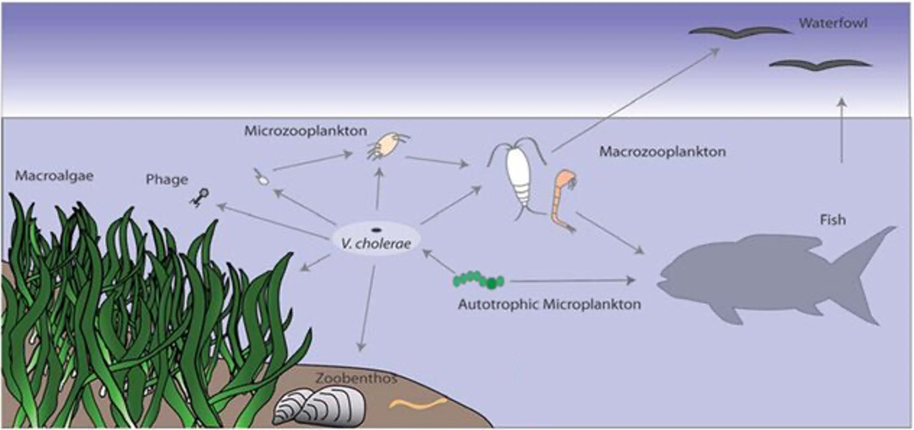
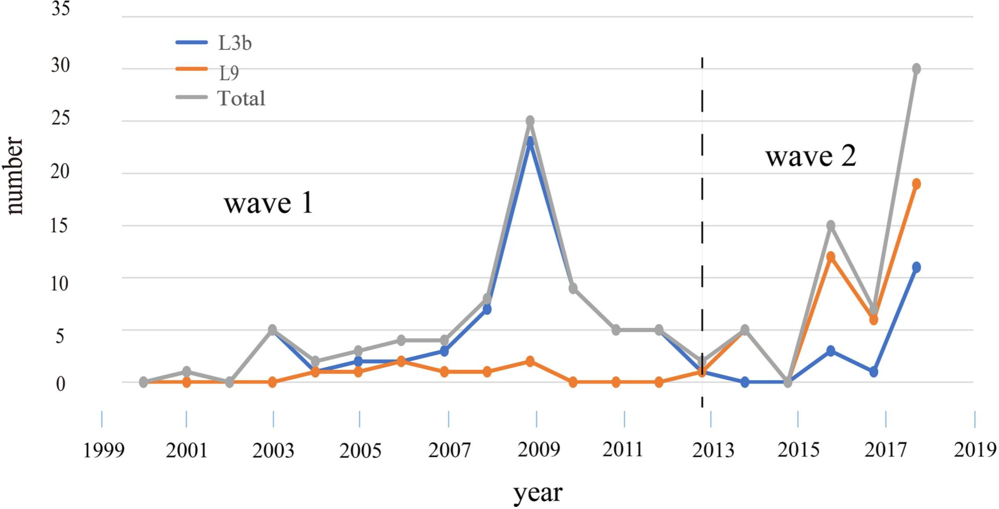
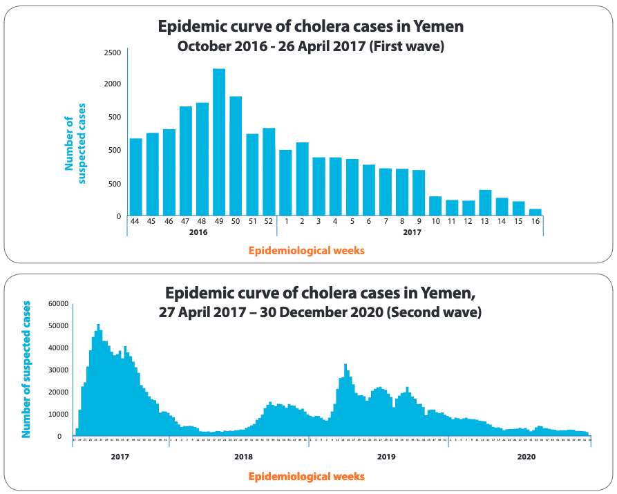
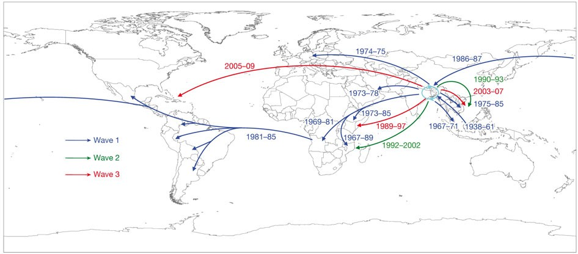
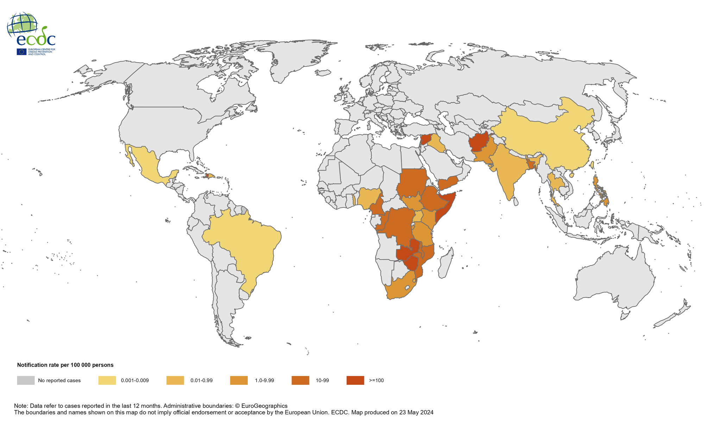
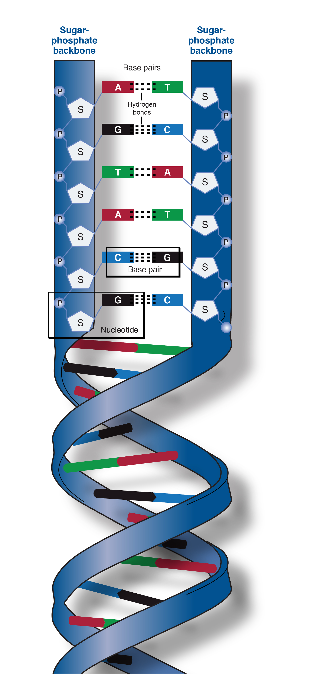

Cholera, *Vibrio cholerae*, and *V. cholerae* Lineages
======================================================

Introduction
------------

This chapter will give you an overview of cholera, the species *Vibrio cholerae*; the main lineages of *V. cholerae*; and the current pandemic lineage of *V. cholerae*, the 7PET lineage.

Acute Watery Diarrhoea, the Disease Cholera and its Epidemiology
----------------------------------------------------------------

Cholera is a disease characterised by acute watery diarrhoea, leading to rapidly progressing dehydration and shock (`Sack et al 2004`_).
If you are interested in how cholera is diagnosed, the World Health Organisation provides guidance and 
precise definitions of what they consider 'a suspected cholera case' and 'a confirmed cholera case' (see `WHO 2023`_).

.. _Sack et al 2004: https://pubmed.ncbi.nlm.nih.gov/14738797/

.. _WHO 2023: https://www.gtfcc.org/wp-content/uploads/2023/02/gtfcc-public-health-surveillance-for-cholera-interim-guidance.pdf

Cholera is an infection caused by a bacterium called *Vibrio cholerae*, a curved Gram-negative rod-shaped bacterium (Figure 1).

.. figure:: Vibrio_cholerae.jpg
  :width: 350

  Figure 1. The bacterium *V. cholerae*. Image credit: Tom Kirn, Ron Taylor, Louisa Howard - Dartmouth Electron Microscope Facility, via Wikipedia.

The *V. cholerae* bacterium is usually transmitted by the faecal-oral route, that is, 
people usually catch cholera by eating food or by drinking water that has been contaminated
with human faeces containing *V. cholerae* (Figure 2). Barriers to disease transmission include
handwashing and hygiene, access to toilets, and clean drinking water (e.g. chlorination of stored water; `Nelson et al 2009`_). 

.. figure:: 7PET_Lifecycle.png
  :width: 750

  Figure 2. Life cycle of the current pandemic lineage (7PET lineage) of *V. cholerae*. On ingestion of *V. cholerae* of the current pandemic lineage (7PET lineage) in contaminated food or water, the *V. cholerae* 7PET bacteria colonise the small intestine, multiply, secrete cholera toxin, and are then shed back into the environment by the host in diarrhoea. The *V. cholerae* 7PET bacteria shed in the stool are in a transient hyperinfectious state that serves to amplify the outbreak by promoting transmission to further human hosts. Image source: A. Coghlan, inspired by Figure 2 in `Nelson et al 2009`_. 

.. _Nelson et al 2009: https://pubmed.ncbi.nlm.nih.gov/19756008/

Cholera outbreaks typically occur in places where there is poor access
to clean water and poor sewage infrastructure (Figure 3). These include low-income settings in which there is poor water sanitation infrastructure, 
or places in which there is a humanitarian crisis (e.g. an earthquake or war) that has disrupted the water sanitation infrastructure.
Examples are Haiti, where there was a cholera epidemic from 2010-2019 which began shortly after a massive earthquake that occurred in 2010, 
and Yemen, which has suffered a cholera epidemic from 2016 up until the present during its ongoing civil war. 

  Figure 3. Children playing in a waste water drainage area that was found to be contaminated with *V. cholerae*. Image credit: Amibola Aman-Oloniyo, Nigeria, via Wikipedia.

Once ingested by a human host, the *V. cholerae* bacteria multiply in the human intestine. The
bacteria attach to the epithelial cells of the intestine and release **cholera toxin** (abbreviated as Ctx, CTX, or CT; Figure 4). Cholera toxin 
binds to the intestinal epithelial cell surface, and stimulates the cells to secrete ions and water into
the intestinal lumen, resulting in acute watery diarrhoea. Cholera toxin is therefore the key **virulence factor** 
of *V. cholerae*. 

.. figure:: CholeraToxin.jpg
  :width: 450

  Figure 4. Cholera toxin is a protein complex that consists of one CtxA protein bound to five CtxB proteins. This image shows the structure formed by the five CtxB proteins. Image credit: Wikipedia user Astrojan.

Note that *V. cholerae* is not the only pathogen that can cause acute watery diarrhoea; similar symptoms also be caused by other bacteria
such as enterotoxigenic *E. coli* (ETEC). 

The Species *Vibrio cholerae* and its Geographic Distribution
------------------------------------------------------------- 

Like other bacteria, *V. cholerae* populations reproduce by cell division, with the
DNA (genetic material) of descendant cells being identical to the DNA of the parent cells. 
Isolates that descended recently from the same ancestral cell and are identical (or nearly identical)
genetically are said to belong to the same **clone**, or be **clonal**. 

Mutations (changes) in the DNA, are
the main source of genetic variation in *V. cholerae*; these sometimes occur when DNA is being copied during cell division, but
can also occur due to DNA damage, for example damage due to ultraviolet (UV) radiation. 

Over evolutionary time, different clones of a species independently accumulate
mutations, so they become quite different at the genetic level and then we consider them different **lineages** of the species (Figure 5). 
The bacteria belonging to one particular lineage are all relatively clonal (highly similar at the genetic level); 
they all descended from a relatively recent common ancestor (although 'recent' in evolutionary time may be hundreds or thousands of years ago!); and
they usually present similar biological features, such as a specific pattern of virulence (`Bacigalupe 2017`_). 

.. _Bacigalupe 2017: https://era.ed.ac.uk/handle/1842/31266

.. figure:: ClonalSpecies.png
  :width: 150

  Figure 5. The population structure of a bacterial species can contain genetically distinguishable lineages. Five different lineages are represented by the blue, orange, green, pink, and red circles. Image credit: A. Coghlan, inspired by Figure 1.2 in `Bacigalupe 2017`_.

.. _Bacigalupe 2017: https://era.ed.ac.uk/handle/1842/31266

The species *V. cholerae* is distributed globally, and is a very diverse species with many different lineages. Figure 6 shows what is known about the global distribution of just two of the many lineages of *V. cholerae*.

.. figure:: LineageDistributions.png
  :width: 1050

  Figure 6. The global distribution of the bacterium *V. cholerae*, for two of the many different lineages of *V. cholerae*, (a) the MX-2 lineage, and (b) the current pandemic lineage (7PET lineage). The numbers in purple circles indicate the number of *V. cholerae* isolates collected in each country, whose whole genomes have been included in the `Vibriowatch`_ database. The number of genomes for the 7PET lineage is far greater than that for the MX-2 lineage, probably reflecting the far greater public health importance of 7PET. Genomes were assigned to lineages using a software called `PopPUNK`_, which we will discuss later in this course. Image source: A. Coghlan. 

.. _Vibriowatch: https://vibriowatch.readthedocs.io

.. _PopPUNK: https://pubmed.ncbi.nlm.nih.gov/30679308/

There is only one lineage of *V. cholerae* which causes epidemic cholera at present.
This lineage is known as the **'7PET'** lineage. What do we mean when we say 7PET causes 'epidemic cholera'?
The word 'epidemic' is defined by the CDC as an unexpected increase in the number of disease cases in a specific geographical area;
they say that an outbreak is defined in the same way but for a more limited geographic area (see the `CDC website`_).
Thus, when we say 7PET is epidemic-causing, we mean that 7PET cause an unexpectedly big increase in the number
of cases of diarrhoeal illness caused by *V. cholerae* in a particular town/city/region. 

.. _CDC website: https://archive.cdc.gov/www_cdc_gov/csels/dsepd/ss1978/lesson1/section11.html

The 7PET lineage is an extremely infectious and virulent lineage of *V. cholerae*, which produces
cholera toxin. 7PET appears to have evolved to become a 
human pathogen (`Feng et al 2008`_, `Chun et al 2009`_, `Hu et al 2016`_, `Mutreja & Dougan 2020`_).

There are many other non-epidemic lineages of *V. cholerae* found around the world that do not cause epidemic
cholera, but sometimes cause small outbreaks of mild diarrhoea. An example is lineage MX-2 (Figure 6). 
The vast majority of the non-epidemic lineages of *V. cholerae* do not produce cholera toxin, but isolates of some
non-epidemic lineages, including some isolates of MX-2, are predicted to produce cholera toxin because they have the genes encoding the cholera toxin (`Domman et al 2017`_).
The non-epidemic lineages of *V. cholerae* are often found in brackish water or in saltwater in association with shellfish 
such as crabs and shrimp, or in rivers or freshwater lakes (Figure 7). 

.. _Chun et al 2009: https://pubmed.ncbi.nlm.nih.gov/19720995/

.. _Feng et al 2008: https://pubmed.ncbi.nlm.nih.gov/19115014/

.. _Hu et al 2016: https://pubmed.ncbi.nlm.nih.gov/27849586/

.. _Mutreja & Dougan 2020: https://pubmed.ncbi.nlm.nih.gov/31345641/

.. _Domman et al 2017: https://pubmed.ncbi.nlm.nih.gov/29123068/

  Figure 7. Non-epidemic lineages of *V. cholerae* such as the MX-2 lineage are part of the bacterioplankton in aquatic environments. The non-epidemic *V. cholerae* are under risk of predation by protozoa and bacteriophages (viruses). These non-epidemic *V. cholerae* can attach to other organisms such as phytoplankton, macroalgae, chitinous zooplankton, and gelatinous egg masses, which may provide sources of nutrients for the non-epidemic *V. cholerae*. Fish and birds feed on plankton and mussels that might harbour non-epidemic *V. cholerae*. Image credit: Adapted by A. Coghlan from Figure 3 in `Lutz et al 2013`_.

.. _Lutz et al 2013: https://pubmed.ncbi.nlm.nih.gov/24379807/

The revised GTFCC definitions of cholera cases and cholera-free country statuses
--------------------------------------------------------------------------------

The WHO's Global Task Force on Cholera Control (GTFCC) is a partnership of more
than 50 institutions, including NGOs, academic institutions, and UN agencies,
that are working together to eliminate cholera. By 2030 they aim to reduce 
cholera deaths by at least 90%, and to eliminate cholera altogether in 20
countries (see the `GTFCC Roadmap 2030`_).

.. _GTFCC Roadmap 2030: https://www.gtfcc.org/about-cholera/roadmap-2030/

Because non-epidemic lineages of *V. cholerae* are found in many countries around
the world, the GTFCC have revised their definition of the disease 'cholera'
to specifically mention the epidemic-causing lineage 7PET.
That is, they define cholera as: "disease caused by toxigenic Vibrio cholerae O1 or O139, carrying the ctxAB genes encoding the cholera toxin (CT), linked to the seventh pandemic lineage or any lineage that might emerge with similar properties" (`GTFCC 2022`_).

.. _GTFCC 2022: https://www.gtfcc.org/wp-content/uploads/2022/06/7th-meeting-of-the-gtfcc-working-group-on-surveillance-2022-report.pdf

You may notice that the WTFCC's definition of 'cholera' mentions the serogroups O1 and O139; we will discuss
serogroup further below, but for now all you need to know is that O1 and O139
are the two serogroups that are seen in the 7PET lineage (`Mutreja et al 2011`_, `Moore et al 2014`_).

.. _Mutreja et al 2011: https://pubmed.ncbi.nlm.nih.gov/21866102/

.. _Moore et al 2014: https://pubmed.ncbi.nlm.nih.gov/24575898/

As mentioned above, non-epidemic lineages of *V. cholerae* such as MX-2 sometimes cause small outbreaks of mild diarrhoea,
but these are considered of relatively minor public health importance compared to outbreaks caused by 7PET.
The GTFCC is aiming to eliminate 7PET in 20 countries by 2030,
not to eliminate all diarrhoeal illness caused by non-epidemic *V. cholerae*. 
This means that in order to prove that
a particular country has become 'cholera-free', there will need to be
sufficient data to show that diarrhoeal illness caused by 7PET has definitely disappeared from that country. 
One type of data that will be very useful for this purpose is whole-genome sequencing data for *V. cholerae*, which
can be used to accurately distinguish 7PET from non-epidemic lineages of *V. cholerae*, as we will discuss
later in this course. 

The History of Cholera: the Seven Historically Recorded Pandemics
-----------------------------------------------------------------

A disease with symptoms like cholera was recorded in ancient texts from ancient India and China, but we have
little information about those ancient outbreaks.
Since the early 1800s there have been seven historically recorded cholera pandemics (a 'pandemic' is
an epidemic that has spread over several countries and usually affects many people; see the `CDC website`_).
The 7th pandemic is the current
and ongoing cholera pandemic, and has been caused by the 7PET lineage (Figure 8).

.. _CDC website: https://archive.cdc.gov/www_cdc_gov/csels/dsepd/ss1978/lesson1/section11.html

.. figure:: SevenPandemics.png
  :width: 650

  Figure 8. A timeline of the seven historically recorded pandemics. The current pandemic is the 7th pandemic and is caused by the 7PET lineage. Image credit: A. Coghlan, inspired by an image by `Laura Olivares Boldú / Wellcome Connecting Science`_.

.. _Laura Olivares Boldú / Wellcome Connecting Science: https://www.yourgenome.org/theme/science-in-the-time-of-cholera/

The 6th pandemic occurred from 1899 to 1923, after which there were only localised outbreaks in parts of Asia for several decades,
and then the 7th pandemic started in 1961 and continues at present (`Feng et al 2008`_). 
We now know that the 6th pandemic  
was actually caused by a different **lineage** of *V. cholerae* than the 7th pandemic. 
We call the lineage that caused the 6th pandemic the **'Classical lineage'** (`Chun et al 2009`_, `Domman et al 2017`_). 
In fact, evidence from *V. cholerae* DNA extracted from a cholera victim who died in 1849 in Phildelphia, USA during the second
pandemic suggests that the Classical lineage also caused the 2nd pandemic (`Devault et al 2014`_).

.. _Domman et al 2017: https://pubmed.ncbi.nlm.nih.gov/29123068/

.. _Chun et al 2009: https://pubmed.ncbi.nlm.nih.gov/19720995/

.. _Devault et al 2014: https://pubmed.ncbi.nlm.nih.gov/24401020/

The Classical lineage has more or less died out since the end of the 6th pandemic (in 1923) 
and is very rarely seen nowadays (e.g. a rare Classical lineage isolate 
from Ghana in 2010 was reported by `Adade et al 2022`_). 

.. _Dorman 2020: https://www.sanger.ac.uk/theses/md25-thesis.pdf

.. _Adade et al 2022: https://pubmed.ncbi.nlm.nih.gov/36312941/

.. _Feng et al 2008: https://pubmed.ncbi.nlm.nih.gov/19115014/  

John Snow and the 1854 Broad Street Cholera Outbreak
----------------------------------------------------

The third cholera pandemic played a key role in this history of Epidemiology and Public Health. In 1854 during this pandemic there was a large outbreak of cholera around Broad Street in London, and a doctor named John Snow carried out a very through investigation of the outbreak, creating a map of cases (Figure 9). From the data he collected, he was able to figure out that cholera was being transmitted through contaminated water from the Broad Street water pump, and also was being spread by contact with another infected person (or their goods) (`Tulchinsky 2018`_). Snow did not know what was the exact contaminant in the water from the Broad Street pump. We now know that it must have contained an epidemic-causing lineage of *V. cholerae*. Snow persuaded the local authorities to remove the handle of the Broad Street pump, and the outbreak ended soon after that. 

.. _Tulchinsky 2018: https://www.ncbi.nlm.nih.gov/pmc/articles/PMC7150208/

.. figure:: SnowCholeraMap.png
  :width: 500

  Figure 9. Map of cholera cases in London in 1854 made by the doctor John Snow during the 3rd historically recorded cholera pandemic. Cholera cases are highlighted in black. The Broad Street pump is indicated with a red dot. Image credit: Adapted by A. Coghlan from the original map made by John Snow in 1854, obtained from Wikipedia.

Snow's very thorough cholera outbreak investigation, which he published in 1855 (`Snow 1855`_), is still considered an excellent example of how accurate and informative data, and careful data analysis, are extremely important for making good public health decisions. Later in this course, we will be analysing data from more recent cholera outbreaks, using different data sources than John Snow had (e.g. whole genome sequencing data). 

.. _Snow 1855: https://www.gutenberg.org/ebooks/72894

The Classical Biotype and the El Tor Biotype
--------------------------------------------

In 1905 a doctor named Felix Gotschlich described  *V. cholerae* that had a different set of biochemical characteristics, or 'biotype' than
had been previously observed for *V. cholerae* (reviewed in `Hu et al 2016`_; `Chastel 2007`_). This novel biotype was first seen in the El Tor Quarantine Station in Egypt,
and so the new biotype of *V. cholerae* was named the '**El Tor biotype**', to distinguish it from earlier *V. cholerae* isolates, which were
described as having the '**Classical biotype**'. 
These biotypes are based on a particular set of laboratory tests (about four
or five laboratory tests, depending on the version of the protocol), which test things like susceptibility to infection by particular bacteriophages,
susceptibility to a particular antibiotic, presence of a particular biochemical pathway, and effect on red blood cells (Figure 10; `CDC 1994`_, `Dorman 2020`_).
You don't need to remember the particular laboratory tests used in biotyping, as they are rarely used nowadays, but just to be aware that they were used historically.
Isolates of the 7PET lineage have the El Tor biotype, and in fact the name '7PET' stands for '7th pandemic El Tor'.
In contrast, Classical lineage isolates have the Classical biotype.

.. _Hu et al 2016: https://pubmed.ncbi.nlm.nih.gov/27849586/

.. _CDC 1994: https://stacks.cdc.gov/view/cdc/52473

.. _Dorman 2020: https://www.sanger.ac.uk/theses/md25-thesis.pdf

.. _Chastel 2007: https://www.biusante.parisdescartes.fr/sfhm/hsm/HSMx2007x041x001/HSMx2007x041x001x0071.pdf

.. figure:: Biotype.png
  :width: 600

  Figure 10. Laboratory tests used to determine the 'biotype' of *V. cholerae*, a laboratory phenotype that can be used to predict whether isolates of the *V. cholerae* causing a particular outbreak belong to the epidemic-causing Classical or 7PET lineages. Isolates of the Classical lineage have the Classical biotype, and isolates of the 7PET lineage have the El Tor biotype. Image credit: from Table 1.1 in `Dorman 2020`_.  

.. _Dorman 2020: https://www.sanger.ac.uk/theses/md25-thesis.pdf

In recent decades, the biotyping laboratory tests have often been used to find out whether the *V. cholerae*
causing an outbreak have the El Tor or Classical biotype, so to predict whether they are likely to belong the 7PET lineage or Classical lineage, respectively 
(`Cvjetanovic & Barua 1972`_, `CDC 1994`_). However, as mentioned above, the Classical lineage (and so Classical biotype) is very rarely seen nowadays. 
Furthermore, although the lineage causing the 7th pandemic, 7PET, shows the El Tor biotype in laboratory tests, some 
non-epidemic lineages of *V. cholerae* also show the El Tor biotype in laboratory biotyping tests (e.g. *V. cholerae* isolates TM11079-80 and 12129(1), which both have the El Tor
biotype and belong to non-epidemic lineages; see Fig. 1. in `Chun et al 2009`_).
Therefore, the biotype is not very useful for distinguishing 7PET from non-epidemic lineages of *V. cholerae*.
As we will discuss later in this course, whole genome sequencing tells us far more accurately whether isolates from an
outbreak are 7PET or not. In fact, biotyping is not very useful nowadays for cholera public health. We have
mentioned it here because of its historical importance in cholera public health, 
and so that you understand that the 7PET lineage has the El Tor biotype,
but that not all *V. cholerae* with the El Tor biotype are 7PET. 

.. _Chun et al 2009: https://pubmed.ncbi.nlm.nih.gov/19720995/

.. _Cvjetanovic & Barua 1972: https://pubmed.ncbi.nlm.nih.gov/4561957/

.. _CDC 1994: https://stacks.cdc.gov/view/cdc/52473

Note that you may see some mention in the literature of variants of the El Tor biotype, such as
the 'Matlab variants', 'Mozambique variants', 'Haitian variants', 'altered El Tor biotype', 'hybrid El Tor' or 'atypical El Tor' (e.g. in Bhandari et al 2021, `Montero et al 2023`_). Isolates with the Matlab/Mozambique/Haitian variants of El Tor biotype or altered/hybrid/atypical El Tor biotype all belong to the 7PET lineage, but
just give slightly different results in the biotyping tests (Figure 10) compared to other 7PET isolates. 

.. _Montero et al 2023: https://pubmed.ncbi.nlm.nih.gov/37215733/

.. _Bhandari et al 2021: https://pubmed.ncbi.nlm.nih.gov/33482361/

Serogroups of *V. cholerae*
---------------------------

Relationships between lineages of *V. cholerae*
-----------------------------------------------

The 7PET lineage, which has caused the current pandemic, and the Classical lineage, which caused the 6th historically
recorded pandemic, are relatively closely related. We know this by making a 'phylogenetic tree' for *V. cholerae*, that is, a
'family tree' of the different lineages (genetically different subtypes) of *V. cholerae* (Figure 11). 
The phylogenetic tree represents our best guess at the relationships between different lineages of *V. cholerae*, based on similarities and
differences between their DNA.

.. _Domman et al 2017: https://pubmed.ncbi.nlm.nih.gov/29123068/

.. figure:: Lineages.png
  :width: 400

  Figure 11. A phylogenetic tree of some of the known lineages of *V. cholerae*. The triangles at the ends of branches represent existing lineages. The red dot represents the last common ancestor of the Classical and 7PET lineages, while the yellow dot represents the last common ancestor of the ELA-3 and 7PET lineages. Practically 100% of 7PET isolates produce cholera toxin. Some isolates from non-epidemic lineages are also predicted to produce cholera toxin (because they have the genes encoding cholera toxin; `Chun et al 2009`_, `Hao et al 2023`_; `Domman et al 2017`_). Image credit: A. Coghlan, based on the tree in Supplementary Figure 2 and Table S3 of `Domman et al 2017`_, and with the addition of information on L3b and L9.

.. _Chun et al 2009: https://pubmed.ncbi.nlm.nih.gov/19720995/

.. _Hao et al 2023: https://pubmed.ncbi.nlm.nih.gov/37146742/

.. _Domman et al 2017: https://pubmed.ncbi.nlm.nih.gov/29123068/

You may have encountered phylogenetic trees before, but if not, don't worry, we will be discussing them a lot in this course.
In this tree, the arrow of time goes from left to right, with the left-hand side of the tree being the furthest back in history and the
very right-hand side of the tree being the present time. The triangles at the right-hand side of the tree different current lineages of *V. cholerae*.

If you look at two of the triangles (representing lineages) at the ends of the branches, e.g. the triangles representing 7PET and Classical, and trace
back along two branches from right to left, you will eventually reach an 'internal node' where those branches meet, further to the left in the tree. This internal
node represents the last common ancestor of the two lineages, e.g.
the last common ancestor of 7PET and Classical (red circle), which is estimated to have lived about 1880 (`Feng et al 2008`_). On the other hand,
the last common ancestor of 7PET and ELA-3 (yellow circle) lived even longer ago.

.. _Feng et al 2008: https://pubmed.ncbi.nlm.nih.gov/19115014/

What the tree tells us is that 7PET and Classical, the two lineages that have caused pandemics, are relatively closely related *V. cholerae* lineages. 
7PET is also relatively closely related to non-epidemic lineages of *V. cholerae*, including MX-2, Gulf Coast and ELA-3. 

Later in the course you will be learning a lot about how to build phylogenetic trees yourself, and how to interpret
them to understand about the relationships between different subtypes of 7PET that have caused different 7PET outbreaks, and to
gain insights into how 7PET is spreading regionally and globally. 

Diarrhoeal illness caused by different lineages of *V. cholerae*
----------------------------------------------------------------

The 7PET lineage, which has caused the current pandemic, and the Classical lineage, which caused the 6th historically
recorded pandemic, are only the two epidemic lineages of *V. cholerae*. The many other
lineages of *V. cholerae* are not epidemic-causing; they sometimes cause relatively small outbreaks of diarrhoeal illness in
tens or even a hundred or so people (`Glenn Morris 1990`_). In contrast, 7PET is the only current *V. cholerae* lineage
that causes large epidemics or pandemics of hundreds of thousands of cases, or even millions of 
cases as seen in the Yemen cholera epidemic from 2016-present (`Mutreja & Dougan 2020`_, `Lassalle et al 2023`_). 

.. _Mutreja & Dougan 2020: https://pubmed.ncbi.nlm.nih.gov/31345641/

.. _Glenn Morris 1990: https://pubmed.ncbi.nlm.nih.gov/2286218/

.. _Lassalle et al 2023: https://pubmed.ncbi.nlm.nih.gov/37770747/

Of the non-epidemic *V. cholerae* lineages, the two lineages that have caused the most cases of diarrhoeal illness
since 2000 are thought to be lineages 'L3b' and 'L9' (`Hao et al 2023`). For example, these two non-epidemic lineages
have caused several hundred cases of diarrhoeal illness in Hangzhou, China between 2001 and 2018 (`Hao et al 2023`_; Figure 12).
Lineage L3b has also been linked to relatively small outbreaks of diarrhoeal illness in South Africa (`Smith et al 2021`_).

Note that L3b and L9 are alternative names for the lineages labelled MX-2 and ELA-3, respectively, in the tree in Figure 11 above
(strictly speaking, MX-2 is a part of L3b and ELA-3 is a part of L9). Don't worry about remembering the names of these non-epidemic
lineages; the key point here is that non-epidemic lineages of *V. cholerae* exist, but are of relatively minor public health importance
compared to 7PET. 

.. _Hao et al 2023: https://pubmed.ncbi.nlm.nih.gov/37146742/

.. _Smith et al 2021: https://pubmed.ncbi.nlm.nih.gov/34670657/

  Figure 12. Cases of diarrhoeal illness per year caused by the L3b and L9 lineages of *V. cholerae* in Hangzhou, China, between 2001 and 2018. The grey lines represent the total number of diarrhoeal cases caused by L3b and L9 together, the blue lines represent the number of cases caused by L3b, and the orange lines the number of cases caused by L9. Image credit: `Hao et al 2023`_.

Indeed, compared to cholera outbreaks/epidemics caused by 7PET, outbreaks of L3b/L9 and other non-epidemic
*V. cholerae* lineages are far smaller and in general cause relatively milder diarrhoeal illness (`Glenn Morris 1990`_, `Glenn Morris 2003`_).
In contrast, the cholera epidemic in Yemen that began in 2016 (and is still continuing) has included
approximately million suspected cholera cases and appproximately 4000 deaths from 2016-2020 (`WHO 2020`_; Figure 13).

.. _Glenn Morris 1990: https://pubmed.ncbi.nlm.nih.gov/2286218/

.. _Glenn Morris 2003: https://pubmed.ncbi.nlm.nih.gov/12856219/

.. _WHO 2020: https://applications.emro.who.int/docs/WHOEMCSR314E-eng.pdf

  Figure 13. Number of suspected cases of cholera per week, during the cholera epidemic caused by 7PET in Yemen, between 2016 and 2020. Image credit: (`WHO 2020`_). 

.. _WHO 2020: https://applications.emro.who.int/docs/WHOEMCSR314E-eng.pdf

Due to its high virulence (ability to cause acute watery diarrhoea) and epidemic-causing potential, the 7PET lineage is of major public health concern,
while the other non-epidemic lineages of *V. cholerae* are in comparison currently only of relatively minor public health concern.
Therefore our focus in this course will be primarily on 7PET, and not the non-epidemic lineages of *V. cholerae*. 
However, some epidemiologists are monitoring these other non-epidemic lineages, in case at some point in future they 
do evolve to be become far more infectious and/or far more virulent (e.g. `Hao et al 2023`_, `Smith et al 2021`_).

.. _Hao et al 2023: https://pubmed.ncbi.nlm.nih.gov/37146742/

.. _Smith et al 2021: https://pubmed.ncbi.nlm.nih.gov/34670657/

The History of 7PET's Global Spread
-----------------------------------

Although the 7PET lineage is estimated to have split off from the Classical lineage in around 1880 (`Feng et al 2008`_),
it wasn't until 1961 that the 7th pandemic began, with many cases of cholera caused by 7PET occurring in Indonesia (`Hu et al 2016`_, `Mutreja & Dougan 2020`_).
From Indonesia, 7PET spread to the Bay of Bengal region of India and Bangladesh, and from the Bay of Bengal subsequently between the 1960s and 2010 then spread 
throughout the world in three overlapping waves (`Mutreja et al 2011`_; Figure 14). 

.. _Feng et al 2008: https://pubmed.ncbi.nlm.nih.gov/19115014/

.. _Hu et al 2016: https://pubmed.ncbi.nlm.nih.gov/27849586/

.. _Mutreja & Dougan 2020: https://pubmed.ncbi.nlm.nih.gov/31345641/

.. _Mutreja et al 2011: https://pubmed.ncbi.nlm.nih.gov/21866102/

  Figure 14. Between the early 1960s and 2010, 7PET spread outward globally from the Bay of Bengal region (highlighted with a pale blue oval), in three overlapping waves of spread. Image credit: `Mutreja et al 2011`_.

.. _Mutreja et al 2011: https://pubmed.ncbi.nlm.nih.gov/21866102/

Since 2010, there have been further spread of 7PET, both within countries and regions, and between countries and continents (Figure 15). 
As mentioned above, cholera is spread by the faecal-oral route, and so the most likely explanation is that 7PET has been 
spread by human travel. 

  Figure 15. Cholera cases reported worldwide between April 2023 and May 2024. Image source: `ECDC`_ (accessed 18th July 2024).

.. _ECDC: https://www.ecdc.europa.eu/en/all-topics-z/cholera/surveillance-and-disease-data/cholera-monthly

In some regions of Asia and Africa, there are now cholera outbreaks every year, and so cholera is now considered 'endemic'.
These include countries around the Bay of Bengal such as India and Bangladesh. 
Note that the WHO has a technical definition of a 'cholera-endemic area': 'an area where confirmed cholera cases were 
detected during the last 3 years with evidence of local transmission (meaning the cases are not imported from elsewhere)' 
(`WHO 2024`_, accessed 18th July 2024). 

.. _WHO 2024: https://www.who.int/news-room/fact-sheets/detail/cholera

Note that we have use the terms 'outbreak', 'epidemic' rather loosely here, and not attempted to
provide precise medical or epidemiological definitions. We recommend that you follow WHO guidelines and definitions;
the WHO provides detailed guidance on what it considers to be an 'imported cholera case', a 'locally acquired cholera case', a 'suspected cholera outbreak',
a 'probable cholera outbreak', a 'confirmed cholera outbreak' (see `WHO 2023`_).

.. _WHO 2023: https://www.gtfcc.org/wp-content/uploads/2023/02/gtfcc-public-health-surveillance-for-cholera-interim-guidance.pdf

The *V. cholerae* Genome and Whole-Genome Sequencing (WGS) of *V. cholerae*
---------------------------------------------------------------------------

Just as for us humans, the genetic material of *V. cholerae* consists of DNA.
The DNA of *V. cholerae* contains all the genetic instructions specifying the development of a *V. cholerae* cell. 

You may be already familiar with the structure of DNA, a famous molecule with a double helix structure. DNA molecules consist of two chains (also known as 'strands') of
smaller molecules called 'nucleotides' (Figure 16). Each nucleotide consists of three parts: a sugar called deoxyribose,
a phosphate group, and one of four 'bases'. The bases are thymine (abbreviated as 'T'), adenine ('A'), guanine ('G')
and cytosine ('C'). 

  Figure 16. A diagram of the structure of DNA, showing the sugar phosphate backbone and base-pairs. The sugars and phosphates form the backbone of the double helix. Image credit: National Human Genome Research Institute, Public domain, via Wikimedia Commons.

The bases in the two strands of a DNA double helix are 'complementary' to each other: that is, T pairs with
A and G pairs with C. Thus, if one strand has the sequence of bases TACGA, the other strand must have the sequence
of bases ATGCT. For convenience, one strand in a DNA double helix is called the 'forward' or '+' ('plus') strand, and the 
other strand the 'reverse' or '-' ('minus') strand.

The 'genome' of *V. cholerae* is the name we give to the set of all DNA molecules in a *V. cholerae* cell.
In each cell, the *V. cholerae* genome is organised into two circular 'chromosomes', each consisting of a long circular DNA molecule (Figure 17). 
In total the two circular chromosomes contain about 4 million base-pairs (4 Mb) of base-pairs, where Chromosome 1 is about 3 Mb 
and Chromosome 2 about 1 million base-pairs (1 Mb; `Heidelberg et al 2000`_). 

.. _Heidelberg et al 2000: https://pubmed.ncbi.nlm.nih.gov/10952301/

.. figure:: Chromosomes.png
  :width: 800

  Figure 17. A diagram showing the two circular chromosomes of *V. cholerae*, for a typical 7PET isolate. The outside circles in blue represent protein-coding genes on the forward and reverse strand of the DNA. Between them, the two chromosomes of *V. cholerae* include almost 4000 genes in a typical 7PET isolate from the 7PET lineage. Other key features of the chromosomes are highlighted as green boxes, where the green box labelled '5' is the 'CTX region' containing the two genes *ctxA* and *ctxB*, which encode the A and B subunits of the cholera toxin, respectively. Image source: `Mutreja & Dougan 2020`_.

.. _Mutreja & Dougan 2020: https://pubmed.ncbi.nlm.nih.gov/31345641/

When we talk about 'sequencing the genome' of an organism, we mean figuring out the sequence of
bases on the strands of its DNA molecules. 
Later in this course we will talk about different methods for sequencing DNA.

The first time that a *V. cholerae* isolate's genome was sequenced was in the year 2000, for a *V. cholerae* 7PET strain called N16961 
that was originally isolated in Bangladesh (`Heidelberg et al 2000`_).
Since the year 2000, the genomes of thousands of other *V. cholerae* isolates have been sequenced. There are quite a lot of small differences
between different *V. cholerae* isolates' genomes (that is, there is genetic variation within *V. cholerae*), 
but the majority of *V. cholerae* isolates have two circular chromosomes that together contain about 4 Mb of DNA. 

Genes of *V. cholerae*
----------------------

Each of the two chromosomes of *V. cholerae* includes many hundred of genes. In 
Each gene comprises a segment of its DNA, typically hundreds or thousands
of base-pairs in length. A very common type of gene is a protein-coding gene, which is a stretch of
DNA which encodes (specifies the production of) particular proteins. For example,
*ctxA* and *ctxB* are two *V. cholerae* genes that encode the CtxA and CtxB proteins, the two
proteins that form cholera toxin. In total the two *V. cholerae* chromosomes contain almost 4000 protein-coding genes in a typical isolate
from the 7PET lineage (`Heidelberg et al 2000`_). 

The *ctxA* and *ctxB* genes are usually found close together in the *V. cholerae* genome, in a region known as the **CTX region** (Figure 18). 
Practically 100% of 7PET isolates contain the CTX region in their chromosome, and so produce cholera toxin, and therefore cause a human 
host to suffer acute watery diarrhoea. Isolates of a small number of non-epidemic lineages of *V. cholerae*, most
of which are relatively closely related to 7PET (e.g. L3, L9, Gulf Coast, Classical), sometimes have *ctxA* and *ctxB* genes (`Chun et al 2009`_, 
`Hao et al 2023`_; `Domman et al 2017`_; see Figure 11 above). Occasionally *ctxAB* genes are seen in isolates of non-epidemic lineages of *V. cholerae* that
are very distantly related to 7PET, but this is very rare (e.g. isolate V51 described in `Chun et al 2009`_). 

.. _Heidelberg et al 2000: https://pubmed.ncbi.nlm.nih.gov/10952301/

.. _Chun et al 2009: https://pubmed.ncbi.nlm.nih.gov/19720995/

.. _Hao et al 2023: https://pubmed.ncbi.nlm.nih.gov/37146742/

.. _Domman et al 2017: https://pubmed.ncbi.nlm.nih.gov/29123068/

.. figure:: CtxRegion.png
  :width: 550

  Figure 18. A diagram showing the CTX region of Chromosome 1 of 7PET strain N16961. The blue arrows represent genes. The *ctxA* and *ctxB* genes encode the A and B subunits, respectively, of the cholera toxin protein complex. Image source: A. Coghlan, inspired by Figure 2 in `Pant et al 2020`_.

.. _Pant et al 2020: https://pubmed.ncbi.nlm.nih.gov/31272871/

Brief Summary
-------------

The key take-home messages of this chapter are:

* Cholera, a disease characterised by acute watery diarrhoea, is caused by ingestion of *Vibrio cholerae*
* Cholera toxin is the most important virulence factor of *V. cholerae*; cholera toxin triggers acute watery diarrhoea
* *V. cholerae* is distributed globally, and is a very diverse species with many different lineages 
* At present there is only one lineage that causes pandemic/epidemic cholera: 7PET, an extremely infectious and virulent lineage
* The genome of a typical 7PET isolate has 4 million base-pairs (4 Mb) of DNA, and contains about 4000 genes
* Practically all 7PET isolates have genes for cholera toxin (*ctxAB* genes)

Suggested Further Reading and Videos
------------------------------------

Suggested further reading to go with this chapter is the nice review by `Mutreja & Dougan 2020`_ on 'Molecular epidemiology and intercontinental spread of cholera'. 

.. _Mutreja & Dougan 2020: https://pubmed.ncbi.nlm.nih.gov/31345641/

You can also watch a talk on cholera and 7PET by Prof. Nick Thomson (Wellcome Sanger Institute, Cambridge, UK), which he
presented at a conference in January 2024. His talk (14 minutes long) is entitled `Understanding Health and Disease at a Global Scale`_.

.. _Understanding Health and Disease at a Global Scale: https://www.youtube.com/watch?v=iv0zfqSEFAg

Contact
-------

I will be grateful if you will send me (Avril Coghlan) corrections or suggestions for improvements to my email address alc@sanger.ac.uk

Acknowledgements
----------------

Contributors to this course: Avril Coghlan, Matt Dorman, Ismail Bashir, Nick Thomson. 

