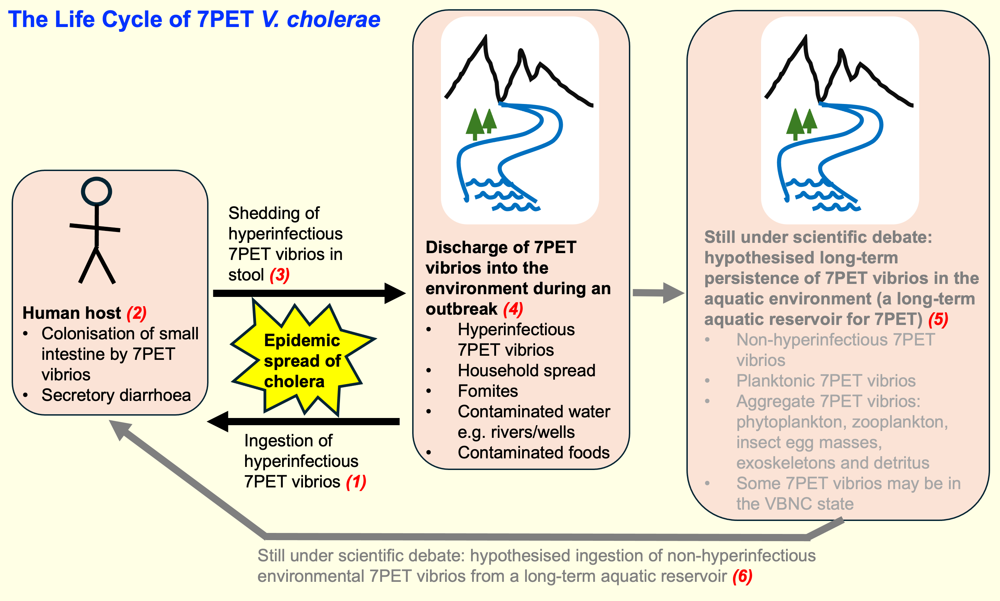
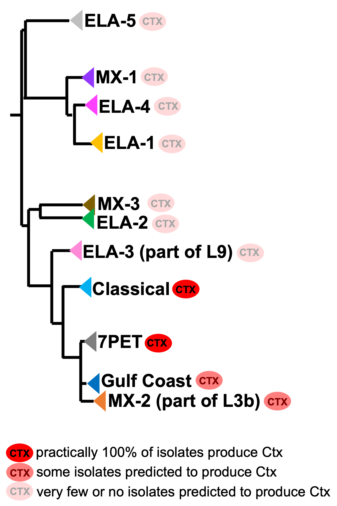

Cholera, *Vibrio cholerae*, and *V. cholerae* Lineages
======================================================

Introduction
------------

This chapter will give you an overview of cholera, the species *Vibrio cholerae*; the main lineages of *V. cholerae*; and the current pandemic lineage of *V. cholerae*, the 7PET lineage.
While we will explain terms as we go along, we have also included a glossary of key terms at the end of the chapter. 

Acute Watery Diarrhoea, the Disease Cholera and its Epidemiology
----------------------------------------------------------------

Cholera is a disease characterised by acute watery diarrhoea, leading to rapidly progressing dehydration and shock (`Sack et al 2004`_).
A distinctive feature of cholera is painless purging of voluminous stools resembling rice-water, known as 'rice-water stool' (`Sack et al 2004`_).
If you are interested in how cholera is diagnosed, the World Health Organisation (WHO) provides guidance and 
precise definitions of what they consider 'a suspected cholera case' and 'a confirmed cholera case' (see `WHO 2023`_).

.. _Sack et al 2004: https://pubmed.ncbi.nlm.nih.gov/14738797/

.. _WHO 2023: https://www.gtfcc.org/wp-content/uploads/2023/02/gtfcc-public-health-surveillance-for-cholera-interim-guidance.pdf

Cholera is an infection caused by a bacterium called *Vibrio cholerae*, a curved Gram-negative rod-shaped bacterium (Figure 1).
The genus *Vibrio* belongs to the Vibrionaceae, a family in the class Gammaproteobacteria that includes many bacteria 
found in marine niches (`Boyd et al 2015`_).

.. _Boyd et al 2015: https://pubmed.ncbi.nlm.nih.gov/26542048/

.. figure:: Vibrio_cholerae.jpg
  :width: 350

  Figure 1. `Transmission electron microscope image of Vibrio cholerae that has been negatively stained`_. Image attribution: this image by Tom Kirn, Ron Taylor and Louisa Howard of `Dartmouth Electron Microscope Facility`_ is in the Public Domain. With kind permission of Maxime Guinel de France, Dartmouth Electron Microscope Facility.

.. _Transmission electron microscope image of Vibrio cholerae that has been negatively stained: https://en.wikipedia.org/wiki/Vibrio_cholerae#/media/File:Vibrio_cholerae.jpg

.. _Dartmouth Electron Microscope Facility: https://www.dartmouth.edu/emlab/

The *V. cholerae* bacterium is usually transmitted by the faecal-oral route, that is, 
people usually catch cholera by eating food or by drinking water that has been contaminated
with human faeces containing *V. cholerae* (`Sack et al 2004`_, `Nelson et al 2009`_). Barriers to disease transmission include
handwashing and hygiene, access to toilets, and clean drinking water (e.g. chlorination of stored water; `Sack et al 2004`_, `Nelson et al 2009`_). 
Figure 2 summarises what is known about the transmission routes for the current pandemic lineage of *V. cholerae*, the 7PET
lineage, which is the lineage of *V. cholerae* responsible for all major outbreaks and epidemics of cholera since the 1960s (`Mutreja et al 2011`_, `Mutreja & Dougan 2020`_). 

.. _Sack et al 2004: https://pubmed.ncbi.nlm.nih.gov/14738797/

.. _Mutreja et al 2011: https://pubmed.ncbi.nlm.nih.gov/21866102/

.. _Mutreja & Dougan 2020: https://pubmed.ncbi.nlm.nih.gov/31345641/

.. _Nelson et al 2009: https://pubmed.ncbi.nlm.nih.gov/19756008/

  Figure 2. Amplification of transmission by human-to-human spread for the current pandemic lineage (7PET lineage) of *V. cholerae*. On ingestion of *V. cholerae* of the current pandemic lineage (7PET lineage) in contaminated food or water (1), the *V. cholerae* 7PET bacteria colonise the small intestine (2), multiply, secrete cholera toxin, and are then shed back into the environment by the host in diarrhoea (3). The *V. cholerae* 7PET bacteria shed in the stool are in a transient hyperinfectious state that serves to amplify the outbreak by promoting transmission to further human hosts (4). Some scientists have hypothesised that 7PET bacteria may persist for many months or even several years in aquatic environments (e.g. `Colwell 1996`_, `Alam et al 2007`_, `Islam et al 2020`_, `Mavian et al 2023`_) (5); however, the ability of 7PET to persist long-term in the environment (5) and to seed new outbreaks (6) is still under scientific debate. VBNC: a 'viable but non-culturable' dormant state that many bacterial species enter under unfavourable conditions such as low temperature and low nutrient conditions (`Lutz et al 2013`_). Image attribution: this image by `Avril Coghlan`_ is licensed under `CC BY 4.0`_.

.. _Nelson et al 2009: https://pubmed.ncbi.nlm.nih.gov/19756008/

.. _Mavian et al 2023: https://pubmed.ncbi.nlm.nih.gov/37735743/

.. _Islam et al 2020: https://pubmed.ncbi.nlm.nih.gov/31285087/

.. _CC BY 4.0: https://creativecommons.org/licenses/by/4.0/

.. _Lutz et al 2013: https://pubmed.ncbi.nlm.nih.gov/24379807/

.. _Alam et al 2007: https://pubmed.ncbi.nlm.nih.gov/17968017/

.. _Colwell 1996: https://pubmed.ncbi.nlm.nih.gov/8953025/

.. _Avril Coghlan: https://www.linkedin.com/in/avril-coghlan-4409545/?originalSubdomain=uk

Cholera outbreaks typically occur in places where there is poor access
to clean water and poor sewage infrastructure (Figure 3). These include low-income settings in which there is poor water and sanitation infrastructure, 
or places in which there is a humanitarian crisis (e.g. an earthquake or war) that has disrupted the water and sanitation infrastructure.
Examples are Haiti, where there was a cholera epidemic from 2010-2019 which began shortly after a massive earthquake that occurred in 2010, 
and Yemen, which has suffered a cholera epidemic from 2016 up until the present during its ongoing civil war. 

.. figure:: ContaminatedWater.png
  :width: 350

  Figure 3. `Water-collection site X on the shore of Lake Edward, Katwe Village, south-western Uganda`_. Water from this lake in Uganda was implicated in a cholera outbreak during June–July 2015. Image attribution: this image by `Pande et al 2018`_ is licensed under `CC BY 4.0`_.

.. _Water-collection site X on the shore of Lake Edward, Katwe Village, south-western Uganda: https://journals.plos.org/plosone/article/figure?id=10.1371/journal.pone.0198431.g003

.. _Pande et al 2018: https://pubmed.ncbi.nlm.nih.gov/29949592/

.. _CC BY 4.0: https://creativecommons.org/licenses/by/4.0/

Once ingested by a human host, the *V. cholerae* bacteria multiply in the human intestine. The
bacteria attach to the epithelial cells of the intestine and release **cholera toxin** (abbreviated as Ctx, CTX, or CT; Figure 4). Cholera toxin 
binds to the intestinal epithelial cell surface, and stimulates the cells to secrete ions and water into
the intestinal lumen, resulting in acute watery diarrhoea. Cholera toxin is therefore the key **virulence factor** 
of *V. cholerae*, and *V. cholerae* isolates that produce cholera toxin are said to be **'toxigenic'**.
Isolates of the current pandemic lineage (**'7PET lineage'**) of *V. cholerae* are toxigenic.

.. figure:: CholeraToxin.jpg
  :width: 450

  Figure 4. `Cholera toxin B pentamer, Vibrio cholerae`_. Cholera toxin is a protein complex that consists of one CtxA protein bound to five CtxB proteins. This image shows the structure formed by the five CtxB proteins. Image attribution: this image was created by Wikipedia user Astrojan based on the `CtxB protein structure`_ deposited in the PDB database by E.A. Merritt & W.G.J. Hol, and is licensed under `CC BY 4.0`_.

.. _Cholera toxin B pentamer, Vibrio cholerae: https://en.wikipedia.org/wiki/File:1chq.jpg

.. _CtxB protein structure: https://www.rcsb.org/structure/1chq

.. __CC BY 4.0: https://creativecommons.org/licenses/by/4.0/

Note that *V. cholerae* is not the only pathogen that can cause acute watery diarrhoea; similar symptoms also be caused by other bacteria
such as enterotoxigenic *E. coli* (ETEC). 

.. image:: Activity.png
  :width: 1050

* Watch a `video giving an overview of cholera, its spread and history by Médecins Sans Frontières (MSF)`_ (15 minutes).
* Watch this `short video on how Médecins Sans Frontières (MSF) responds to a cholera outbreak`_ (3 minutes).
* Watch this `short video tour of a Médecins Sans Frontières (MSF) cholera treatment centre in Nigeria in 2022`_ (4 minutes).
* What this `interview in 2021 with Dr Firdausi Qadri, a leading cholera researcher who works in the International Centre for Diarrhoeal Disease and Research, Bangladesh (ICDDR,B)`_  (24 minutes). 

.. _video giving an overview of cholera, its spread and history by Médecins Sans Frontières (MSF): https://www.youtube.com/watch?v=TzPXP1_eUzw

.. _short video on how Médecins Sans Frontières (MSF) responds to a cholera outbreak: https://www.youtube.com/watch?v=VNbU98fetGo

.. _short video tour of a Médecins Sans Frontières (MSF)  cholera treatment centre in Nigeria in 2022: https://www.youtube.com/watch?v=Gwc1lP_7riI

.. _interview in 2021 with Dr Firdausi Qadri, a leading cholera researcher who works in the International Centre for Diarrhoeal Disease and Research, Bangladesh (ICDDR,B): https://www.youtube.com/watch?v=AmuXQzZW58M

Epidemic and Non-epidemic Lineages of *Vibrio cholerae* and their Geographic Distribution
-----------------------------------------------------------------------------------------

Like other bacteria, *V. cholerae* populations reproduce by cell division, with the
DNA (genetic material) of descendant cells being identical to the DNA of the parent cells. 
Isolates that descended recently from the same ancestral cell and are identical (or nearly identical)
genetically are said to belong to the same **clone**, or be **clonal**. 

Mutations (changes) in the DNA, are
a source of genetic variation in *V. cholerae*; these sometimes occur when DNA is being copied during cell division, but
can also occur due to DNA damage, for example damage due to ultraviolet (UV) radiation. 

Over evolutionary time, different clones of a species independently accumulate
mutations, so they eventually they become so different at the genetic level that we can consider them different **lineages** (also sometimes known as different 'strains') of the species (Figure 5). 
That is, a lineage is group of organisms belonging to the same bacterial species, and that are genetically more closely related to each other than other members of the same species
(adapted from a definition by the `National Cancer Institute`_). 
There can be many lineages within a particular bacterial species. 
The bacteria belonging to one particular lineage are all relatively clonal (highly similar at the genetic level); 
they all descended from a relatively recent common ancestor (although 'recent' in evolutionary time may be hundreds or thousands of years ago!); and
they usually present similar biological features, such as a specific pattern of virulence (`Bacigalupe 2017`_). 

.. _Bacigalupe 2017: https://era.ed.ac.uk/handle/1842/31266

.. _National Cancer Institute: https://www.cancer.gov/publications/dictionaries/cancer-terms/def/organism-strain

.. figure:: ClonalSpecies.png
  :width: 350

  Figure 5. The population structure of a bacterial species can contain genetically distinguishable lineages. Five different lineages are represented by the blue, orange, green, pink, and red circles. The top two circles (blue circles) represent two isolates that are highly similar genetically so are considered to belong to the same lineage (lineage 1). Similarly, the next two circles (orange circles) represent two additional isolates that are highly similar genetically to each other, but are relatively distant genetically from lineage 1, so are considered to belong to a separate lineage (lineage 2). Image attribution: this image by `Avril Coghlan`_, inspired by Figure 1.2 in `Bacigalupe 2017`_, is licensed under `CC BY 4.0`_.

.. _Bacigalupe 2017: https://era.ed.ac.uk/handle/1842/31266

.. _CC BY 4.0: https://creativecommons.org/licenses/by/4.0/

.. _Avril Coghlan: https://www.linkedin.com/in/avril-coghlan-4409545/?originalSubdomain=uk

The species *V. cholerae* is distributed globally, and is a very diverse species with many different lineages. Figure 6 shows what is known about the global distribution of just two of the many lineages of *V. cholerae*.

.. figure:: LineageDistributions.png
  :width: 1050

  Figure 6. The global distribution of the bacterium *V. cholerae*, for two of the many different lineages of *V. cholerae*, (a) the MX-2 lineage, and (b) the current pandemic lineage (7PET lineage). The numbers in purple circles indicate the number of *V. cholerae* isolates collected in each country, whose whole genomes have been included in the `Vibriowatch`_ database. The number of genomes for the 7PET lineage is far greater than that for MX-2, reflecting the far greater public health importance of 7PET, which has led to more sequencing of this lineage from the stool of sick people. Genomes were assigned to lineages using a software called `PopPUNK`_, which we will discuss later in this course. Image attribution: this image by `Avril Coghlan`_, based on a screenshot from the `Pathogenwatch website`_, is licensed under `CC BY 4.0`_.

.. _Pathogenwatch website: https://pathogen.watch/

.. _Vibriowatch: https://vibriowatch.readthedocs.io

.. _PopPUNK: https://pubmed.ncbi.nlm.nih.gov/30679308/

.. _CC BY 4.0: https://creativecommons.org/licenses/by/4.0/

.. _Avril Coghlan: https://www.linkedin.com/in/avril-coghlan-4409545/?originalSubdomain=uk

There is only one lineage of *V. cholerae* which causes epidemic cholera at present.
This lineage is known as the **'7PET'** lineage. What do we mean when we say 7PET causes **'epidemic cholera'**?
The word 'epidemic' is defined by the CDC as an unexpected increase in the number of disease cases in a specific geographical area;
they say that an outbreak is defined in the same way but for a more limited geographic area (see the `CDC website`_).
Here, when we say 7PET is epidemic-causing, we mean that 7PET can cause a very large increase in the number
of cases of diarrhoeal illness caused by *V. cholerae* in a particular town/city/region over a relatively short period of time. 

.. _CDC website: https://archive.cdc.gov/www_cdc_gov/csels/dsepd/ss1978/lesson1/section11.html

Note that we will not attempt here to define exactly how many cases of acute watery diarrhoea you can see
before you declare a cholera outbreak; for this we refer you to the WHO's detailed technical guidance,
in which they provide precise definitions of what they consider 'a suspected cholera case', 'a confirmed cholera case',
'a suspected cholera outbreak', 'a probable cholera outbreak', or 'a confirmed cholera outbreak' (see `WHO 2023`_).

.. _WHO 2023: https://www.gtfcc.org/wp-content/uploads/2023/02/gtfcc-public-health-surveillance-for-cholera-interim-guidance.pdf

The 7PET lineage is an extremely infectious and virulent lineage of *V. cholerae*, which is epidemic-causing and which produces
cholera toxin. 7PET appears to have evolved to become a 
human pathogen (`Feng et al 2008`_, `Chun et al 2009`_, `Hu et al 2016`_, `Mutreja & Dougan 2020`_).

.. _Chun et al 2009: https://pubmed.ncbi.nlm.nih.gov/19720995/

.. _Feng et al 2008: https://pubmed.ncbi.nlm.nih.gov/19115014/

.. _Hu et al 2016: https://pubmed.ncbi.nlm.nih.gov/27849586/

.. _Mutreja & Dougan 2020: https://pubmed.ncbi.nlm.nih.gov/31345641/

There are many other non-epidemic lineages of *V. cholerae* found around the world that do not cause epidemic
cholera, but sometimes cause small outbreaks of mild diarrhoea. An example is lineage MX-2 (Figure 6). 
The vast majority of the non-epidemic lineages of *V. cholerae* do not produce cholera toxin, but isolates of some
non-epidemic lineages, including some isolates of MX-2, are predicted to produce cholera toxin because they have the genes encoding the cholera toxin (`Domman et al 2017`_).
The non-epidemic lineages of *V. cholerae* are often found in brackish water or in saltwater in association with shellfish 
such as crabs and shrimp, or in rivers or freshwater lakes (Figure 7). 

.. _Domman et al 2017: https://pubmed.ncbi.nlm.nih.gov/29123068/

.. figure:: VibrioCholeraeInSea.jpg
  :width: 750

  Figure 7. `Vibrio cholerae interactions with other organisms and the environment`_. Non-epidemic lineages of *V. cholerae* such as the MX-2 lineage are part of the bacterioplankton in aquatic environments. The non-epidemic *V. cholerae* are under risk of predation by protozoa and bacteriophages (viruses). These non-epidemic *V. cholerae* can attach to other organisms such as phytoplankton, macroalgae, chitinous zooplankton, and gelatinous egg masses, which may provide sources of nutrients for the non-epidemic *V. cholerae*. Fish and birds feed on plankton and mussels that might harbour non-epidemic *V. cholerae*. Under unfavourable conditions, such as low temperature and low nutrient conditions, non-epidemic *V. cholerae* enter a 'viable but non-culturable' (VBNC) dormant state. In contrast to the non-epidemic lineages of *V. cholerae*, as we mentioned above (Figure 2 above), long-term persistance of 7PET in aquatic environments is a controversial scientific question and is still under active debate. Image attribution: this image by `Lutz et al 2013`_ is licensed under `CC BY 3.0`_.

.. _Vibrio cholerae interactions with other organisms and the environment: https://www.frontiersin.org/journals/microbiology/articles/10.3389/fmicb.2013.00375/full

.. _Lutz et al 2013: https://pubmed.ncbi.nlm.nih.gov/24379807/

.. _CC BY 3.0: https://creativecommons.org/licenses/by/3.0/

Serogroups of *V. cholerae*
---------------------------

The outer membrane of the cell membrane of Gram-negative bacteria such as *V. cholerae* contains a component known as
'lipopolysaccharide' (LPS) that serves as a barrier to protect the bacteria from external stresses. Lipopolysaccharide
molecules are very large molecules consisting of three parts: an outer core polysaccharide known as the **'O-antigen'**, 
an inner core oligosaccharide, and Lipid A (Figure 8). 

  Figure 8. `Structure of a lipopolysaccharide`_. Image attribution: this image by `Mike Jones`_ is licensed under `CC BY-SA 3.0`_.

.. _Mike Jones: https://en.wikipedia.org/wiki/User:Adenosine?rdfrom=commons:User:Adenosine

.. _Structure of a lipopolysaccharide: https://en.wikipedia.org/wiki/Lipopolysaccharide#/media/File:LPS.svg

.. _CC BY-SA 3.0: https://creativecommons.org/licenses/by-sa/3.0/

Within the species *V. cholerae* there is considerable variation in the surface structure of the O-antigen. 
A subgroup of *V. cholerae* bacteria that share the same distinctive surface structure in their O-antigen are
said to belong to the same **'serogroup'**. Since the 1930s, *V. cholerae* isolates have been classified into 
many different serogroups on the basis of laboratory tests that reflect differences in the interactions of the 
the particular O-antigen produced by each serogroup with serogroup-specific antibodies from the host (`Murase et al 2022`_).
So far 210 different serogroups have been identified within *V. cholerae*, named
O1, O2, O3, ... O210 (`Murase et al 2022`_). To determine whether a particular *V. cholerae* isolate belongs to the O1 serogroup, one can carry out a
relatively rapid laboratory test, to see if the *V. cholerae* cells will agglutinate in O1 antisera (containing anti-O1-antigen antibodies) (`CDC 1994`_); while to determine whether a
*V. cholerae* isolate belongs to the O2 serogroup, one must test for agglutination in O2 antisera (containing anti-O2-antigen antibodies). In other words, the serogroup
is a laboratory phenotype that reflects the surface structure of the O-antigen. 

.. _Murase et al 2022: https://pubmed.ncbi.nlm.nih.gov/35930328/

.. _CDC 1994: https://stacks.cdc.gov/view/cdc/52473

Most isolates belonging to the current pandemic lineage (7PET lineage) of *V. cholerae* have the O1 serogroup, while a small fraction of 7PET isolates have serogroup O139 (`Mutreja et al 2011`_,
`Moore et al 2014`_). 
*V. cholerae* isolates that belong to non-epidemic lineages can also sometimes have serogroups O1 or O139, or any of the other >200 known *V. cholerae* serogroups.
Therefore, if a *V. cholerae* isolate from a patient with acute watery diarrhoea is shown via laboratory testing to have serogroup O1 or O139, then there is a strong possibility
that the diarrhoea was caused by 7PET. However, it's important to bear in mind that one can not be 100% sure that the isolate is 7PET, since some non-epidemic 
lineages have serogroups O1 or O139, for example, lineage MX-2 (Figure 6; `Domman et al 2017`_). 

.. _Mutreja et al 2011: https://pubmed.ncbi.nlm.nih.gov/21866102/

.. _Moore et al 2014: https://pubmed.ncbi.nlm.nih.gov/24575898/

.. _Domman et al 2017: https://pubmed.ncbi.nlm.nih.gov/29123068/

Because it is relatively cheap, easy and rapid, laboratory identification of serogroup is currently an important method of predicting whether an isolate is 7PET (`CDC 1994`_, `WHO 2023`_). 
For example, in surveillance units where there is no confirmed cholera outbreak, the WHO currently defines a 'confirmed cholera case' as:

*"Any person infected with Vibrio cholerae O1 or O139 identified by presumptive identification
(culture/seroagglutination) or PCR. The strain should also be demonstrated to be toxigenic (by PCR)
if there is no concomitant confirmed cholera outbreak in other surveillance unit(s) of the country
and there is no established epidemiological link to a confirmed cholera case/ source of exposure
in another country"* (`WHO 2023`_).

.. _CDC 1994: https://stacks.cdc.gov/view/cdc/52473

.. _WHO 2023: https://www.gtfcc.org/wp-content/uploads/2023/02/gtfcc-public-health-surveillance-for-cholera-interim-guidance.pdf

Because isolates of the current pandemic lineage (7PET lineage) have either serogroup O1 or O139,
sometimes the term 'non-O1 *V. cholerae* (NOVC)' or 'non-O1/non-O139 *V. cholerae*'
is used to refer to non-epidemic lineages of *V. cholerae* 
(e.g. `Morris 1990`_). However, it's worth being aware in the back of your mind that 
some non-epidemic lineages of
*V. cholerae* have serogroups O1 or O139, such as MX-2 (Figure 6; `Domman et al 2017`_).

.. _Morris 1990: https://pubmed.ncbi.nlm.nih.gov/2286218/

The Revised GTFCC Definitions of Cholera Cases and Cholera-free Country Statuses
--------------------------------------------------------------------------------

The WHO's Global Task Force on Cholera Control (GTFCC) is a partnership of more
than 50 institutions, including NGOs, academic institutions, and UN agencies,
that are working together to eliminate cholera. By 2030 they aim to reduce 
cholera deaths by at least 90%, and to eliminate cholera altogether in 20
countries (see the `GTFCC Roadmap 2030`_).

.. _GTFCC Roadmap 2030: https://www.gtfcc.org/about-cholera/roadmap-2030/

Because non-epidemic lineages of *V. cholerae* are found in many countries around
the world, the GTFCC have recently revised their definition of the disease 'cholera'
to specifically mention the epidemic-causing lineage 7PET.
That is, they define cholera as: 

*"disease caused by toxigenic Vibrio cholerae O1 or O139, carrying the ctxAB genes encoding the cholera toxin (CT), linked to the seventh pandemic lineage or any lineage that might emerge with similar properties"* (`GTFCC 2022`_).

.. _GTFCC 2022: https://www.gtfcc.org/wp-content/uploads/2022/06/7th-meeting-of-the-gtfcc-working-group-on-surveillance-2022-report.pdf

As mentioned above, non-epidemic lineages of *V. cholerae* such as MX-2 sometimes cause small outbreaks of mild diarrhoea,
but these are considered of relatively minor public health importance compared to outbreaks caused by 7PET.
The GTFCC is aiming to eliminate 7PET in 20 countries by 2030,
not to eliminate all diarrhoeal illness caused by non-epidemic *V. cholerae*. 
This means that in order to prove that
a particular country has become 'cholera-free', there will need to be
sufficient data to show that diarrhoeal illness caused by 7PET has definitely disappeared from that country. 
One type of data that will be very useful for this purpose is whole-genome sequencing data for *V. cholerae*, which
can be used to accurately distinguish 7PET from non-epidemic lineages of *V. cholerae*, as we will discuss
later in this course. 

The History of Cholera: the Seven Historically Recorded Pandemics
-----------------------------------------------------------------

A disease with symptoms like cholera was recorded in ancient texts from ancient India and China, but we have
little information about those ancient outbreaks (`Pollitzer et al 1959`_).
Since the early 1800s there have been seven historically recorded cholera pandemics (`Kaper et al 1995`_) (a 'pandemic' is
an epidemic that has spread over several countries and usually affects many people; see the `CDC website`_).
The 7th pandemic is the current
and ongoing cholera pandemic, and has been caused by the 7PET lineage (Figure 9).

.. _Kaper et al 1995: https://pubmed.ncbi.nlm.nih.gov/7704895/

.. _Pollitzer et al 1959: https://iris.who.int/handle/10665/41711

.. _CDC website: https://archive.cdc.gov/www_cdc_gov/csels/dsepd/ss1978/lesson1/section11.html

.. figure:: SevenPandemics.png
  :width: 850

  Figure 9. A timeline of the seven historically recorded pandemics. The current pandemic is the 7th pandemic and is caused by the 7PET lineage. Image attribution: this image by `Avril Coghlan`_, inspired by `A timeline showing the seven cholera pandemics throughout history by Laura Olivares Boldú / Wellcome Connecting Science`_, is licensed under `CC BY 4.0`_. With kind permission of Laura Olivares Boldú of Wellcome Connecting Science.

.. _CC BY 4.0: https://creativecommons.org/licenses/by/4.0/

.. _Avril Coghlan: https://www.linkedin.com/in/avril-coghlan-4409545/?originalSubdomain=uk

.. _A timeline showing the seven cholera pandemics throughout history by Laura Olivares Boldú / Wellcome Connecting Science: https://www.yourgenome.org/theme/science-in-the-time-of-cholera/

The 6th pandemic occurred from 1899 to 1923, after which there were only localised outbreaks in parts of Asia for several decades,
and then the 7th pandemic started in 1961 and continues at present (`Feng et al 2008`_). 
We now know that the 6th pandemic  
was actually caused by a different **lineage** of *V. cholerae* than the 7th pandemic. 
We call the lineage that caused the 6th pandemic the **'Classical lineage'** (`Chun et al 2009`_, `Domman et al 2017`_). 
In fact, evidence from *V. cholerae* DNA extracted from a cholera victim who died in 1849 in Phildelphia, USA during the second
pandemic suggests that the Classical lineage also caused the 2nd pandemic (`Devault et al 2014`_).

.. _Domman et al 2017: https://pubmed.ncbi.nlm.nih.gov/29123068/

.. _Chun et al 2009: https://pubmed.ncbi.nlm.nih.gov/19720995/

.. _Devault et al 2014: https://pubmed.ncbi.nlm.nih.gov/24401020/

The Classical lineage has more or less died out since the end of the 6th pandemic (in 1923) 
and is very rarely seen nowadays (e.g. a rare Classical lineage isolate 
from Ghana in 2010 was reported by `Adade et al 2022`_). 

.. _Dorman 2020: https://www.sanger.ac.uk/theses/md25-thesis.pdf

.. _Adade et al 2022: https://pubmed.ncbi.nlm.nih.gov/36312941/

.. _Feng et al 2008: https://pubmed.ncbi.nlm.nih.gov/19115014/  

John Snow and the 1854 Broad Street Cholera Outbreak
----------------------------------------------------

The third cholera pandemic played a key role in this history of Epidemiology and Public Health. In 1854 during this pandemic there was a large outbreak of cholera around Broad Street in London, and a doctor named John Snow carried out a very through investigation of the outbreak, creating a map of cases (Figure 10). From the data he collected, he was able to figure out that cholera was being transmitted through contaminated water from the Broad Street water pump, and also was being spread by contact with another infected person (or their goods) (`Tulchinsky 2018`_). Snow did not know what was the exact contaminant in the water from the Broad Street pump. We now know that it must have contained an epidemic-causing lineage of *V. cholerae*. Snow persuaded the local authorities to remove the handle of the Broad Street pump, and the outbreak ended soon after that. 

.. _Tulchinsky 2018: https://www.ncbi.nlm.nih.gov/pmc/articles/PMC7150208/

.. figure:: SnowCholeraMap.png
  :width: 500

  Figure 10. Map of cholera cases in London in 1854 made by the doctor John Snow during the 3rd historically recorded cholera pandemic. Cholera cases are highlighted in black. The Broad Street pump is indicated with a red dot. Image attribution: This image was adapted from the `original map made by John Snow in 1854`_, which is in the Public Domain. The original image was adapted by `Avril Coghlan`_ to indicate the position of the Broad Street pump with a red dot.

.. _original map made by John Snow in 1854: https://en.wikipedia.org/wiki/File:Snow-cholera-map-1.jpg

.. _Avril Coghlan: https://www.linkedin.com/in/avril-coghlan-4409545/?originalSubdomain=uk

Snow's very thorough cholera outbreak investigation, which he published in 1855 (`Snow 1855`_), is still considered an excellent example of how accurate and informative data, and careful data analysis, are extremely important for making good public health decisions. Later in this course, we will be analysing data from more recent cholera outbreaks, using different data sources than John Snow had (e.g. whole-genome sequencing data). 

.. _Snow 1855: https://www.gutenberg.org/ebooks/72894

.. image:: Activity.png
  :width: 1050

* Watch a `video on John Snow and the 1854 Broad Street cholera outbreak by Harvard Online`_ (8 minutes).

.. _video on John Snow and the 1854 Broad Street cholera outbreak by Harvard Online: https://www.youtube.com/watch?v=lNjrAXGRda4

The Classical Biotype and the El Tor Biotype
--------------------------------------------

In 1905 a doctor named Felix Gotschlich described  *V. cholerae* that had a different set of biochemical characteristics, or 'biotype' than
had been previously observed for *V. cholerae* (reviewed in `Hu et al 2016`_; `Chastel 2007`_). This novel biotype was first seen in the El Tor Quarantine Station in Egypt,
and so the new biotype of *V. cholerae* was named the '**El Tor biotype**', to distinguish it from earlier *V. cholerae* isolates, which were
described as having the '**Classical biotype**'. 
These biotypes are based on a particular set of laboratory tests (about four
or five laboratory tests, depending on the version of the protocol), which test things like susceptibility to infection by particular bacteriophages,
susceptibility to a particular antibiotic, presence of a particular biochemical pathway, and effect on red blood cells (Figure 11; `Cvjetanovic & Barua 1972`_, `CDC 1994`_, `Dorman 2020`_).
Isolates of the 7PET lineage have the El Tor biotype, and in fact the name '7PET' stands for '7th pandemic El Tor'.
In contrast, Classical lineage isolates have the Classical biotype.

.. _Hu et al 2016: https://pubmed.ncbi.nlm.nih.gov/27849586/

.. _CDC 1994: https://stacks.cdc.gov/view/cdc/52473

.. _Dorman 2020: https://www.sanger.ac.uk/theses/md25-thesis.pdf

.. _Chastel 2007: https://www.biusante.parisdescartes.fr/sfhm/hsm/HSMx2007x041x001/HSMx2007x041x001x0071.pdf

.. _Cvjetanovic & Barua 1972: https://pubmed.ncbi.nlm.nih.gov/4561957/

.. figure:: Biotype.png
  :width: 600

  Figure 11. `Summary of V. cholerae O1 biotyping phenotypes`_. Laboratory tests are used to determine the 'biotype' of *V. cholerae*, a laboratory phenotype that can be used to predict whether isolates of the *V. cholerae* causing a particular outbreak belong to the epidemic-causing Classical or 7PET lineages. Isolates of the Classical lineage have the Classical biotype, and isolates of the 7PET lineage have the El Tor biotype. Image attribution: this image by `Matt Dorman`_, based on Table 1.1 in `Dorman 2020`_, is licensed under `CC BY 4.0`_. 

.. _CC BY 4.0: https://creativecommons.org/licenses/by/4.0/

.. _Matt Dorman: https://www.universityofgalway.ie/our-research/people/mathematical-statistical-sciences/matthewdorman/

.. _Dorman 2020: https://www.sanger.ac.uk/theses/md25-thesis.pdf

.. _Summary of V. cholerae O1 biotyping phenotypes: https://www.sanger.ac.uk/theses/md25-thesis.pdf

Although the lineage causing the 7th pandemic, 7PET, shows the El Tor biotype in laboratory tests, some 
non-epidemic lineages of *V. cholerae* also show the El Tor biotype in laboratory biotyping tests (e.g. *V. cholerae* isolates TM11079-80 and 12129(1), which both have the El Tor
biotype and belong to non-epidemic lineages; `Chun et al 2009`_).
Therefore, the biotype is not very useful for distinguishing 7PET from non-epidemic lineages of *V. cholerae*.
As we will discuss later in this course, whole-genome sequencing tells us far more accurately whether isolates from an
outbreak are 7PET or not. 

.. _Chun et al 2009: https://pubmed.ncbi.nlm.nih.gov/19720995/

.. _Cvjetanovic & Barua 1972: https://pubmed.ncbi.nlm.nih.gov/4561957/

.. _CDC 1994: https://stacks.cdc.gov/view/cdc/52473

Note that you may see some mention in the literature of variants of the El Tor biotype, such as
the 'Matlab variants', 'Mozambique variants', 'Haitian variants', 'altered El Tor biotype', 'hybrid El Tor' or 'atypical El Tor' (e.g. in `Bhandari et al 2021`_, 
`Montero et al 2023`_). Isolates with the Matlab/Mozambique/Haitian variants of El Tor biotype or altered/hybrid/atypical El Tor biotype all belong to the 7PET lineage, but
just give slightly different results in the biotyping tests (Figure 10) compared to other 7PET isolates. 

.. _Montero et al 2023: https://pubmed.ncbi.nlm.nih.gov/37215733/

.. _Bhandari et al 2021: https://pubmed.ncbi.nlm.nih.gov/33482361/

Relationships between Epidemic and Non-epidemic Lineages of *V. cholerae*
-------------------------------------------------------------------------

The 7PET lineage, which has caused the current pandemic, and the Classical lineage, which caused the 6th historically
recorded pandemic, are relatively closely related. We know this by analysing whole-genome sequencing data (that is, genetic information in DNA) in order to make a 'phylogenetic tree' for *V. cholerae*, that is, a tree that depicts the evolutionary relationships between the different lineages of *V. cholerae* and shows how they descended from a common ancestor (Figure 12). 
The phylogenetic tree represents our best guess at the evolutionary relationships between different lineages of *V. cholerae*, based on similarities and
differences between their whole-genome sequences.

.. _Domman et al 2017: https://pubmed.ncbi.nlm.nih.gov/29123068/

  Figure 12. A phylogenetic tree of some of the known lineages of *V. cholerae*. The triangles at the ends of branches represent existing lineages. The red dot represents the last common ancestor of the Classical and 7PET lineages, while the yellow dot represents the last common ancestor of the ELA-3 and 7PET lineages. The tree was based on information in Supplementary Figure 2 and Table S3 of `Domman et al 2017`_, and with the addition of information on the L3b and L9 lineages that are discussed below. Image attribution: this image by `Avril Coghlan`_ is licensed under `CC BY 4.0`_.

.. _CC BY 4.0: https://creativecommons.org/licenses/by/4.0/

.. _Avril Coghlan: https://www.linkedin.com/in/avril-coghlan-4409545/?originalSubdomain=uk

.. _Chun et al 2009: https://pubmed.ncbi.nlm.nih.gov/19720995/

.. _Hao et al 2023: https://pubmed.ncbi.nlm.nih.gov/37146742/

.. _Domman et al 2017: https://pubmed.ncbi.nlm.nih.gov/29123068/

You may have encountered phylogenetic trees before, but if not, don't worry, we will be discussing them a lot in this course, including how to build them based on whole-genome sequencing data.
In this tree, the arrow of time goes from left to right, with the left-hand side of the tree being the furthest back in history and the
very right-hand side of the tree being the present time. The triangles at the right-hand side of the tree represent different current lineages of *V. cholerae*.

If you look at two of the triangles (representing lineages) at the ends of the branches, e.g. the triangles representing 7PET and Classical, and trace
back along two branches from right to left, you will eventually reach an 'internal node' where those branches meet, further to the left in the tree. This internal
node represents the last common ancestor of the two lineages, e.g.
the last common ancestor of 7PET and Classical (red circle), which is estimated to have lived about 1880 (`Feng et al 2008`_). On the other hand,
the last common ancestor of 7PET and ELA-3 (yellow circle) lived even longer ago.

.. _Feng et al 2008: https://pubmed.ncbi.nlm.nih.gov/19115014/

What the tree tells us is that 7PET and Classical, the two lineages that have caused pandemics, are relatively closely related *V. cholerae* lineages. 
7PET is also relatively closely related to non-epidemic lineages of *V. cholerae*, including MX-2, Gulf Coast and ELA-3. 

Practically 100% of 7PET isolates produce cholera toxin. Some isolates from non-epidemic lineages are also predicted to produce cholera toxin (because they have the genes encoding cholera toxin; `Chun et al 2009`_, `Domman et al 2017`_; `Hao et al 2023`_), especially isolates from lineages that are relatively closely related to
7PET, such as MX-2 and Gulf Coast (Figure 13).

  Figure 13. A phylogenetic tree of some of the known lineages of *V. cholerae*, showing which lineages are predicted to produce cholera toxin, based on presence of the genes encoding cholera toxin). This tree was based upon information in Supplementary Figure 2 and Table S3 of `Domman et al 2017`_, and with the addition of information on L3b and L9. Image attribution: this image by `Avril Coghlan`_ is licensed under `CC BY 4.0`_.

.. _CC BY 4.0: https://creativecommons.org/licenses/by/4.0/

.. _Avril Coghlan: https://www.linkedin.com/in/avril-coghlan-4409545/?originalSubdomain=uk

Later in the course you will be learning a lot about how to build phylogenetic trees yourself, and how to interpret
them to investigate the relationships between different sublineages of 7PET that have caused different 7PET outbreaks, and to
gain insights into how 7PET is spreading regionally and globally. You will see that it is often very interesting and informative to display information
beside a phylogenetic tree; for example, in Figure 13 we plotted presence/absence of particular genes. We can also display additional
non-genetic data that we have about the isolates (known as **'metadata'**), such as the exact location or date of collection of the isolates, or
the serogroup or antimicrobial resistance phenotypes of isolates as determined by laboratory tests.

Diarrhoeal Illness Caused by Epidemic and Non-epidemic Lineages of *V. cholerae*
--------------------------------------------------------------------------------

The 7PET lineage, which has caused the current pandemic, and the Classical lineage, which caused the 2nd and 6th historically
recorded pandemics, are the only known epidemic lineages of *V. cholerae*. The many other
lineages of *V. cholerae* that we know about are not epidemic-causing; they sometimes cause relatively small outbreaks of diarrhoeal illness in
tens or even a hundred or so people (`Morris 1990`_). In contrast, 7PET is the only current *V. cholerae* lineage
that causes large epidemics or pandemics of many thousands of cases, or even millions of 
cases as seen in the Yemen cholera epidemic that began in 2016 and continues to the present (`Mutreja & Dougan 2020`_, `Lassalle et al 2023`_). 

.. _Mutreja & Dougan 2020: https://pubmed.ncbi.nlm.nih.gov/31345641/

.. _Morris 1990: https://pubmed.ncbi.nlm.nih.gov/2286218/

.. _Lassalle et al 2023: https://pubmed.ncbi.nlm.nih.gov/37770747/

Of the non-epidemic *V. cholerae* lineages, the two lineages that have caused the most cases of diarrhoeal illness
since 2000 are thought to be lineages 'L3b' and 'L9' (`Hao et al 2023`_). For example, these two non-epidemic lineages
have caused several hundred cases of diarrhoeal illness in Hangzhou, China between 2001 and 2018 (`Hao et al 2023`_; Figure 14).
Lineage L3b has also been linked to relatively small outbreaks of diarrhoeal illness in South Africa (`Smith et al 2021`_).

.. _Hao et al 2023: https://pubmed.ncbi.nlm.nih.gov/37146742/

.. _Smith et al 2021: https://pubmed.ncbi.nlm.nih.gov/34670657/

.. figure:: L3b_Hangzhou.jpg
  :width: 750

  Figure 14. `The distribution of Vibrio cholerae isolates in different lineages in Hangzhou, China from 2000 to 2018`_. (a) Cases of diarrhoeal illness per year caused by the L3b and L9 lineages of *V. cholerae* in Hangzhou, China, between 2000 and 2018. The grey lines represent the total number of diarrhoeal cases caused by L3b and L9 together, the blue lines represent the number of cases caused by L3b, and the orange lines the number of cases caused by L9. (b) The number of *V. cholerae* isolates in Hangzhou, China belonging to the L3b, L9 and some other lineages, in each year from 2000 to 2018. The sizes of circles indicate the number of isolates belonging to each lineage, in each year. Image attribution: this image by `Hao et al 2023`_ is licensed under `CC BY-NC-ND 4.0`_.

.. _CC BY-NC-ND 4.0: https://creativecommons.org/licenses/by-nc-nd/4.0/

.. _Hao et al 2023: https://pubmed.ncbi.nlm.nih.gov/37146742/

.. _The distribution of Vibrio cholerae isolates in different lineages in Hangzhou, China from 2000 to 2018: https://www.sciencedirect.com/science/article/pii/S1567134823000394?via%3Dihub

Note that L3b and L9 are alternative names for the lineages labelled MX-2 and ELA-3, respectively, in the tree in Figure 12 above
(strictly speaking, MX-2 is a part of L3b and ELA-3 is a part of L9). Don't worry about remembering the names of these non-epidemic
lineages; the key point here is that non-epidemic lineages of *V. cholerae* exist, but are of relatively minor public health importance
compared to 7PET. 

Indeed, compared to cholera outbreaks/epidemics caused by 7PET, outbreaks of L3b/L9 and other non-epidemic
*V. cholerae* lineages are far smaller and in general cause relatively milder diarrhoeal illness (`Morris 1990`_, `Morris 2003`_).
In contrast, the cholera epidemic in Yemen that began in 2016 (and is still continuing) caused
approximately 2.5 million suspected cholera cases and appproximately 4000 deaths from 2016-2020 (`Ng et al 2020`_, `WHO 2020`_; Figure 15).

.. _Morris 1990: https://pubmed.ncbi.nlm.nih.gov/2286218/

.. _Morris 2003: https://pubmed.ncbi.nlm.nih.gov/12856219/

.. _WHO 2020: https://applications.emro.who.int/docs/WHOEMCSR314E-eng.pdf

.. _Ng et al 2020: https://pubmed.ncbi.nlm.nih.gov/32752599/

  Figure 15. `Total number of suspected cholera cases in Yemen and associated case-fatality rate (CFR) from 2009 to 2019`_. Whole-genome sequencing of isolates from the Yemen epidemic has revealed that the majority (92%) of clinical isolates in Yemen belonged to the 7PET lineage (`Lassalle et al 2023`_). Image attribution: this image by `Ng et al 2020`_ is licensed under `CC BY-NC 4.0`_.

.. _Total number of suspected cholera cases in Yemen and associated case-fatality rate (CFR) from 2009 to 2019: https://www.jpmph.org/journal/view.php?doi=10.3961/jpmph.20.154

.. _Ng et al 2020: https://pubmed.ncbi.nlm.nih.gov/32752599/

.. _CC BY-NC 4.0: https://creativecommons.org/licenses/by-nc/4.0/

.. _Lassalle et al 2023: https://pubmed.ncbi.nlm.nih.gov/37770747/

Due to its high virulence (ability to cause acute watery diarrhoea) and epidemic-causing potential, the 7PET lineage is of major public health concern,
while the other non-epidemic lineages of *V. cholerae* are in comparison currently only of relatively minor public health concern.
Therefore our focus in this course will be primarily on 7PET, and not the non-epidemic lineages of *V. cholerae*. 
However, some epidemiologists are monitoring these other non-epidemic lineages, in case at some point in future they 
do evolve to be become far more infectious and/or far more virulent (e.g. `Hao et al 2023`_, `Smith et al 2021`_).

.. _Hao et al 2023: https://pubmed.ncbi.nlm.nih.gov/37146742/

.. _Smith et al 2021: https://pubmed.ncbi.nlm.nih.gov/34670657/

The History of 7PET's Global Spread
-----------------------------------

Although the 7PET lineage is estimated to have diverged (split off) from the Classical lineage in around 1880 (`Feng et al 2008`_), the 7PET lineage
does not appear to have been epidemic-causing for the first half of the 1900s (`Hu et al 2016`_). However, evidence suggests that throughout that period the 7PET
lineage was sometimes associated with the human population, and was accumulating evolutionary changes (mutations; `Hu et al 2016`_).
It wasn't until 1961 that the 7th pandemic began, with many cases of cholera caused by 7PET occurring in Indonesia (`Hu et al 2016`_, `Mutreja & Dougan 2020`_).
From Indonesia, 7PET spread to the Bay of Bengal region of India and Bangladesh, and subsequently between the 1960s and 2010 7PET then spread outward from the Bay of Bengal  
to large regions of the world in three 'waves' that overlapped in time but were genetically distinct subtypes of 7PET (`Mutreja et al 2011`_, `Ramamurthy et al 2019`_, `Rouard et al 2022`_; Figure 16). 

.. _Feng et al 2008: https://pubmed.ncbi.nlm.nih.gov/19115014/

.. _Hu et al 2016: https://pubmed.ncbi.nlm.nih.gov/27849586/

.. _Mutreja & Dougan 2020: https://pubmed.ncbi.nlm.nih.gov/31345641/

.. _Mutreja et al 2011: https://pubmed.ncbi.nlm.nih.gov/21866102/

.. _Rouard et al 2022: https://pubmed.ncbi.nlm.nih.gov/35787619/

.. _Ramamurthy et al 2019: https://pubmed.ncbi.nlm.nih.gov/31396501/

From 1961 to 1991, the 'wave 1' genetic subtype of 7PET spread from Indonesia
to the Bay of Bengal and then to Africa and Latin America (`Mutreja et al 2011`_, `Ramamurthy et al 2019`_, `Rouard et al 2022`_; Figure 16). 
Between 1978 and 1984, the 'wave 2' genetic subtype of 7PET, which was genetically distinct from the wave 1 isolates, was common (`Ramamurthy et al 2019`_). Wave 2 isolates were first
seen in India, and then the 'wave 2' genetic subtype spread to Africa the Americas (`Mutreja et al 2011`_, `Ramamurthy et al 2019`_, `Rouard et al 2022`_; Figure 16).
A third genetically distinct subtype, 'wave 3', was seen from 1991 to the present, and has also spread to Africa and the Americas (`Mutreja et al 2011`_, `Ramamurthy et al 2019`_, `Rouard et al 2022`_; Figure 16). 
Based on genetic information, each of these three genetically subtypes (waves 1, 2, 3) has been further subdivided into 7PET *sublineages*, as shown in Figure 16; we will mention some of these
sublineages later in the course, but for the moment you don't need to remember their names.

.. _Mutreja et al 2011: https://pubmed.ncbi.nlm.nih.gov/21866102/

.. _Rouard et al 2022: https://pubmed.ncbi.nlm.nih.gov/35787619/

.. _Ramamurthy et al 2019: https://pubmed.ncbi.nlm.nih.gov/31396501/

.. figure:: 7PET_Spread2.jpg
  :width: 1100

  Figure 16. `Intercontinental transmissions of the seventh pandemic lineage of V. cholerae El Tor (7PET)`_. Between the 1960s and 2010, 7PET spread outward globally from the Bay of Bengal region (highlighted with a green oval), in three overlapping waves of spread. Introductions of the various sublineages (genetic subtypes) of the 7PET lineage are represented by solid coloured lines (or dotted lines if the direction of transmission is uncertain). The estimated dates of introduction of the sublineages are shown. (A) shows spread of wave 1 sublineages of the 7PET lineage, (B) shows wave 2 sublineages of 7PET, and (C) wave 3 sublineages of 7PET.  Image attribution: this image by `Rouard et al 2022`_ is licensed under `CC BY 4.0`_.

.. _Rouard et al 2022: https://pubmed.ncbi.nlm.nih.gov/35787619/

.. _CC BY 4.0: https://creativecommons.org/licenses/by/4.0/

.. _Intercontinental transmissions of the seventh pandemic lineage of V. cholerae El Tor (7PET): https://comptes-rendus.academie-sciences.fr/biologies/articles/10.5802/crbiol.77/

As mentioned above, cholera is spread by the faecal-oral route, and so the most likely explanation is that 7PET has been 
spread by human travel. For example, there is overwhelming evidence that the Haiti cholera epidemic from 2010-2019 was due
to individuals infected by 7PET in a foreign country travelling to Haiti (`Orata et al 2014`_). 

.. _Orata et al 2014: https://pubmed.ncbi.nlm.nih.gov/24699938/

Figure 17 shows a map of the global distribution of cholera cases in 'cholera-endemic' countries published by `Ali et al 2015`_. In these countries, there are relatively frequent cholera outbreaks, and so cholera is considered 'endemic'.
The WHO has a technical definition of a 'cholera-endemic area': 
"an area where confirmed cholera cases were detected during the last 3 years with evidence of local transmission (meaning the cases are not imported from elsewhere)"
(`WHO 2024`_, accessed 18th July 2024). 
The WHO also provides detailed technical guidance on what it considers to be 
a 'locally acquired cholera case' versus an 'imported cholera case' (see `WHO 2023`_).
To see an up-to-date map of cholera cases reported to the WHO in recent months, you can see
the `WHO's Global Cholera and Acute Watery Diarrhoea (AWD) Dashboard`_.

.. _WHO 2024: https://www.who.int/news-room/fact-sheets/detail/cholera

.. _WHO 2023: https://www.gtfcc.org/wp-content/uploads/2023/02/gtfcc-public-health-surveillance-for-cholera-interim-guidance.pdf

.. _Ali et al 2015: https://pubmed.ncbi.nlm.nih.gov/26043000/

.. _WHO's Global Cholera and Acute Watery Diarrhoea (AWD) Dashboard: https://who-global-cholera-and-awd-dashboard-1-who.hub.arcgis.com/

.. figure:: CholeraCasesMap2.png
  :width: 800

  Figure 17. `Global Burden of Cholera in Endemic Countries`_. Annual number of cholera cases in endemic countries. These numbers are estimated number of cholera cases, rather than reported cases, as many cholera cases are not reported to the public health organisations such as the WHO (see `Ali et al 2015`_ for details on how the estimates were calculated). Image attribution: this image by `Ali et al 2015`_ is licensed under `CC BY 4.0`_.

.. _Ali et al 2015: https://pubmed.ncbi.nlm.nih.gov/26043000/

.. _Global Burden of Cholera in Endemic Countries: https://journals.plos.org/plosntds/article/figure?id=10.1371/journal.pntd.0003832.g002

.. _CC BY 4.0: https://creativecommons.org/licenses/by/4.0/

The *V. cholerae* Genome and Whole-Genome Sequencing (WGS) of *V. cholerae*
---------------------------------------------------------------------------

Just as for us humans, the genetic material of *V. cholerae* consists of DNA.
The DNA of *V. cholerae* contains all the genetic instructions specifying the development of a *V. cholerae* cell. 

You may be already familiar with the structure of DNA, a famous molecule with a double helix structure. DNA molecules consist of two chains (also known as 'strands') of
smaller molecules called 'nucleotides' (Figure 18). Each nucleotide consists of three parts: a sugar called deoxyribose,
a phosphate group, and one of four 'bases'. The bases are thymine (abbreviated as 'T'), adenine ('A'), guanine ('G')
and cytosine ('C'). 

  Figure 18. `Structure of DNA with sugar phosphate backbone and bases`_. The sugars and phosphates form the backbone of the double helix. Image attribution: this image by `National Human Genome Research Institute`_ is in the Public Domain. / Adapted by `Avril Coghlan`_ from the original to indicate the 5' and 3' ends of each DNA strand.

.. _Avril Coghlan: https://www.linkedin.com/in/avril-coghlan-4409545/?originalSubdomain=uk

.. _National Human Genome Research Institute: https://commons.wikimedia.org/wiki/File:Phosphate_backbone.jpg

.. _Structure of DNA with sugar phosphate backbone and bases: https://commons.wikimedia.org/wiki/File:Phosphate_backbone.jpg

The bases in the two strands of a DNA double helix are 'complementary' to each other: that is, T pairs with
A and G pairs with C. Thus, if one strand has the sequence of bases AGTACG, the other strand must have the sequence
of bases TCATGC (Figure 18). For convenience, one strand in a DNA double helix is called the 'forward' or '+' ('plus') strand, and the 
other strand the 'reverse' or '-' ('minus') strand.

Each strand of DNA also has a direction. That is, each strand has a 5' end and a 3' end (said '5-prime' and '3-prime'),
where the 5' end is the end with a terminal phosphate group (Figure 18). 
In a DNA double helix, the two strands have opposite directions. 
By convention, we write a DNA sequence as the sequence of bases from 5' to 3' on the + strand.
If the + strand sequence is 5'-AGTACG-3', it's just written TCATGC (Figure 18).  

The 'genome' of *V. cholerae* is the name we give to the set of all DNA molecules in a *V. cholerae* cell.
In each cell, the *V. cholerae* genome is organised into two circular 'chromosomes', each consisting of a long circular DNA molecule (Figure 19). 
In total the two circular chromosomes contain about 4 million base-pairs (4 Mb), where Chromosome 1 is about 3 Mb 
and Chromosome 2 about 1 million base-pairs (1 Mb; `Heidelberg et al 2000`_). 

.. _Heidelberg et al 2000: https://pubmed.ncbi.nlm.nih.gov/10952301/

.. figure:: Chromosomes.png
  :width: 800

  Figure 19. `A circular representation of the two chromosomes of O1 El Tor V. cholerae N16961 genome`_. This shows the two circular chromosomes of *V. cholerae*, for a typical 7PET isolate, isolate N16961. The outside circles in blue represent protein-coding genes on the forward and reverse strand of the DNA. Between them, the two chromosomes of *V. cholerae* include almost 4000 genes in a typical 7PET isolate from the 7PET lineage. Other key features of the chromosomes are highlighted as green boxes, where the green box labelled '5' is the 'CTX prophage region' that contains several genes, including *ctxA* and *ctxB*, which encode the A and B subunits of the cholera toxin, respectively. Image attribution: this image by `Mutreja & Dougan 2020`_ is licensed under `CC BY 4.0`_. / Adapted by `Avril Coghlan`_ from the original to hide additional details that were not the focus here.

.. _Avril Coghlan: https://www.linkedin.com/in/avril-coghlan-4409545/?originalSubdomain=uk

.. _Mutreja & Dougan 2020: https://pubmed.ncbi.nlm.nih.gov/31345641/

.. _CC BY 4.0: https://creativecommons.org/licenses/by/4.0/

.. _A circular representation of the two chromosomes of O1 El Tor V. cholerae N16961 genome: https://www.sciencedirect.com/science/article/pii/S0264410X19309296?via%3Dihub

When we talk about 'sequencing the genome' of an organism, we mean figuring out the sequence of
bases on the strands of its DNA molecules. 
Later in this course we will talk about different methods for sequencing DNA.

The first time that a *V. cholerae* isolate's genome was fully sequenced was in the year 2000, for a *V. cholerae* 7PET laboratory strain called N16961 
that was originally isolated in Bangladesh (`Heidelberg et al 2000`_).
Since the year 2000, the genomes of thousands of other *V. cholerae* isolates have been sequenced. There are quite a lot of small differences
between different *V. cholerae* isolates' genomes (that is, there is genetic variation within *V. cholerae*), 
but the majority of *V. cholerae* isolates have two circular chromosomes that together contain about 4 Mb of DNA. 

Genes of *V. cholerae*
----------------------

Each of the two chromosomes of *V. cholerae* includes many hundred of genes. 
Each gene comprises a segment of its DNA, typically hundreds or thousands
of base-pairs in length. A very common type of gene is a protein-coding gene, which is a stretch of
DNA which encodes (specifies the production of) particular proteins. For example,
*ctxA* and *ctxB* are two *V. cholerae* genes that encode the CtxA and CtxB proteins, the two
proteins that form cholera toxin. In total the two *V. cholerae* chromosomes contain almost 4000 protein-coding genes in a typical isolate
from the 7PET lineage (`Heidelberg et al 2000`_). 

The *ctxA* and *ctxB* genes are usually found close together in the *V. cholerae* genome, in a region known as the **CTX prophage region** that also includes some other genes (Figure 20). 
Practically 100% of 7PET isolates contain the CTX prophage region in their chromosome, and so produce cholera toxin, and therefore cause a human 
host to suffer acute watery diarrhoea. Isolates of a small number of non-epidemic lineages of *V. cholerae*, most
of which are relatively closely related to 7PET (e.g. L3, L9, Gulf Coast, Classical), sometimes have *ctxA* and *ctxB* genes (`Chun et al 2009`_, 
`Hao et al 2023`_; `Domman et al 2017`_; see Figure 13 above). Occasionally *ctxAB* genes are seen in isolates of non-epidemic lineages of *V. cholerae* that
are very distantly related to 7PET, but this is very rare (e.g. isolate V51 described in `Chun et al 2009`_). 

.. _Heidelberg et al 2000: https://pubmed.ncbi.nlm.nih.gov/10952301/

.. _Chun et al 2009: https://pubmed.ncbi.nlm.nih.gov/19720995/

.. _Hao et al 2023: https://pubmed.ncbi.nlm.nih.gov/37146742/

.. _Domman et al 2017: https://pubmed.ncbi.nlm.nih.gov/29123068/

.. figure:: CtxRegion.png
  :width: 550

  Figure 20. A diagram showing the CTX prophage region of Chromosome 1 of 7PET laboratory strain N16961. The blue arrows represent genes. The *ctxA* and *ctxB* genes encode the A and B subunits, respectively, of the cholera toxin protein complex. Image attribution: this image by `Avril Coghlan`_ is licensed under `CC BY 4.0`_. The information on the genes' order and names was taken from `Pant et al 2020`_.

.. _Avril Coghlan: https://www.linkedin.com/in/avril-coghlan-4409545/?originalSubdomain=uk

.. _Pant et al 2020: https://pubmed.ncbi.nlm.nih.gov/31272871/

.. _CC BY 4.0: https://creativecommons.org/licenses/by/4.0/

.. image:: Activity.png
  :width: 1050

* Watch a `talk by Dr Nick Thomson, a researcher in cholera genomics at the Wellcome Sanger Institute, UK, on "Understanding Health and Disease at a Global Scale"`_ (14 minutes).
* Watch a `talk by Dr François-Xavier Weill, a leading cholera researcher based in the Pasteur Institute, Paris, on his work on genomics for tracing the cholera epidemic in Africa`_ (26 minutes).
* Read a `review published in 2020 by Dr Ankur Mutreja and Dr Gordon Dougan, on "Molecular epidemiology and intercontinental spread of cholera"`_.

.. _talk by Dr François-Xavier Weill, a leading cholera researcher based in the Pasteur Institute, Paris, on his work on genomics for tracing the cholera epidemic in Africa : https://www.youtube.com/watch?v=O7Nmoety2BY

.. _talk by Dr Nick Thomson, a researcher in cholera genomics at the Wellcome Sanger Institute, UK, on "Understanding Health and Disease at a Global Scale": https://www.youtube.com/watch?v=iv0zfqSEFAg

.. _review published in 2020 by Dr Ankur Mutreja and Dr Gordon Dougan, on "Molecular epidemiology and intercontinental spread of cholera": https://pubmed.ncbi.nlm.nih.gov/31345641/

Brief Summary
-------------

The key take-home messages of this chapter are:

* Cholera, a disease characterised by acute watery diarrhoea, is caused by ingestion of *Vibrio cholerae*
* Cholera toxin is the most important virulence factor of *V. cholerae*; cholera toxin triggers acute watery diarrhoea
* *V. cholerae* is distributed globally, and is a very diverse species with many different lineages 
* At present there is only one lineage that causes pandemic/epidemic cholera: 7PET, an extremely infectious and virulent lineage
* The genome of a typical 7PET isolate has 4 million base-pairs (4 Mb) of DNA, and contains about 4000 genes
* Practically all 7PET isolates have the genes that encode cholera toxin (genes *ctxA* and *ctxB*)
* A 7PET outbreak requires a rapid and large public health response to halt/reduce it, e.g. WASH, treatment centres, vaccination
* Whole genome sequencing (WGS) can be used to determine whether a new outbreak of diarrhoeal illness is caused by 7PET 

Glossary of Key Terms
---------------------

* **7PET**: the name of the current pandemic lineage of *Vibrio cholerae*. 7PET is the lineage of *V. cholerae* that has been responsible for all major outbreaks and epidemics of cholera since the 1960s. '7PET' is short for 'Seventh Pandemic El Tor' because 7PET has caused the 7th historically recorded cholera pandemic, and isolates of the 7PET lineage have the El Tor biotype (a laboratory phenotype). 
* **Biotype**: a subgroup of *V. cholerae* bacteria that display a particular phenotype upon a certain set of biochemical laboratory tests. The biotype phenotype has been used historically to predict whether isolates of the *V. cholerae* causing a particular outbreak belong to the epidemic-causing 7PET lineage.
* **Cholera**: a disease characterised by acute watery diarrhoea, which is caused by ingestion of *Vibrio cholerae*.
* **Cholera case**: a patient diagnosed with cholera using standard criteria; see the `WHO 2023`_ guidance and definitions for what they consider 'a suspected cholera case' and 'a confirmed cholera case'.
* **Cholera toxin (Ctx, CTX, or CT)**: the most important virulence factor of *Vibrio cholerae*; cholera toxin triggers acute watery diarrhoea.
* **Clone**: a group of cells produced asexually from one ancestor, to which they are genetically identical (or nearly identical).
* **DNA (Deoxyribonucleic acid)**: the molecule that carries genetic information of an organism.
* **Epidemic**: an unexpected increase in the number of disease cases in a specific geographical area (definition from the `CDC website`_). An epidemic is considered to occur of a larger geographic area than an outbreak. See the WHO's detailed technical guidance (`WHO 2023`_) for precise definitions of what they consider to be 'a suspected cholera case', 'a confirmed cholera case', 'a suspected cholera outbreak', 'a probable cholera outbreak', or 'a confirmed cholera outbreak'.
* **Epidemic-causing lineage of V. cholerae**: a *V. cholerae* lineage that can cause a very large increase in the number of cases of diarrhoeal illness caused by *V. cholerae* in a particular town/city/region over a relatively short period of time. The 7PET lineage is the only epidemic-causing lineage of *V. cholerae* at present.
* **Genome**: all the genetic material present in a cell or organism.
* **Lineage** (also called a 'strain'): a group of organisms belonging to the same bacterial species, and that are genetically more closely related to each other than other members of the same species. There can be many lineages within a particular bacterial species. Different lineages of a bacterial species may have different biological characteristics, such as the ability to cause more severe disease. (Adapted from a definition by the `National Cancer Institute`_.)
* **Metadata**: non-genetic data that has been collected for bacterial isolates, such as the exact location or date of collection of the isolates.
* **Mutation**: a change in the genetic material of an organism, caused by a change its DNA (e.g. the change of single base-pair in its DNA).
* **O-antigen**: a component of the surface lipopolysaccharide (LPS) of Gram-negative bacteria such as *V. cholerae*. 
* **Outbreak**: an unexpected increase in the number of disease cases in a specific geographical area (definition from the `CDC website`_). An outbreak is considered to occur of a smaller geographic area than an epidemic.  See the WHO's detailed technical guidance (`WHO 2023`_) for precise definitions of what they consider to be 'a suspected cholera case', 'a confirmed cholera case', 'a suspected cholera outbreak', 'a probable cholera outbreak', or 'a confirmed cholera outbreak'.
* **Pandemic**: an epidemic that has spread over several countries and usually affects many people (definition from the `CDC website`_).
* **Pandemic lineage**: a lineage of a bacterial species that is causing or caused a pandemic of a disease.
* **Phylogenetic tree**: a diagram that depicts the evolutionary relationships between particular organisms, and how they descended from a common ancestor.
* **Serogroup**: a subgroup of *V. cholerae* bacteria that share the same distinctive surface structure in their O-antigen, and so have the same laboratory phenotype when exposed to host antibodies specific for that particular type of O-antigen.
* **Strain**: see 'lineage'. 
* **Toxigenic V. cholerae**: *V. cholerae* that produces the cholera toxin. Isolates of the 7PET lineage are toxigenic, but a small fraction of isolates of some other lineages of *V. cholerae* are also toxigenic.
* **Viable but Non-Culturable (VBNC)**: a dormant state that many bacterial species enter under unfavourable conditions such as low temperature and low nutrient conditions.
* **Vibrio cholerae (V. cholerae)**: a curved Gram-negative rod-shaped bacterium that causes the disease cholera.
* **Virulence factor**: a protein (or protein complex) that helps a bacterium to colonise a host at the cellular level.
* **Whole genome sequencing (WGS)**: the process of determining the DNA sequence of an organism's whole genome.

.. _National Cancer Institute: https://www.cancer.gov/publications/dictionaries/cancer-terms/def/organism-strain

.. _CDC website: https://archive.cdc.gov/www_cdc_gov/csels/dsepd/ss1978/lesson1/section11.html

.. _WHO 2023: https://www.gtfcc.org/wp-content/uploads/2023/02/gtfcc-public-health-surveillance-for-cholera-interim-guidance.pdf

Contact
-------

I will be grateful if you will send me (Avril Coghlan) corrections or suggestions for improvements to my email address alc@sanger.ac.uk

Acknowledgements
----------------

Contributors to this course: Avril Coghlan, Matt Dorman, Ismail Bashir, Anne Bishop, Jolynne Mokaya, Nisha Singh, Nick Thomson. 

