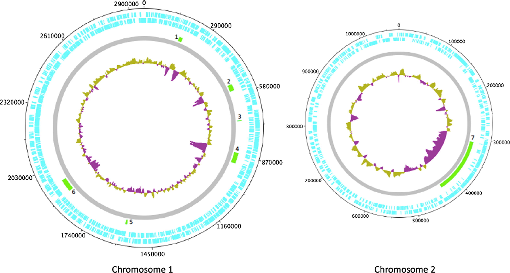

Cholera, *Vibrio cholerae*, and *V. cholerae* Lineages
======================================================

Introduction
------------

This chapter will give you an overview of cholera, the species *Vibrio cholerae*, the main lineages of *V. cholerae*, and the most current pandemic lineage of *V. cholerae*, 7PET.

Acute Watery Diarrhoea, the Disease Cholera and its Epidemiology
----------------------------------------------------------------

Cholera is a disease characterised by acute watery diarrhoea. It is an infection caused by a water-borne bacterium
called *Vibrio cholerae*, a curved Gram-negative rod.

  The bacterium *V. cholerae*. Image credit: Tom Kirn, Ron Taylor, Louisa Howard - Dartmouth Electron Microscope Facility.

The *V. cholerae* bacterium is usually tranmitted by the faecal-oral route, that is, 
people usually catch cholera by eating food or drinking water that has been contaminated
with human faeces containing *V. cholerae*.

.. figure:: FaecalOralRoute.jpg
  :width: 500

  The faecal-oral route for disease transmission. The orange lines represent barriers, ie. toilets, safe water, hygiene and handwashing. Image credit: Howard G., Bartam J., Williams A., Overbo A., Fuente D., Geere J.A. Domestic water quantity, service level and health, second edition. Geneva: World Health Organization; 2020.

Cholera outbreaks typically occur in places where there is poor access
to clean water and poor sewage infrastructure. These include low-income settings in which there is poor water sanitation infrastructure, 
or places in which there is a humanitarian crisis (e.g. an earthquake or war) that has disrupted the water sanitation infrastructure.

.. figure:: Wastewater.jpg
  :width: 350

  Children playing in a waste water drainage area that was found to be contaminated with *V. cholerae*. Image credit: Amibola Aman-Oloniyo, Nigeria.

Once ingested by a human host, the *V. cholerae* bacteria multiply in the human intestine. The
bacteria attach to the epithelial cells of the intestine and release **cholera toxin**. Cholera toxin
binds to the intestinal epithelial cell surface, and stimulates the cells to secrete ions and water into
the intestinal lumen, resulting in acute watery diarrhoea. Therefore, cholera toxin is the key **virulence factor** 
of *V. cholerae*. 

.. figure:: CholeraToxin.jpg
  :width: 450

  Cholera toxin (Ctx) is a protein complex that consists of one CtxA subunit bound to five CtxB subunits. This image shows the structure of the CtxB pentamer. Image credit: Wikipedia user Astrojan.

Note that *V. cholerae* is not the only pathogen that can cause acute watery diarrhoea; similar symptoms also be caused by other bacteria
such as enterotoxigenic *E. coli* (ETEC). 

The Species *Vibrio cholerae* and its Geographic Distribution
-------------------------------------------------------------

The species *V. cholerae* is distributed globally, and is a very diverse species with many different lineages. Importantly, at present there is actually
only one lineage of *V. cholerae* which causes pandemic/epidemic cholera, and we will discuss this lineage, which known as
**'7PET'**, in more detail below. The 7PET lineage is an extremely infectious and virulent lineage of *V. cholerae*. 

There are many other non-pandemic/non-epidemic lineages of *V. cholerae* found around the world that do not cause pandemic/epidemic
cholera.

.. figure:: GlobalDistribution.jpg
  :width: 650

  The global distribution of the bacterium *V. cholerae*, including representatives of many different lineages of *V. cholerae*, including both the current pandemic lineage (7PET), as well as other many other lineages, which are not pandemic-causing/epidemic-causing. Triangles indicate where *V. cholerae* was detected. The studies shown here are actually only a small fraction of the studies published for certain areas and should guide as an example. Image credit: `Lutz et al 2013`_.

While 7PET appears to have evolved to become a human pathogen (`Feng et al 2008`_, `Chun et al 2009`_, `Hu et al 2016`_, `Mutreja & Dougan 2020`_),
the other current lineages of *V. cholerae* are non-pandemic/non-epidemic lineages. These non-pandemic/non-epidemic lineages of *V. cholerae* are often found in brackish water or saltwater in association with shellfish
such as crabs and shrimp, or in rivers or freshwater lakes. 

.. _Chun et al 2009: https://pubmed.ncbi.nlm.nih.gov/19720995/

.. _Feng et al 2008: https://pubmed.ncbi.nlm.nih.gov/19115014/

.. _Hu et al 2016: https://pubmed.ncbi.nlm.nih.gov/27849586/

.. _Mutreja & Dougan 2020: https://pubmed.ncbi.nlm.nih.gov/31345641/

.. figure:: VibrioCholeraeInSea.jpg
  :width: 800

  Non-pandemic/non-epidemic lineages of *V. cholerae* are part of the bacterioplankton in aquatic environments. Image credit: `Lutz et al 2013`_.

.. _Lutz et al 2013: https://pubmed.ncbi.nlm.nih.gov/24379807/

The History of Cholera: the Seven Historically Recorded Pandemics
-----------------------------------------------------------------

A disease that sounds like cholera was recorded in ancient India and China. Since the early 1800s there have
been seven historically recorded cholera pandemics caused by *Vibrio cholerae*. The 7th pandemic is the current
and ongoing cholera pandemic, and has been caused by the *V. cholerae* lineage known as 7PET, which we
will discuss below. There were six previous historically recorded pandemics since the early 1800s.
The 6th pandemic occurred from 1899 to 1923, after which there were only localised outbreaks in Asia for several decades,
and then the 7th pandemic started in 1961 and continues at present (`Feng et al 2008`_). 

.. _Feng et al 2008: https://pubmed.ncbi.nlm.nih.gov/19115014/  

.. figure:: SevenPandemics.png
  :width: 650

  A timeline of the seven historically recorded pandemics. The current pandemic is the 7th pandemic and is caused by the 7PET lineage of *V. cholerae*. 

.. figure:: SnowCholeraMap.jpg
  :width: 500
  
  Map of cholera cases in London in 1854 made by the doctor John Snow during the third historically recorded cholera pandemic. Cholera cases are highlighted in black. Image credit: Original map made by John Snow in 1854.

The Classical Biotype and the El Tor Biotype
--------------------------------------------

The 7th pandemic isolates are described as having the **'El Tor biotype'**, to distinguish them from earlier form of *V. cholerae* that caused 
the 6th pandemic, which were described to as having the **'Classical biotype'**. These biotypes are based on a particular set of laboratory tests (about four
or five laboratory tests, depending on the version of the protocol), which test things like susceptibility to infection by particular bacteriophages, 
susceptibility to a particular antibiotic, presence of a particular biochemical pathway, and effect on red blood cells (`CDC 1994`_).  
The current pandemic lineage of *V. cholerae* is called '7PET' because it shows the El Tor biotype: '7PET'
stands for '7th pandemic El Tor'. 

.. _CDC 1994: https://stacks.cdc.gov/view/cdc/52473

.. figure:: LabTests.png
  :width: 250

  A set of about four or five laboratory tests are used to determine the biotype of *V. cholerae*, which is a laboratory phenotype that can be used to predict whether isolates of the *V. cholerae* causing a particular outbreak are from the 7th pandemic (i.e. belong to the 7PET lineage). Image credit: DynV at openclipart.org.

For many decades these laboratory tests have been used to find out whether the *V. cholerae*
causing an outbreak have the El Tor biotype (`CDC 1994`_), so to predict whether they are likely to be pandemic-causing/epidemic-causing *V. cholerae* (7PET). 
However, although the lineage causing the 7th pandemic, 7PET, shows the El Tor biotype in laboratory tests, some other
lineages of *V. cholerae* also show the El Tor biotype in laboratory tests (see Fig. 1. in `Chun et al 2009`_). 
As we will discuss later in this course, whole genome sequencing tells us far more accurately whether isolates from an 
outbreak are pandemic-causing/epidemic-causing *V. cholerae* (i.e. are 7PET). 

.. _Chun et al 2009: https://pubmed.ncbi.nlm.nih.gov/19720995/

The Classical Lineage
---------------------

Interestingly, we now know that, at the genetic level, the biotype phenotype is determined by several 
different genes (`Dorman 2020`_). The difference in biotype between isolates from the 6th and 7th pandemic 
reflects that there are genetic differences in these biotype-determining genes between the *V. cholerae* that caused these two pandemics (`Dorman 2020`_). 
Indeed, we now know, based on whole genome sequencing data, that the 6th pandemic is actually genetically quite different from the 7th pandemic and 
was actually caused by a different **lineage** (a genetically different subtype) of *V. cholerae* than the 7th pandemic. You can
think of these different lineages as being different branches of the family tree of *V. cholerae*. 
We call the lineage that caused the 6th pandemic the **'Classical lineage'**. 

The Classical lineage of *V. cholerae* caused the 6th pandemic, which ended in 1923, and the Classical lineage has
more or less died out since then and is very rarely seen nowadays (although a Classical lineage isolate 
from Ghana in 2010 was reported by `Adade et al 2022`_). 
Before talking more about the Classical lineage and other lineages of *V. cholerae*, we will take a brief
digression to talk about the *V. cholerae* genome and whole genome sequencing for *V. cholerae*. 

.. _Dorman 2020: https://www.sanger.ac.uk/theses/md25-thesis.pdf

.. _Adade et al 2022: https://pubmed.ncbi.nlm.nih.gov/36312941/

Introduction to the *V. cholerae* Genome 
----------------------------------------

The genetic material of *V. cholerae* is usually found in two circular chromosomes. The larger chromosome is known as Chromosome 1
and the smaller chromosome as Chromosome 2. These two chromosomes each contain a long (circular) molecular of DNA, and together these
two long pieces of DNA are called the **genome** of *V. cholerae*. In total
these circular chromosomes contain about 4 million base-pairs (4 Mb) of base-pairs, where Chromosome 1 is about 3 Mb and Chromosome 2 about 1 Mb.
Each of these chromosomes includes many hundred of genes, and in total the two chromosomes contain almost 4000 genes in a typical isolate
from the 7PET lineage (`Heidelberg 2000`_). 

.. _Heidelberg et al 2000: https://pubmed.ncbi.nlm.nih.gov/10952301/

  A diagram showing the two circular chromosomes of *V. cholerae*, for a typical isolate of the current pandemic lineage (7PET lineage). The outside circles in blue represent genes on the forward and reverse strand of the DNA. Between them, the two chromosomes of *V. cholerae* include almost 4000 genes in a typical isolate from the 7PET lineage. The innermost circle shows below average (purple) and above average (mustard) GC content along the chromosomes. Other key features of the chromosomes are highlighted as green boxes, where the green box labelled '5' is the region containing the two genes that encode the A and B subunits of the cholera toxin. This region is known as the 'CTX region'. Image source: `Mutreja & Dougan 2020`_.

.. _Mutreja & Dougan 2020: https://pubmed.ncbi.nlm.nih.gov/31345641/

In isolates of the current pandemic lineage (7PET lineage), we usually see the two genes that encode the A and B subunits of the cholera toxin close together
on Chromosome 1. These two genes are called the *ctxA* and *ctxB* genes. If we could zoom in a lot on chromosome 1, we would be able to see the
*ctxA* and *ctxB* genes close together in a region known as the **CTX regione**. Practically 100% of isolates of the current pandemic lineage (7PET) contain the CTX region in their chromosome, and so produce cholera toxin, and therefore cause a human host to suffer acute watery diarrhoea. Most non-pandemic/non-epidemic lineages
of *V. cholerae* do not have the *ctxA* and *ctxB* genes, and so do not produce cholera toxin. However, a small number of non-pandemic/non-epidemic lineages of *V. cholerae*, most
of which are relatively closely related to 7PET, sometimes do have *ctxA* and *ctxB* genes (`Chun et al 2009`_).

.. _Chun et al 2009: https://pubmed.ncbi.nlm.nih.gov/19720995/

.. figure:: CtxProphage.jpg
  :width: 850

  A diagram showing just the CTX region of Chromosome 1 of a typical isolate of the current pandemic lineage (7PET lineage), isolate N16961 (bottom row), as well as a typical isolate of the lineage that caused the previous pandemic (i.e. Classical lineage), isolate O395 (top row). The arrows represent genes, and the *ctxA* and *ctxB* genes encode the A and B subunits, respectively, of the cholera toxin protein complex. Image source: `Pant et al 2020`_.

.. _Pant et al 2020: https://pubmed.ncbi.nlm.nih.gov/31272871/

Genetic Variation in *V. cholerae*
----------------------------------

-Discuss possible presence of the cholera toxin genes that are found as part of the cholera prophage region, possible presence of plasmids containing AMR genes.
N16961 is the “reference strain”
Rare V. cholerae non-O1/O139 have the two chromosomes fused into one (Johnson et al 2015) 
Rare V. cholerae O1 El Tor have an additional 0.9-Mb replicon; genome size 5.0 Mb (Okada et al 2015)

Introduction to Whole Genome Sequencing for *V. cholerae*
---------------------------------------------------------

-brief mention that the V. cholerae genome was first published in 2000 by Heidelberg et al PMID:10952301;

Lineages of *V. cholerae*
-------------------------

-clear explanation of tree for the V. cholerae species (Domman et al 2017 Americas paper) showing the lineages ( explain trees)
-brief mention of the lineages’ geographic distribution (non-7PET lineages found in coastal and fresh water around the world, 7PET found in humans) and role in cholera and diarrhoeal illness; brief mention that epidemic/pandemic cholera is caused by 7PET and spread by human travel & poor sanitation, and that non-7PET lineages only cause very small outbreaks that don’t reach large numbers and so are only of minor public health concern;

7PET
----

-its emergence in the 1960s, its very high virulence & very high transmissibility; its causing the 7th pandemic and causing all large cholera outbreaks & epidemics since the 1960s; brief mention of the need for a rapid public health response (WASH, treatment centres, contact tracing, public information campaign, vaccination, etc.) as soon as possible at the start of a 7PET outbreak, to contain/reduce/stop it;
-brief mention of serogroup as a likely virulence factor, and that 7PET usually has O1 (mostly) or O139 serogroup (sometimes), but that some other lineages are also O1 or O139;
-a brief history of the global spread of the current pandemic lineage (7PET), including mention of the Bay of Bengal being a region where cholera is endemic and from where 7PET has spread around the world, and brief history of introductions of 7PET into Africa; brief mention of countries worldwide where 7PET is now endemic;
-brief mention of how 7PET has split into sublineages, and brief mention that new sublineages have arisen over time in the Bay of Bengal region and spread around the world; brief mention of names of sublineages previously or currently found in Africa;
-the recently revised GTFCC definitions of cholera cases and ‘cholera-free’ country statuses;
-brief mention that 7PET can be controlled by vaccination; that vaccines have high efficiency against 7PET but are in short supply and that genomic information has great potential to help us decide who to vaccine (e.g. populations exposed to 7PET, especially those exposed to multi-drug resistant 7PET sublineages)

Brief Summary of Take-home Messages
-----------------------------------

The key take-home messages of this chapter are:

* Cholera is characterised by acute watery diarrhoea
* Cholera is caused by ingestion of *Vibrio cholerae*
* The acute water diarrhoea is triggered by cholera toxin produced by *V. cholerae*
* Cholera toxin is the key virulence factor of *V. cholerae* 
* *V. cholerae* is distributed globally, and is a very diverse species with many different lineages 
* Most lineages of *V. cholerae* do not cause pandemic/epidemic cholera
* At present there is only one lineage that causes pandemic/epidemic cholera: 7PET 
* 7PET is the only high-risk lineage of *V. cholerae* at present
* Biotype is a laboratory phenotype used to predict whether *V. cholerae* isolates are epidemic-causing/pandemic-causing (i.e. 7PET)
* Biotype is not a perfect predictor of 7PET, because a small % of non-pandemic/non-epidemic lineages have the El Tor biotype
* The genome of a 7PET isolate has 4 Mb split over two chromosomes, and contains about 4000 genes
* Practically all 7PET isolates have genes for cholera toxin (*ctxAB* genes)
* Presence of *ctxAB* is not a perfect predictor of 7PET, because a small % of non-pandemic/non-epidemic lineages have *ctxAB* 
* Whole genome sequencing is the most accurate way to determine whether an outbreak is 7PET (pandemic-causing/epidemic-causing) 
* A 7PET outbreak requires a rapid and large public health response

Suggested Further Reading
-------------------------

Suggested further reading to go with this chapter is the nice review by `Mutreja & Dougan 2020`_ on "Molecular epidemiology and intercontinental spread of cholera". 

.. _Mutreja & Dougan 2020: https://pubmed.ncbi.nlm.nih.gov/31345641/

Contact
-------

I will be grateful if you will send me (Avril Coghlan) corrections or suggestions for improvements to my email address alc@sanger.ac.uk

Acknowledgements
----------------

Contributors to this course: Avril Coghlan, Nick Thomson. 

