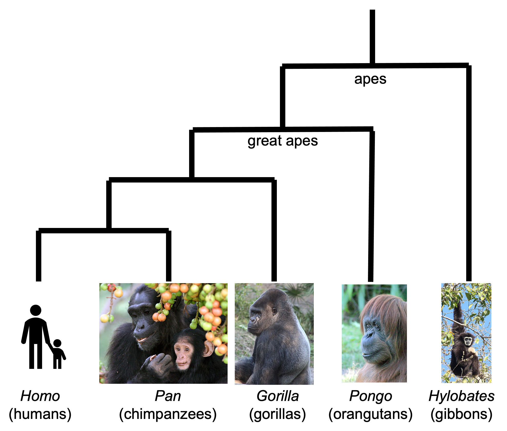

Module 1.2: Classification of *Vibrio cholerae*
===============================================

Introduction to Module 1.2
--------------------------

Welcome!
In Module 1.2, we will talk about how *Vibrio cholerae* has been historically classified in different ways:
by serogroup, by biotype, and more recently (and most accurately) by analysis of whole genome sequencing (WGS) data.
This module may take you roughly one hour to work through (maybe a bit more or less than that, depending on your own pace).
While we will explain terms as we go along, we have also included a `glossary of key terms for Module 1`_.

.. _glossary of key terms for Module 1: https://cholerabook.readthedocs.io/en/latest/vibriogenomes_glossary.html

Serogroups of *V. cholerae*
---------------------------

The outer membrane of the cell membrane of Gram-negative bacteria such as *V. cholerae* contains a component known as
'lipopolysaccharide' (LPS) that serves as a barrier to protect the bacteria from external stresses. Lipopolysaccharide
molecules are very large molecules consisting of three parts: an outer core polysaccharide known as the **'O-antigen'**, 
an inner core oligosaccharide, and Lipid A (Figure 1). 

.. figure:: LPS.png
  :width: 200

  Figure 1. `Structure of a lipopolysaccharide`_. Image attribution: this image by `Mike Jones`_ is licensed under `CC BY-SA 3.0`_.

.. _Mike Jones: https://en.wikipedia.org/wiki/User:Adenosine?rdfrom=commons:User:Adenosine

.. _Structure of a lipopolysaccharide: https://en.wikipedia.org/wiki/Lipopolysaccharide#/media/File:LPS.svg

.. _CC BY-SA 3.0: https://creativecommons.org/licenses/by-sa/3.0/

Within the species *V. cholerae* there is considerable variation in the surface structure of the O-antigen. 
A subgroup of *V. cholerae* bacteria that share the same distinctive surface structure in their O-antigen are
said to belong to the same **'serogroup'**. Since the 1930s, *V. cholerae* isolates have been classified into 
many different serogroups on the basis of laboratory tests that reflect differences in the interactions of the 
the particular O-antigen produced by each serogroup with serogroup-specific antibodies from the host (`Murase et al 2022`_).
So far 210 different serogroups have been identified within *V. cholerae*, named
O1, O2, O3, ... O210 (`Murase et al 2022`_). To determine whether a particular *V. cholerae* isolate belongs to the O1 serogroup, one can carry out a
relatively rapid laboratory test, to see if the *V. cholerae* cells will agglutinate in O1 antisera (containing anti-O1-antigen antibodies) (`CDC 1994`_); while to determine whether a
*V. cholerae* isolate belongs to the O2 serogroup, one must test for agglutination in O2 antisera (containing anti-O2-antigen antibodies). In other words, the serogroup
is a laboratory phenotype that reflects the surface structure of the O-antigen. 

.. _Murase et al 2022: https://pubmed.ncbi.nlm.nih.gov/35930328/

.. _CDC 1994: https://stacks.cdc.gov/view/cdc/52473

Most isolates belonging to the current pandemic lineage (7PET lineage) of *V. cholerae* have the O1 serogroup, while a small fraction of 7PET isolates have serogroup O139 (`Mutreja et al 2011`_,
`Moore et al 2014`_). 
*V. cholerae* isolates that belong to non-epidemic lineages can also sometimes have serogroups O1 or O139, or any of the other >200 known *V. cholerae* serogroups.
Therefore, if a *V. cholerae* isolate from a patient with acute watery diarrhoea is shown via laboratory testing to have serogroup O1 or O139, then there is a strong possibility
that the diarrhoea was caused by 7PET. However, it's important to bear in mind that one can not be 100% sure that the isolate is 7PET, since some non-epidemic 
lineages have serogroups O1 or O139, for example, lineage MX-2 (Figure 8; `Domman et al 2017`_). 

.. _Mutreja et al 2011: https://pubmed.ncbi.nlm.nih.gov/21866102/

.. _Moore et al 2014: https://pubmed.ncbi.nlm.nih.gov/24575898/

.. _Domman et al 2017: https://pubmed.ncbi.nlm.nih.gov/29123068/

Because it is relatively cheap, easy and rapid, laboratory identification of serogroup is currently an important method of predicting whether an isolate is 7PET (`CDC 1994`_, `WHO 2023`_). 
For example, in surveillance units where there is no confirmed cholera outbreak, the WHO currently defines a 'confirmed cholera case' as:

*"Any person infected with Vibrio cholerae O1 or O139 identified by presumptive identification
(culture/seroagglutination) or PCR. The strain should also be demonstrated to be toxigenic (by PCR)
if there is no concomitant confirmed cholera outbreak in other surveillance unit(s) of the country
and there is no established epidemiological link to a confirmed cholera case/ source of exposure
in another country"* (`WHO 2023`_).

.. _CDC 1994: https://stacks.cdc.gov/view/cdc/52473

.. _WHO 2023: https://www.gtfcc.org/wp-content/uploads/2023/02/gtfcc-public-health-surveillance-for-cholera-interim-guidance.pdf

Because isolates of the current pandemic lineage (7PET lineage) have either serogroup O1 or O139,
sometimes the term 'non-O1 *V. cholerae* (NOVC)' or 'non-O1/non-O139 *V. cholerae*' (NTVC)
is used to refer to non-epidemic lineages of *V. cholerae* 
(e.g. `Morris 1990`_, `Rehm et al 2023`_). However, it's worth being aware in the back of your mind that 
some non-epidemic lineages of
*V. cholerae* have serogroups O1 or O139, such as MX-2 (Figure 8; `Domman et al 2017`_).

.. _Morris 1990: https://pubmed.ncbi.nlm.nih.gov/2286218/

.. _Rehm et al 2023: https://pubmed.ncbi.nlm.nih.gov/37530997/

The Classical Biotype and the El Tor Biotype
--------------------------------------------

In 1905 a doctor named Felix Gotschlich described  *V. cholerae* that had a different set of biochemical characteristics, or 'biotype' than
had been previously observed for *V. cholerae* (reviewed in `Hu et al 2016`_; `Chastel 2007`_). This novel biotype was first seen in the El Tor Quarantine Station in Egypt,
and so the new biotype of *V. cholerae* was named the '**El Tor biotype**', to distinguish it from earlier *V. cholerae* isolates, which were
described as having the '**Classical biotype**'. 
These biotypes are based on a particular set of laboratory tests (about four
or five laboratory tests, depending on the version of the protocol), which test things like susceptibility to infection by particular bacteriophages,
susceptibility to a particular antibiotic, presence of a particular biochemical pathway, and effect on red blood cells (Figure 2; `Cvjetanovic & Barua 1972`_, `CDC 1994`_, `Dorman 2020`_).
Isolates of the 7PET lineage have the El Tor biotype, and in fact the name '7PET' stands for '7th pandemic El Tor'.
In contrast, Classical lineage isolates have the Classical biotype.

.. _Hu et al 2016: https://pubmed.ncbi.nlm.nih.gov/27849586/

.. _CDC 1994: https://stacks.cdc.gov/view/cdc/52473

.. _Dorman 2020: https://www.sanger.ac.uk/theses/md25-thesis.pdf

.. _Chastel 2007: https://www.biusante.parisdescartes.fr/sfhm/hsm/HSMx2007x041x001/HSMx2007x041x001x0071.pdf

.. _Cvjetanovic & Barua 1972: https://pubmed.ncbi.nlm.nih.gov/4561957/

.. figure:: Biotype.png
  :width: 600

  Figure 2. `Summary of V. cholerae O1 biotyping phenotypes`_. Laboratory tests are used to determine the 'biotype' of *V. cholerae*, a laboratory phenotype that can be used to predict whether isolates of the *V. cholerae* causing a particular outbreak belong to the epidemic-causing Classical or 7PET lineages. Isolates of the Classical lineage have the Classical biotype, and isolates of the 7PET lineage have the El Tor biotype. Image attribution: this image by `Matt Dorman`_, based on Table 1.1 in `Dorman 2020`_, is licensed under `CC BY 4.0`_. 

.. _CC BY 4.0: https://creativecommons.org/licenses/by/4.0/

.. _Matt Dorman: https://www.universityofgalway.ie/our-research/people/mathematical-statistical-sciences/matthewdorman/

.. _Dorman 2020: https://www.sanger.ac.uk/theses/md25-thesis.pdf

.. _Summary of V. cholerae O1 biotyping phenotypes: https://www.sanger.ac.uk/theses/md25-thesis.pdf

Although the lineage causing the 7th pandemic, 7PET, shows the El Tor biotype in laboratory tests, some 
non-epidemic lineages of *V. cholerae* also show the El Tor biotype in laboratory biotyping tests (e.g. *V. cholerae* isolates TM11079-80 and 12129(1), which both have the El Tor
biotype and belong to non-epidemic lineages; `Chun et al 2009`_).
Therefore, the biotype is not very useful for distinguishing 7PET from non-epidemic lineages of *V. cholerae*.
As we will discuss later in this course, whole-genome sequencing tells us far more accurately whether isolates from an
outbreak are 7PET or not. 

.. _Chun et al 2009: https://pubmed.ncbi.nlm.nih.gov/19720995/

.. _Cvjetanovic & Barua 1972: https://pubmed.ncbi.nlm.nih.gov/4561957/

.. _CDC 1994: https://stacks.cdc.gov/view/cdc/52473

Note that you may see some mention in the literature of variants of the El Tor biotype, such as
the 'Matlab variants', 'Mozambique variants', 'Haitian variants', 'altered El Tor biotype', 'hybrid El Tor' or 'atypical El Tor' (e.g. in `Bhandari et al 2021`_, 
`Montero et al 2023`_). These variants do not correspond exactly to the El Tor biotype, e.g. they may differ from El Tor in a small number of the laboratory test results in Figure 2.
Isolates with the Matlab/Mozambique/Haitian variants of El Tor biotype or altered/hybrid/atypical El Tor biotype all belong to the 7PET lineage, but
just give slightly different results in the biotyping tests (Figure 2) compared to other 7PET isolates. 

.. _Montero et al 2023: https://pubmed.ncbi.nlm.nih.gov/37215733/

.. _Bhandari et al 2021: https://pubmed.ncbi.nlm.nih.gov/33482361/

Tracing the Evolutionary History of *V. cholerae* Lineages Using Whole Genome Sequencing (WGS) Data 
---------------------------------------------------------------------------------------------------

You have probably heard of the famous evolutionary biologist Charles Darwin, who proposed in his book `'The Descent of Man, and Selection in Relation to Sex'`_ , published
in 1871, that humans are closely related to chimpanzees and other great apes. At the time, this idea caused great controversy among both fellow scientists and the general public. 
However, the hypothesis that humans are closely related to chimpanzees and other great apes has been strongly supported by comparing the complete DNA (that is, *whole
genome sequence* (WGS) data) of chimpanzees, humans and other great apes, and building a *phylogenetic tree*, that is, a tree that attempts to recover the evolutionary history
of the apes since their last comman ancestor, and to understand the
relationships between the individual species, based on genetic differences between their DNA (Figure 3). 
Put simply, species that have greatest similarity in their DNA are placed closest in the tree, assuming that they shared a common ancestor most recently.
Species that have many differences between their DNA are placed further away in the tree, assuming that their last common ancestor was a long time ago.
In module 1.4 we will talk more about DNA and how DNA information 
can be used to build a phylogenetic tree. 

.. _'The Descent of Man, and Selection in Relation to Sex': https://www.gutenberg.org/ebooks/2300

  Figure 3. A phylogenetic tree of the apes (an evolutionary tree based on DNA evidence), showing that humans' closest relatives are chimpanzees. Image attribution: this image by `Avril Coghlan`_ is licensed under `CC BY 4.0`_. This work uses the photograph of chimpanzees, '`Adult female-infant wild chimpanzees feeding on Ficus sur fruits in Kibale National Park, Uganda`_' by Alain Houle (Harvard University), which is licensed under `CC BY 4.0`_; the photograph of a gorilla, '`Silverback Gorilla`_' by Wikimedia user Tyeashap, which is licensed under `CC BY 4.0`_; the photograph of an orangutan, '`Female orangutan`_' by W. H. Calvin, which is licensed under `CC BY 4.0`_; and the photograph of a gibbon, '`Lar Gibbon (Hylobates lar)`_' by Jan Ebr, which is licensed under `CC BY 4.0`_.

.. _CC BY 4.0: https://creativecommons.org/licenses/by/4.0/

.. _Avril Coghlan: https://www.linkedin.com/in/avril-coghlan-4409545/?originalSubdomain=uk

.. _Adult female-infant wild chimpanzees feeding on Ficus sur fruits in Kibale National Park, Uganda: https://commons.wikimedia.org/wiki/File:Adult_female_and_infant_wild_chimpanzees_feeding_on_Ficus_sur.jpeg

.. _Silverback Gorilla: https://commons.wikimedia.org/wiki/File:Silverback_Gorilla_02.jpg

.. _Female orangutan: https://commons.wikimedia.org/wiki/File:Orangutan_female_quarterview_2004.jpg

.. _Lar Gibbon (Hylobates lar): https://en.m.wikipedia.org/wiki/File:Hylobates_lar_245798133.jpg

Just like for the apes, we can use analyse DNA sequence information (WGS data) for isolates *Vibrio cholerae* lineages, to build a phylogenetic tree for
*V. cholerae* (Figure 4). This tree is our best attempt to reconstruct the evolutionary history of the *V. cholerae* lineages since their last common 
ancestor, and to understand the relationships between the different *V. cholerae* lineages, based on comparing their DNA.

.. figure:: Lineages_simple.png
  :width: 350

  Figure 4. A phylogenetic tree of some of the known lineages of *V. cholerae*. The triangles at the ends of branches represent existing lineages. The red dot represents the last common ancestor of the Classical and 7PET lineages, while the yellow dot represents the last common ancestor of the ELA-3 and 7PET lineages. The tree was based on information in Supplementary Figure 2 and Table S3 of `Domman et al 2017`_, and with the addition of information on the L3b and L9 lineages that are discussed below. Image attribution: this image by `Avril Coghlan`_ is licensed under `CC BY 4.0`_.

.. _CC BY 4.0: https://creativecommons.org/licenses/by/4.0/

.. _Avril Coghlan: https://www.linkedin.com/in/avril-coghlan-4409545/?originalSubdomain=uk

.. _Chun et al 2009: https://pubmed.ncbi.nlm.nih.gov/19720995/

.. _Hao et al 2023: https://pubmed.ncbi.nlm.nih.gov/37146742/

.. _Domman et al 2017: https://pubmed.ncbi.nlm.nih.gov/29123068/

The 7PET lineage, which has caused the current pandemic, and the Classical lineage, which caused the 6th historically
recorded pandemic, are relatively closely related. We know this by analysing whole-genome sequencing data (that is, genetic information in DNA) in order to make a 'phylogenetic tree' for *V. cholerae*, that is, a tree that depicts the evolutionary relationships between the different lineages of *V. cholerae* and shows how they descended from a common ancestor (Figure 4). 
The phylogenetic tree represents our best guess at the evolutionary relationships between different lineages of *V. cholerae*, based on similarities and
differences between their whole-genome sequences.

.. _Domman et al 2017: https://pubmed.ncbi.nlm.nih.gov/29123068/

You may have encountered phylogenetic trees before, but if not, don't worry, we will be discussing them a lot in this course, including how to build them based on whole-genome sequencing data.
In this tree, the arrow of time goes from left to right, with the left-hand side of the tree being the furthest back in history and the
very right-hand side of the tree being the present time. The triangles at the right-hand side of the tree represent different current lineages of *V. cholerae*.

If you look at two of the triangles (representing lineages) at the ends of the branches, e.g. the triangles representing 7PET and Classical, and trace
back along two branches from right to left, you will eventually reach an 'internal node' where those branches meet, further to the left in the tree. This internal
node represents the last common ancestor of the two lineages, e.g.
the last common ancestor of 7PET and Classical (red circle), which is estimated to have lived about 1880 (`Feng et al 2008`_). On the other hand,
the last common ancestor of 7PET and ELA-3 (yellow circle) lived even longer ago.

.. _Feng et al 2008: https://pubmed.ncbi.nlm.nih.gov/19115014/

What the tree tells us is that 7PET and Classical, the two lineages that have caused pandemics, are relatively closely related *V. cholerae* lineages. 
7PET is also relatively closely related to non-epidemic lineages of *V. cholerae*, including MX-2, Gulf Coast and ELA-3. 

Practically 100% of 7PET isolates produce cholera toxin. Some isolates from non-epidemic lineages are also predicted to produce cholera toxin (because they have the genes encoding cholera toxin; `Chun et al 2009`_, `Domman et al 2017`_; `Hao et al 2023`_), especially isolates from lineages that are relatively closely related to
7PET, such as MX-2 and Gulf Coast (Figure 5).

.. figure:: Lineages.png
  :width: 400

  Figure 5. A phylogenetic tree of some of the known lineages of *V. cholerae*, showing which lineages are predicted to produce cholera toxin, based on presence of the genes encoding cholera toxin). This tree was based upon information in Supplementary Figure 2 and Table S3 of `Domman et al 2017`_, and with the addition of information on L3b and L9. Image attribution: this image by `Avril Coghlan`_ is licensed under `CC BY 4.0`_.

.. _CC BY 4.0: https://creativecommons.org/licenses/by/4.0/

.. _Avril Coghlan: https://www.linkedin.com/in/avril-coghlan-4409545/?originalSubdomain=uk

Later in the course you will be learning a lot about how to build phylogenetic trees yourself, and how to interpret
them to investigate the relationships between different sublineages of 7PET that have caused different 7PET outbreaks, and to
gain insights into how 7PET is spreading regionally and globally. You will see that it is often very interesting and informative to display information
beside a phylogenetic tree; for example, in Figure 5 we plotted presence/absence of particular genes. We can also display additional
non-genetic data that we have about the isolates (known as **'metadata'**), such as the exact location or date of collection of the isolates, or
the serogroup or antimicrobial resistance phenotypes of isolates as determined by laboratory tests.

The Revised GTFCC Definitions of Cholera Cases and Cholera-free Country Statuses
--------------------------------------------------------------------------------

The WHO's Global Task Force on Cholera Control (GTFCC) is a partnership of more
than 50 institutions, including non-governmental organisations (NGOs), academic institutions, and United Nations (UN) agencies,
that are working together to eliminate cholera. By 2030 they aim to reduce 
cholera deaths by at least 90%, and to eliminate cholera altogether in 20
countries (see the `GTFCC Roadmap 2030`_).

.. _GTFCC Roadmap 2030: https://www.gtfcc.org/about-cholera/roadmap-2030/

Because non-epidemic lineages of *V. cholerae* are found in many countries around
the world, the GTFCC have recently revised their definition of the disease 'cholera'
to specifically mention the epidemic-causing lineage 7PET.
That is, they define cholera as: 

*"disease caused by toxigenic Vibrio cholerae O1 or O139, carrying the ctxAB genes encoding the cholera toxin (CT), linked to the seventh pandemic lineage or any lineage that might emerge with similar properties"* (`GTFCC 2022`_).

.. _GTFCC 2022: https://www.gtfcc.org/wp-content/uploads/2022/06/7th-meeting-of-the-gtfcc-working-group-on-surveillance-2022-report.pdf

As mentioned above, non-epidemic lineages of *V. cholerae* such as MX-2 sometimes cause small outbreaks of mild diarrhoea,
but these are considered of relatively minor public health importance compared to outbreaks caused by 7PET.
The GTFCC is aiming to eliminate 7PET in 20 countries by 2030,
not to eliminate all diarrhoeal illness caused by non-epidemic *V. cholerae*. 
This means that in order to prove that
a particular country has become 'cholera-free', there will need to be
sufficient data to show that diarrhoeal illness caused by 7PET has definitely disappeared from that country. 
One type of data that will be very useful for this purpose is whole-genome sequencing data for *V. cholerae*, which
can be used to accurately distinguish 7PET from non-epidemic lineages of *V. cholerae*, as we will discuss
later in this course. 

Brief Summary
-------------

The key take-home messages of this chapter are:

* Cholera, a disease characterised by acute watery diarrhoea, is caused by ingestion of *Vibrio cholerae*
* Cholera toxin is the most important virulence factor of *V. cholerae*; cholera toxin triggers acute watery diarrhoea
* *V. cholerae* is distributed globally, and is a very diverse species with many different lineages 
* At present there is only one lineage that causes pandemic/epidemic cholera: 7PET, an extremely infectious and virulent lineage
* The genome of a typical 7PET isolate has 4 million base-pairs (4 Mb) of DNA, and contains about 4000 genes
* Practically all 7PET isolates have the genes that encode cholera toxin (genes *ctxA* and *ctxB*)
* A 7PET outbreak requires a rapid and large public health response to halt/reduce it, e.g. WASH, treatment centres, vaccination
* Whole genome sequencing (WGS) can be used to determine whether a new outbreak of diarrhoeal illness is caused by 7PET 

Contact
-------

I will be grateful if you will send me (Avril Coghlan) corrections or suggestions for improvements to my email address alc@sanger.ac.uk

Acknowledgements
----------------

Contributors to this course: Avril Coghlan, Matt Dorman, Ismail Bashir, Anne Bishop, Jolynne Mokaya, Nisha Singh, Nick Thomson. 
