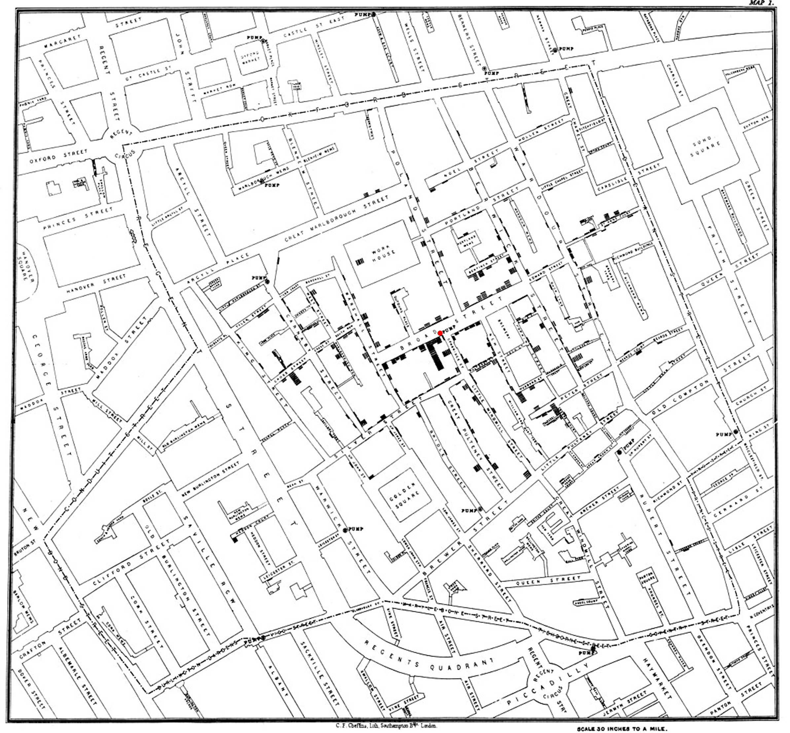
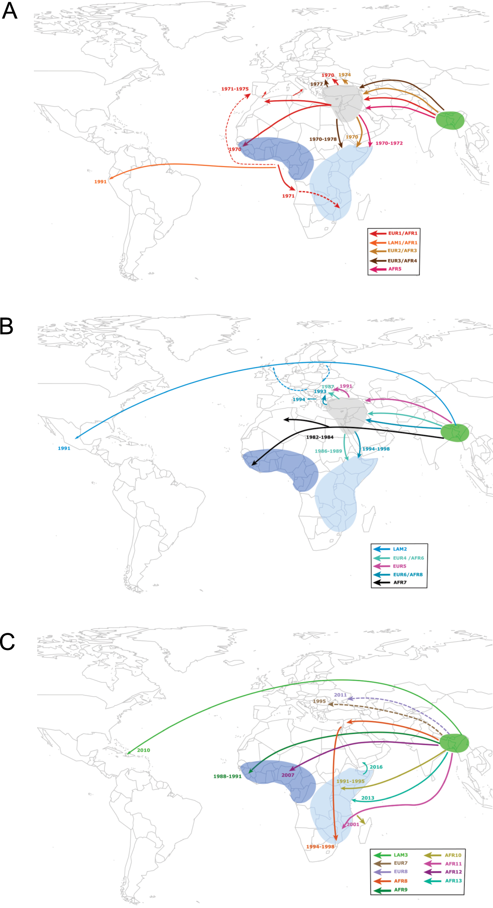
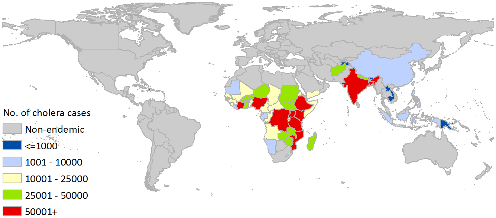

Module 1.3: The History of Cholera Pandemics and Cholera Spread
===============================================================

Introduction to Module 1.3
--------------------------

Welcome!
In Module 1.3, we will talk about historically recorded cholera pandemics, and the history of spread of cholera during the 
current (seventh) pandemic.

The History of Cholera: the Seven Historically Recorded Pandemics
-----------------------------------------------------------------

A disease with symptoms like cholera was recorded in ancient texts from ancient India and China, but we have
little information about those ancient outbreaks (`Pollitzer et al 1959`_).
Since the early 1800s there have been seven historically recorded cholera pandemics (`Kaper et al 1995`_) (a 'pandemic' is
an epidemic that has spread over several countries and usually affects many people; see the `CDC website`_).
The 7th pandemic is the current
and ongoing cholera pandemic, and has been caused by the 7PET lineage (Figure 9).

.. _Kaper et al 1995: https://pubmed.ncbi.nlm.nih.gov/7704895/

.. _Pollitzer et al 1959: https://iris.who.int/handle/10665/41711

.. _CDC website: https://archive.cdc.gov/www_cdc_gov/csels/dsepd/ss1978/lesson1/section11.html

.. figure:: SevenPandemics.png
  :width: 850

  Figure 9. A timeline of the seven historically recorded pandemics. The current pandemic is the 7th pandemic and is caused by the 7PET lineage. Image attribution: this image by `Avril Coghlan`_, inspired by `A timeline showing the seven cholera pandemics throughout history by Laura Olivares Boldú / Wellcome Connecting Science`_, is licensed under `CC BY 4.0`_. With kind permission of Laura Olivares Boldú of Wellcome Connecting Science.

.. _CC BY 4.0: https://creativecommons.org/licenses/by/4.0/

.. _Avril Coghlan: https://www.linkedin.com/in/avril-coghlan-4409545/?originalSubdomain=uk

.. _A timeline showing the seven cholera pandemics throughout history by Laura Olivares Boldú / Wellcome Connecting Science: https://www.yourgenome.org/theme/science-in-the-time-of-cholera/

The 6th pandemic occurred from 1899 to 1923, after which there were only localised outbreaks in parts of Asia for several decades,
and then the 7th pandemic started in 1961 and continues at present (`Feng et al 2008`_). 
We now know that the 6th pandemic  
was actually caused by a different **lineage** of *V. cholerae* than the 7th pandemic. 
We call the lineage that caused the 6th pandemic the **'Classical lineage'** (`Chun et al 2009`_, `Domman et al 2017`_). 
In fact, evidence from *V. cholerae* DNA extracted from a cholera victim who died in 1849 in Phildelphia, USA during the second
pandemic suggests that the Classical lineage also caused the 2nd pandemic (`Devault et al 2014`_).

.. _Domman et al 2017: https://pubmed.ncbi.nlm.nih.gov/29123068/

.. _Chun et al 2009: https://pubmed.ncbi.nlm.nih.gov/19720995/

.. _Devault et al 2014: https://pubmed.ncbi.nlm.nih.gov/24401020/

The Classical lineage has more or less died out since the end of the 6th pandemic (in 1923) 
and is very rarely seen nowadays (e.g. a rare Classical lineage isolate 
from Ghana in 2010 was reported by `Adade et al 2022`_). 

.. _Dorman 2020: https://www.sanger.ac.uk/theses/md25-thesis.pdf

.. _Adade et al 2022: https://pubmed.ncbi.nlm.nih.gov/36312941/

.. _Feng et al 2008: https://pubmed.ncbi.nlm.nih.gov/19115014/  

John Snow and the 1854 Broad Street Cholera Outbreak
----------------------------------------------------

The third cholera pandemic played a key role in this history of Epidemiology and Public Health. In 1854 during this pandemic there was a large outbreak of cholera around Broad Street in London, and a doctor named John Snow carried out a very through investigation of the outbreak, creating a map of cases (Figure 10). From the data he collected, he was able to figure out that cholera was being transmitted through contaminated water from the Broad Street water pump, and also was being spread by contact with another infected person (or their goods) (`Tulchinsky 2018`_). Snow did not know what was the exact contaminant in the water from the Broad Street pump. We now know that it must have contained an epidemic-causing lineage of *V. cholerae*. Snow persuaded the local authorities to remove the handle of the Broad Street pump, and the outbreak ended soon after that. 

.. _Tulchinsky 2018: https://www.ncbi.nlm.nih.gov/pmc/articles/PMC7150208/

  Figure 10. Map of cholera cases in London in 1854 made by the doctor John Snow during the 3rd historically recorded cholera pandemic. Cholera cases are highlighted in black. The Broad Street pump is indicated with a red dot. Image attribution: This image was adapted from the `original map made by John Snow in 1854`_, which is in the Public Domain. The original image was adapted by `Avril Coghlan`_ to indicate the position of the Broad Street pump with a red dot.

.. _original map made by John Snow in 1854: https://en.wikipedia.org/wiki/File:Snow-cholera-map-1.jpg

.. _Avril Coghlan: https://www.linkedin.com/in/avril-coghlan-4409545/?originalSubdomain=uk

Snow's very thorough cholera outbreak investigation, which he published in 1855 (`Snow 1855`_), is still considered an excellent example of how accurate and informative data, and careful data analysis, are extremely important for making good public health decisions. Later in this course, we will be analysing data from more recent cholera outbreaks, using different data sources than John Snow had (e.g. whole-genome sequencing data). 

.. _Snow 1855: https://www.gutenberg.org/ebooks/72894

* Watch a `video on John Snow and the 1854 Broad Street cholera outbreak by Harvard Online`_ (8 minutes).

.. _video on John Snow and the 1854 Broad Street cholera outbreak by Harvard Online: https://www.youtube.com/watch?v=lNjrAXGRda4

The History of 7PET's Global Spread
-----------------------------------

Although the 7PET lineage is estimated to have diverged (split off) from the Classical lineage in around 1880 (`Feng et al 2008`_), the 7PET lineage
does not appear to have been epidemic-causing for the first half of the 1900s (`Hu et al 2016`_). However, evidence suggests that throughout that period the 7PET
lineage was sometimes associated with the human population, and was accumulating evolutionary changes (mutations; `Hu et al 2016`_).
It wasn't until 1961 that the 7th pandemic began, with many cases of cholera caused by 7PET occurring in Indonesia (`Hu et al 2016`_, `Mutreja & Dougan 2020`_).
From Indonesia, 7PET spread to the Bay of Bengal region of India and Bangladesh, and subsequently between the 1960s and 2010 7PET then spread outward from the Bay of Bengal  
to large regions of the world in three 'waves' that overlapped slightly in time, and the isolates in the same 'wave' represent closely related clones of 7PET that spread 
from the Bay of Bengal to the rest of the world at around the same time (`Mutreja et al 2011`_, `Ramamurthy et al 2019`_, `Rouard et al 2022`_; Figure 16).
Each wave included several sublineages of 7PET (Figure 16). 

.. _Feng et al 2008: https://pubmed.ncbi.nlm.nih.gov/19115014/

.. _Hu et al 2016: https://pubmed.ncbi.nlm.nih.gov/27849586/

.. _Mutreja & Dougan 2020: https://pubmed.ncbi.nlm.nih.gov/31345641/

.. _Mutreja et al 2011: https://pubmed.ncbi.nlm.nih.gov/21866102/

.. _Rouard et al 2022: https://pubmed.ncbi.nlm.nih.gov/35787619/

.. _Ramamurthy et al 2019: https://pubmed.ncbi.nlm.nih.gov/31396501/

From 1961 to 1991, the 'wave 1' clones of 7PET spread from Indonesia
to the Bay of Bengal and then to Africa and Latin America (`Mutreja et al 2011`_, `Ramamurthy et al 2019`_, `Rouard et al 2022`_; Figure 16). 
Between 1978 and 1984, the 'wave 2' clones 7PET spread from the Bay of Bengal around the globe, 
and were genetically distinct from the wave 1 clones (`Ramamurthy et al 2019`_). Wave 2 isolates were first
seen in India, and then 'wave 2' clones spread to Africa and the Americas (`Mutreja et al 2011`_, `Ramamurthy et al 2019`_, `Rouard et al 2022`_; Figure 16).
A third wave of clones, 'wave 3', later spread outwards from Bay of Bengal around the globe. The wave 3 clones have been observed from 1991 to the present, and have
(like wave 1 and wave 2) spread to Africa and the Americas (`Mutreja et al 2011`_, `Ramamurthy et al 2019`_, `Rouard et al 2022`_; Figure 16). 
Each of these three waves included several 7PET *sublineages*, as shown in Figure 16; we will mention some of these
sublineages later in the course, but for the moment you don't need to remember their names.

.. _Mutreja et al 2011: https://pubmed.ncbi.nlm.nih.gov/21866102/

.. _Rouard et al 2022: https://pubmed.ncbi.nlm.nih.gov/35787619/

.. _Ramamurthy et al 2019: https://pubmed.ncbi.nlm.nih.gov/31396501/

  Figure 16. `Intercontinental transmissions of the seventh pandemic lineage of V. cholerae El Tor (7PET)`_. Between the 1960s and 2010, 7PET spread outward globally from the Bay of Bengal region (highlighted with a green oval), in three overlapping waves of spread. Introductions of the various sublineages of the 7PET lineage are represented by solid coloured lines (or dotted lines if the direction of transmission is uncertain). The estimated dates of introduction of the sublineages are shown. (A) shows spread of wave 1 sublineages of the 7PET lineage, (B) shows wave 2 sublineages of 7PET, and (C) wave 3 sublineages of 7PET.  Image attribution: this image by `Rouard et al 2022`_ is licensed under `CC BY 4.0`_.

.. _Rouard et al 2022: https://pubmed.ncbi.nlm.nih.gov/35787619/

.. _CC BY 4.0: https://creativecommons.org/licenses/by/4.0/

.. _Intercontinental transmissions of the seventh pandemic lineage of V. cholerae El Tor (7PET): https://comptes-rendus.academie-sciences.fr/biologies/articles/10.5802/crbiol.77/

As mentioned above, cholera is spread by the faecal-oral route, and so the most likely explanation is that 7PET has been 
spread by human travel. For example, there is strong evidence that the Haiti cholera epidemic from 2010-2019 was due
to individuals infected by 7PET in a foreign country travelling to Haiti (`Orata et al 2014`_). 

.. _Orata et al 2014: https://pubmed.ncbi.nlm.nih.gov/24699938/

Figure 17 shows a map of the global distribution of cholera cases in 'cholera-endemic' countries published by `Ali et al 2015`_. In these countries, there are relatively frequent cholera outbreaks, and so cholera is considered 'endemic'.
The WHO has a technical definition of a 'cholera-endemic area': 
"an area where confirmed cholera cases were detected during the last 3 years with evidence of local transmission (meaning the cases are not imported from elsewhere)"
(`WHO 2024`_, accessed 18th July 2024). 
The WHO also provides detailed technical guidance on what it considers to be 
a 'locally acquired cholera case' versus an 'imported cholera case' (see `WHO 2023`_).

To see an up-to-date map of cholera cases reported to the WHO in recent months, you can see
the `WHO's Global Cholera and Acute Watery Diarrhoea (AWD) Dashboard`_.

.. _WHO 2024: https://www.who.int/news-room/fact-sheets/detail/cholera

.. _WHO 2023: https://www.gtfcc.org/wp-content/uploads/2023/02/gtfcc-public-health-surveillance-for-cholera-interim-guidance.pdf

.. _Ali et al 2015: https://pubmed.ncbi.nlm.nih.gov/26043000/

.. _WHO's Global Cholera and Acute Watery Diarrhoea (AWD) Dashboard: https://who-global-cholera-and-awd-dashboard-1-who.hub.arcgis.com/

  Figure 17. `Global Burden of Cholera in Endemic Countries`_. Annual number of cholera cases in endemic countries. These numbers are estimated number of cholera cases, rather than reported cases, as many cholera cases are not reported to the public health organisations such as the WHO (see `Ali et al 2015`_ for details on how the estimates were calculated). Image attribution: this image by `Ali et al 2015`_ is licensed under `CC BY 4.0`_.

.. _Ali et al 2015: https://pubmed.ncbi.nlm.nih.gov/26043000/

.. _Global Burden of Cholera in Endemic Countries: https://journals.plos.org/plosntds/article/figure?id=10.1371/journal.pntd.0003832.g002

.. _CC BY 4.0: https://creativecommons.org/licenses/by/4.0/

Brief Summary
-------------

The key take-home messages of this chapter are:

* Cholera, a disease characterised by acute watery diarrhoea, is caused by ingestion of *Vibrio cholerae*
* Cholera toxin is the most important virulence factor of *V. cholerae*; cholera toxin triggers acute watery diarrhoea
* *V. cholerae* is distributed globally, and is a very diverse species with many different lineages 
* At present there is only one lineage that causes pandemic/epidemic cholera: 7PET, an extremely infectious and virulent lineage
* The genome of a typical 7PET isolate has 4 million base-pairs (4 Mb) of DNA, and contains about 4000 genes
* Practically all 7PET isolates have the genes that encode cholera toxin (genes *ctxA* and *ctxB*)
* A 7PET outbreak requires a rapid and large public health response to halt/reduce it, e.g. WASH, treatment centres, vaccination
* Whole genome sequencing (WGS) can be used to determine whether a new outbreak of diarrhoeal illness is caused by 7PET 

Glossary of Key Terms for Module 1
----------------------------------

* **7PET**: the name of the current pandemic lineage of *Vibrio cholerae*. 7PET is the lineage of *V. cholerae* that has been responsible for all major outbreaks and epidemics of cholera since the 1960s. '7PET' is short for 'Seventh Pandemic El Tor' because 7PET has caused the 7th historically recorded cholera pandemic, and isolates of the 7PET lineage have the El Tor biotype (a laboratory phenotype). 
* **Biotype**: a subgroup of *V. cholerae* bacteria that display a particular phenotype upon a certain set of biochemical laboratory tests. The biotype phenotype has been used historically to predict whether isolates of the *V. cholerae* causing a particular outbreak belong to the epidemic-causing 7PET lineage.
* **Biotype variants**: biotypes which differ in a small number of the laboratory test results that are used to identify the El Tor biotype.
* **Cholera**: a disease characterised by acute watery diarrhoea, which is caused by ingestion of *Vibrio cholerae*.
* **Cholera case**: a patient diagnosed with cholera using standard criteria; see the `WHO 2023`_ guidance and definitions for what they consider 'a suspected cholera case' and 'a confirmed cholera case'.
* **Cholera-endemic area**: see 'endemic'.
* **Cholera toxin (Ctx, CTX, or CT)**: the most important virulence factor of *Vibrio cholerae*; cholera toxin triggers acute watery diarrhoea.
* **Clone**: a group of cells produced asexually from one ancestor, to which they are genetically identical (or nearly identical).
* **DNA (Deoxyribonucleic acid)**: the molecule that carries genetic information of an organism.
* **Endemic**: according to the `CDC website`_, an 'endemic' refers to the constant presence and/or usual prevalence of a disease or infectious agent in a population within a geographic area. The WHO defines a 'cholera-endemic area' as "an area where confirmed cholera cases were detected during the last 3 years with evidence of local transmission (meaning the cases are not imported from elsewhere)" (`WHO 2024`_, accessed 18th July 2024). 
* **Epidemic**: an unexpected increase in the number of disease cases in a specific geographical area (definition from the `CDC website`_). An epidemic is considered to occur of a larger geographic area than an outbreak. See the WHO's detailed technical guidance (`WHO 2023`_) for precise definitions of what they consider to be 'a suspected cholera case', 'a confirmed cholera case', 'a suspected cholera outbreak', 'a probable cholera outbreak', or 'a confirmed cholera outbreak'.
* **Epidemic-causing lineage of V. cholerae**: a *V. cholerae* lineage that can cause a very large increase in the number of cases of diarrhoeal illness caused by *V. cholerae* in a particular town/city/region over a relatively short period of time. The 7PET lineage is the only epidemic-causing lineage of *V. cholerae* at present.
* **Gene**: a segment of the DNA of an organism, typically hundreds or thousands of base-pairs in length. A very common type of gene is a protein-coding gene, which is a stretch of DNA which encodes (specifies the production of) a particular protein. 
* **Genome**: all the genetic material present in a cell or organism.
* **Isolate**: an organism collected from a specific sample material e.g. from a stool sample or from river water. 
* **Lineage**: a group of organisms belonging to the same bacterial species, and that are genetically more closely related to each other than other members of the same species. There can be many lineages within a particular bacterial species. Different lineages of a bacterial species may have different biological characteristics, such as the ability to cause more severe disease. (Adapted from a definition by the `National Cancer Institute`_.)
* **Metadata**: non-genetic data that has been collected for bacterial isolates, such as the exact location or date of collection of the isolates.
* **Mutation**: a change in the genetic material of an organism, caused by a change its DNA (e.g. the change of single base-pair in its DNA).
* **O-antigen**: a component of the surface lipopolysaccharide (LPS) of Gram-negative bacteria such as *V. cholerae*. 
* **Outbreak**: an unexpected increase in the number of disease cases in a specific geographical area (definition from the `CDC website`_). An outbreak is considered to occur of a smaller geographic area than an epidemic.  See the WHO's detailed technical guidance (`WHO 2023`_) for precise definitions of what they consider to be 'a suspected cholera case', 'a confirmed cholera case', 'a suspected cholera outbreak', 'a probable cholera outbreak', or 'a confirmed cholera outbreak'.
* **Pandemic**: an epidemic that has spread over several countries and usually affects many people (definition from the `CDC website`_).
* **Pandemic lineage**: a lineage of a bacterial species that is causing or caused a pandemic of a disease.
* **Phylogenetic tree**: a diagram that depicts the evolutionary relationships between particular organisms, and how they descended from a common ancestor.
* **Serogroup**: a subgroup of *V. cholerae* bacteria that share the same distinctive surface structure in their O-antigen, and so have the same laboratory phenotype when exposed to host antibodies specific for that particular type of O-antigen.
* **Strain**: see 'lineage'. Also used to refer to a single bacterial isolate that has been cultured over time in a laboratory.
* **Toxigenic V. cholerae**: *V. cholerae* that produces the cholera toxin. Isolates of the 7PET lineage are toxigenic, but a small fraction of isolates of some other lineages of *V. cholerae* are also toxigenic.
* **Variant biotype**: See 'biotype variants'.
* **Viable but Non-Culturable (VBNC)**: a dormant state that many bacterial species enter under unfavourable conditions such as low temperature and low nutrient conditions.
* **Vibrio cholerae (V. cholerae)**: a curved Gram-negative rod-shaped bacterium that causes the disease cholera.
* **Virulence factor**: a protein (or protein complex) that helps a bacterium to colonise a host at the cellular level.
* **Whole genome sequencing (WGS)**: the process of determining the DNA sequence of an organism's whole genome.

.. _National Cancer Institute: https://www.cancer.gov/publications/dictionaries/cancer-terms/def/organism-strain

.. _CDC website: https://archive.cdc.gov/www_cdc_gov/csels/dsepd/ss1978/lesson1/section11.html

.. _WHO 2023: https://www.gtfcc.org/wp-content/uploads/2023/02/gtfcc-public-health-surveillance-for-cholera-interim-guidance.pdf

.. _WHO 2024: https://www.who.int/news-room/fact-sheets/detail/cholera

Contact
-------

I will be grateful if you will send me (Avril Coghlan) corrections or suggestions for improvements to my email address alc@sanger.ac.uk

Acknowledgements
----------------

Contributors to this course: Avril Coghlan, Matt Dorman, Ismail Bashir, Anne Bishop, Jolynne Mokaya, Nisha Singh, Nick Thomson.

