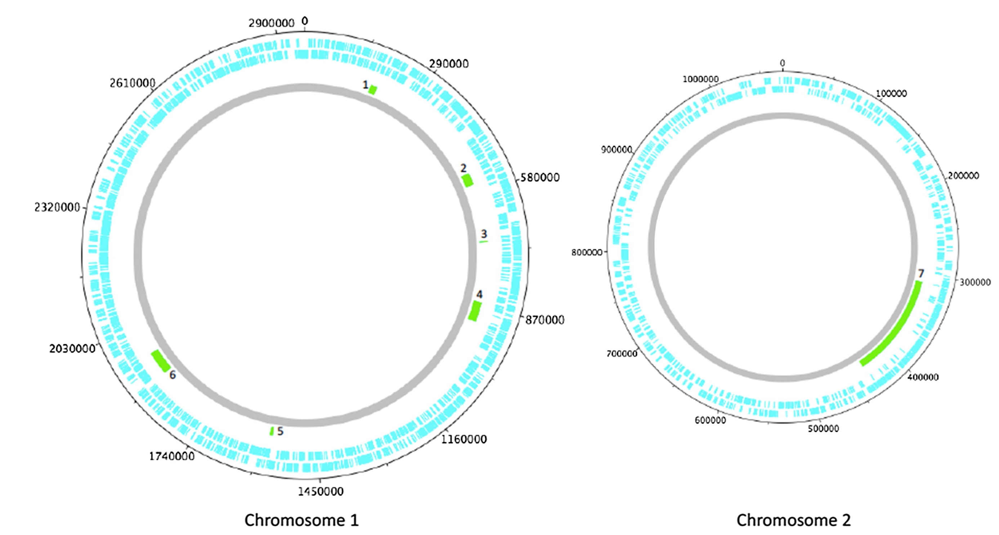
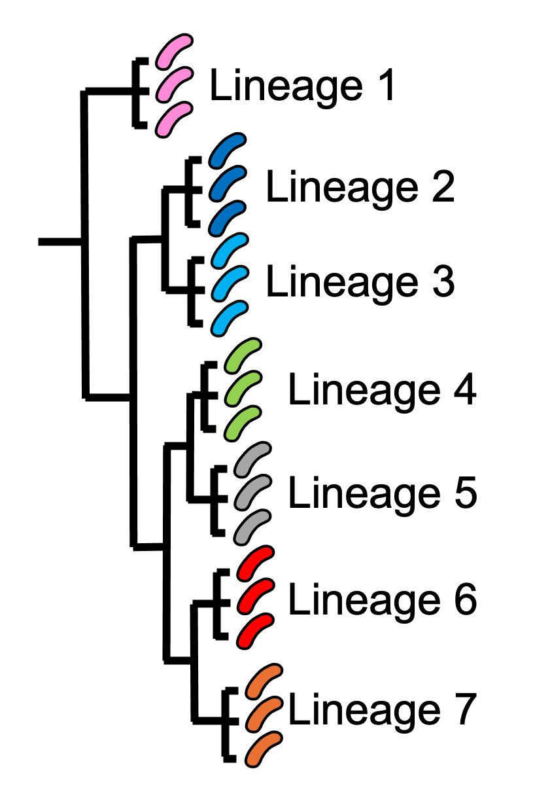

Module 1.4: DNA, Genomes, Whole Genome Sequencing, Mutations, and Genome Evolution
==================================================================================

Introduction to Module 1.4
--------------------------

Welcome!
In Module 1.4, we will talk about *V. cholerae* genomes: what is DNA, what is a genome,
what is genome sequencing, and how genomes evolve by mutations.

The *V. cholerae* Genome and Whole-Genome Sequencing (WGS) of *V. cholerae*
---------------------------------------------------------------------------

Just as for us humans, the genetic material of *V. cholerae* consists of DNA.
The DNA of *V. cholerae* contains all the genetic instructions specifying the development of a *V. cholerae* cell. 

You may be already familiar with the structure of DNA, a famous molecule with a double helix structure. DNA molecules consist of two chains (also known as 'strands') of
smaller molecules called 'nucleotides' (Figure 18). Each nucleotide consists of three parts: a sugar called deoxyribose,
a phosphate group, and one of four 'bases'. The bases are thymine (abbreviated as 'T'), adenine ('A'), guanine ('G')
and cytosine ('C'). 

.. figure:: DNA_structure.png
  :width: 200

  Figure 18. `Structure of DNA with sugar phosphate backbone and bases`_. The sugars and phosphates form the backbone of the double helix. Image attribution: this image by `National Human Genome Research Institute`_ is in the Public Domain. / Adapted by `Avril Coghlan`_ from the original to indicate the 5' and 3' ends of each DNA strand.

.. _Avril Coghlan: https://www.linkedin.com/in/avril-coghlan-4409545/?originalSubdomain=uk

.. _National Human Genome Research Institute: https://commons.wikimedia.org/wiki/File:Phosphate_backbone.jpg

.. _Structure of DNA with sugar phosphate backbone and bases: https://commons.wikimedia.org/wiki/File:Phosphate_backbone.jpg

The bases in the two strands of a DNA double helix are 'complementary' to each other: that is, T pairs with
A and G pairs with C. Thus, if one strand has the sequence of bases AGTACG, the other strand must have the sequence
of bases TCATGC (Figure 18). For convenience, one strand in a DNA double helix is called the 'forward' or '+' ('plus') strand, and the 
other strand the 'reverse' or '-' ('minus') strand.

Each strand of DNA also has a direction. That is, each strand has a 5' end and a 3' end (said '5-prime' and '3-prime'),
where the 5' end is the end with a terminal phosphate group (Figure 18). 
In a DNA double helix, the two strands have opposite directions. 
By convention, we write a DNA sequence as the sequence of bases from 5' to 3' on the + strand.
If the + strand sequence is 5'-AGTACG-3', it's just written TCATGC (Figure 18).  

The 'genome' of *V. cholerae* is the name we give to the set of all DNA molecules in a *V. cholerae* cell.
In each cell, the *V. cholerae* genome is organised into two circular 'chromosomes', each consisting of a long circular DNA molecule (Figure 19). 
In total the two circular chromosomes contain about 4 million base-pairs (4 Mb), where Chromosome 1 is about 3 Mb 
and Chromosome 2 about 1 million base-pairs (1 Mb; `Heidelberg et al 2000`_). 

.. _Heidelberg et al 2000: https://pubmed.ncbi.nlm.nih.gov/10952301/

  Figure 19. `A circular representation of the two chromosomes of O1 El Tor V. cholerae N16961 genome`_. This shows the two circular chromosomes of *V. cholerae*, for a typical 7PET isolate, isolate N16961. The outside circles in blue represent protein-coding genes on the forward and reverse strand of the DNA. Between them, the two chromosomes of *V. cholerae* include almost 4000 genes in a typical 7PET isolate from the 7PET lineage. Other key features of the chromosomes are highlighted as green boxes, where the green box labelled '5' is the 'CTX prophage region' that contains several genes, including *ctxA* and *ctxB*, which encode the A and B subunits of the cholera toxin, respectively. Image attribution: this image by `Mutreja & Dougan 2020`_ is licensed under `CC BY 4.0`_. / Adapted by `Avril Coghlan`_ from the original to hide additional details that were not the focus here.

.. _Avril Coghlan: https://www.linkedin.com/in/avril-coghlan-4409545/?originalSubdomain=uk

.. _Mutreja & Dougan 2020: https://pubmed.ncbi.nlm.nih.gov/31345641/

.. _CC BY 4.0: https://creativecommons.org/licenses/by/4.0/

.. _A circular representation of the two chromosomes of O1 El Tor V. cholerae N16961 genome: https://www.sciencedirect.com/science/article/pii/S0264410X19309296?via%3Dihub

When we talk about 'sequencing the genome' of an organism, we mean figuring out the sequence of
bases on the strands of its DNA molecules. 
Later in this course we will talk about different methods for sequencing DNA.

The first time that a *V. cholerae* isolate's genome was fully sequenced was in the year 2000, for a *V. cholerae* 7PET laboratory strain called N16961 
that was originally isolated in Bangladesh (`Heidelberg et al 2000`_).
Since the year 2000, the genomes of thousands of other *V. cholerae* isolates have been sequenced. There are quite a lot of small differences
between different *V. cholerae* isolates' genomes (that is, there is genetic variation within *V. cholerae*), 
but the majority of *V. cholerae* isolates have two circular chromosomes that together contain about 4 Mb of DNA. 

Genes of *V. cholerae*
----------------------

Each of the two chromosomes of *V. cholerae* includes many hundred of genes. 
Each gene comprises a segment of its DNA, typically hundreds or thousands
of base-pairs in length. A very common type of gene is a protein-coding gene, which is a stretch of
DNA which encodes (specifies the production of) a particular protein. For example,
*ctxA* and *ctxB* are two *V. cholerae* genes that encode the CtxA and CtxB proteins, the two
proteins that form cholera toxin. In total the two *V. cholerae* chromosomes contain almost 4000 protein-coding genes in a typical isolate
from the 7PET lineage (`Heidelberg et al 2000`_). 

The *ctxA* and *ctxB* genes are usually found close together in the *V. cholerae* genome, in a region known as the **CTX prophage region** that also includes some other genes (Figure 20). 
Practically 100% of 7PET isolates contain the CTX prophage region in their chromosome, and so produce cholera toxin, and therefore cause a human 
host to suffer acute watery diarrhoea. Isolates of a small number of non-epidemic lineages of *V. cholerae*, most
of which are relatively closely related to 7PET (e.g. L3, L9, Gulf Coast, Classical), sometimes have *ctxA* and *ctxB* genes (`Chun et al 2009`_, 
`Hao et al 2023`_; `Domman et al 2017`_; see Figure 13 above). Occasionally *ctxAB* genes are seen in isolates of non-epidemic lineages of *V. cholerae* that
are very distantly related to 7PET, but this is very rare (e.g. isolate V51 described in `Chun et al 2009`_). 

.. _Heidelberg et al 2000: https://pubmed.ncbi.nlm.nih.gov/10952301/

.. _Chun et al 2009: https://pubmed.ncbi.nlm.nih.gov/19720995/

.. _Hao et al 2023: https://pubmed.ncbi.nlm.nih.gov/37146742/

.. _Domman et al 2017: https://pubmed.ncbi.nlm.nih.gov/29123068/

.. figure:: CtxRegion.png
  :width: 550

  Figure 20. A diagram showing the CTX prophage region of Chromosome 1 of 7PET laboratory strain N16961. The blue arrows represent genes. The *ctxA* and *ctxB* genes encode the A and B subunits, respectively, of the cholera toxin protein complex. Image attribution: this image by `Avril Coghlan`_ is licensed under `CC BY 4.0`_. The information on the genes' order and names was taken from `Pant et al 2020`_.

.. _Avril Coghlan: https://www.linkedin.com/in/avril-coghlan-4409545/?originalSubdomain=uk

.. _Pant et al 2020: https://pubmed.ncbi.nlm.nih.gov/31272871/

.. _CC BY 4.0: https://creativecommons.org/licenses/by/4.0/

How Do Lineages Emerge at the Genetic Level?
--------------------------------------------

Like other bacteria, *V. cholerae* populations reproduce by cell division, with the
DNA (genetic material) of descendant cells being identical to the DNA of the parent cells. 
Isolates that descended recently from the same ancestral cell and are identical (or nearly identical)
genetically are said to belong to the same **clone**, or be **clonal**. 

Mutations (changes) in the DNA, are
a source of genetic variation in *V. cholerae*; these sometimes occur when DNA is being copied during cell division, but
can also occur due to DNA damage, for example damage due to ultraviolet (UV) radiation or mutagenic (mutation-inducing) chemicals such as tobacco products.

Over evolutionary time, different clones of a bacterial species independently accumulate
mutations, so they eventually they become so different at the genetic level that we can consider them different **lineages** of the species (Figure 5). 
That is, a lineage is group of organisms belonging to the same bacterial species, and that are genetically more closely related to each other than other members of the same species
(adapted from a definition by the `National Cancer Institute`_). 
There can be many lineages within a particular bacterial species.
The bacteria belonging to one particular lineage are all relatively clonal (highly similar at the genetic level); 
they all descended from a relatively recent common ancestor (although 'recent' in evolutionary time may be hundreds or thousands of years ago!); and
they usually present similar biological features, such as a specific pattern of virulence (`Bacigalupe 2017`_). 
Note that the word 'strain' is sometimes used interchangeably with 'lineage', but we prefer here to use the term 'lineage' because 'strain'
is also commonly used to refer to a single bacterial isolate that has been cultured over time in a laboratory.

.. _Bacigalupe 2017: https://era.ed.ac.uk/handle/1842/31266

.. _National Cancer Institute: https://www.cancer.gov/publications/dictionaries/cancer-terms/def/organism-strain

  Figure 5. The population structure of a bacterial species can contain genetically distinguishable lineages. The isolates that belong to the same lineage are much closer to each other genetically, and share a more recent common ancestor with each other, compared to isolates of different lineages. This cartoon shows a 'phylogenetic tree' representing the evolution of seven different lineages of the same bacterial species (similar to a family tree). For illustrative purposes, we show three isolates of each lineage, and represent the isolates by pink, dark blue, light blue, green, grey, red and orange *V. cholerae* images, respectively. Isolates of the red lineage are high similar genetically so are considered to belong to the same lineage (lineage 6). Similarly, isolates of the orange lineage are highly similar genetically to each other, but are relatively distant from lineage 6, so are considered to belong to a separate lineage (lineage 7). Image attribution: this image by `Avril Coghlan`_ is licensed under `CC BY 4.0`_.

.. _CC BY 4.0: https://creativecommons.org/licenses/by/4.0/

.. _Avril Coghlan: https://www.linkedin.com/in/avril-coghlan-4409545/?originalSubdomain=uk

.. image:: Activity.png
  :width: 1050

* Watch a `talk by Dr Nick Thomson, a researcher in cholera genomics at the Wellcome Sanger Institute, UK, on "Understanding Health and Disease at a Global Scale"`_ (14 minutes).
* Watch a `talk by Dr François-Xavier Weill, a leading cholera researcher based in the Pasteur Institute, Paris, on his work on genomics for tracing the cholera epidemic in Africa`_ (26 minutes).
* Read a `review published in 2020 by Dr Ankur Mutreja and Dr Gordon Dougan, on "Molecular epidemiology and intercontinental spread of cholera"`_.

.. _talk by Dr François-Xavier Weill, a leading cholera researcher based in the Pasteur Institute, Paris, on his work on genomics for tracing the cholera epidemic in Africa : https://www.youtube.com/watch?v=O7Nmoety2BY

.. _talk by Dr Nick Thomson, a researcher in cholera genomics at the Wellcome Sanger Institute, UK, on "Understanding Health and Disease at a Global Scale": https://www.youtube.com/watch?v=iv0zfqSEFAg

.. _review published in 2020 by Dr Ankur Mutreja and Dr Gordon Dougan, on "Molecular epidemiology and intercontinental spread of cholera": https://pubmed.ncbi.nlm.nih.gov/31345641/

Brief Summary
-------------

The key take-home messages of this chapter are:

* Cholera, a disease characterised by acute watery diarrhoea, is caused by ingestion of *Vibrio cholerae*
* Cholera toxin is the most important virulence factor of *V. cholerae*; cholera toxin triggers acute watery diarrhoea
* *V. cholerae* is distributed globally, and is a very diverse species with many different lineages 
* At present there is only one lineage that causes pandemic/epidemic cholera: 7PET, an extremely infectious and virulent lineage
* The genome of a typical 7PET isolate has 4 million base-pairs (4 Mb) of DNA, and contains about 4000 genes
* Practically all 7PET isolates have the genes that encode cholera toxin (genes *ctxA* and *ctxB*)
* A 7PET outbreak requires a rapid and large public health response to halt/reduce it, e.g. WASH, treatment centres, vaccination
* Whole genome sequencing (WGS) can be used to determine whether a new outbreak of diarrhoeal illness is caused by 7PET 

Glossary of Key Terms for Module 1
----------------------------------

* **7PET**: the name of the current pandemic lineage of *Vibrio cholerae*. 7PET is the lineage of *V. cholerae* that has been responsible for all major outbreaks and epidemics of cholera since the 1960s. '7PET' is short for 'Seventh Pandemic El Tor' because 7PET has caused the 7th historically recorded cholera pandemic, and isolates of the 7PET lineage have the El Tor biotype (a laboratory phenotype). 
* **Biotype**: a subgroup of *V. cholerae* bacteria that display a particular phenotype upon a certain set of biochemical laboratory tests. The biotype phenotype has been used historically to predict whether isolates of the *V. cholerae* causing a particular outbreak belong to the epidemic-causing 7PET lineage.
* **Biotype variants**: biotypes which differ in a small number of the laboratory test results that are used to identify the El Tor biotype.
* **Cholera**: a disease characterised by acute watery diarrhoea, which is caused by ingestion of *Vibrio cholerae*.
* **Cholera case**: a patient diagnosed with cholera using standard criteria; see the `WHO 2023`_ guidance and definitions for what they consider 'a suspected cholera case' and 'a confirmed cholera case'.
* **Cholera-endemic area**: see 'endemic'.
* **Cholera toxin (Ctx, CTX, or CT)**: the most important virulence factor of *Vibrio cholerae*; cholera toxin triggers acute watery diarrhoea.
* **Clone**: a group of cells produced asexually from one ancestor, to which they are genetically identical (or nearly identical).
* **DNA (Deoxyribonucleic acid)**: the molecule that carries genetic information of an organism.
* **Endemic**: according to the `CDC website`_, an 'endemic' refers to the constant presence and/or usual prevalence of a disease or infectious agent in a population within a geographic area. The WHO defines a 'cholera-endemic area' as "an area where confirmed cholera cases were detected during the last 3 years with evidence of local transmission (meaning the cases are not imported from elsewhere)" (`WHO 2024`_, accessed 18th July 2024). 
* **Epidemic**: an unexpected increase in the number of disease cases in a specific geographical area (definition from the `CDC website`_). An epidemic is considered to occur of a larger geographic area than an outbreak. See the WHO's detailed technical guidance (`WHO 2023`_) for precise definitions of what they consider to be 'a suspected cholera case', 'a confirmed cholera case', 'a suspected cholera outbreak', 'a probable cholera outbreak', or 'a confirmed cholera outbreak'.
* **Epidemic-causing lineage of V. cholerae**: a *V. cholerae* lineage that can cause a very large increase in the number of cases of diarrhoeal illness caused by *V. cholerae* in a particular town/city/region over a relatively short period of time. The 7PET lineage is the only epidemic-causing lineage of *V. cholerae* at present.
* **Gene**: a segment of the DNA of an organism, typically hundreds or thousands of base-pairs in length. A very common type of gene is a protein-coding gene, which is a stretch of DNA which encodes (specifies the production of) a particular protein. 
* **Genome**: all the genetic material present in a cell or organism.
* **Isolate**: an organism collected from a specific sample material e.g. from a stool sample or from river water. 
* **Lineage**: a group of organisms belonging to the same bacterial species, and that are genetically more closely related to each other than other members of the same species. There can be many lineages within a particular bacterial species. Different lineages of a bacterial species may have different biological characteristics, such as the ability to cause more severe disease. (Adapted from a definition by the `National Cancer Institute`_.)
* **Metadata**: non-genetic data that has been collected for bacterial isolates, such as the exact location or date of collection of the isolates.
* **Mutation**: a change in the genetic material of an organism, caused by a change its DNA (e.g. the change of single base-pair in its DNA).
* **O-antigen**: a component of the surface lipopolysaccharide (LPS) of Gram-negative bacteria such as *V. cholerae*. 
* **Outbreak**: an unexpected increase in the number of disease cases in a specific geographical area (definition from the `CDC website`_). An outbreak is considered to occur of a smaller geographic area than an epidemic.  See the WHO's detailed technical guidance (`WHO 2023`_) for precise definitions of what they consider to be 'a suspected cholera case', 'a confirmed cholera case', 'a suspected cholera outbreak', 'a probable cholera outbreak', or 'a confirmed cholera outbreak'.
* **Pandemic**: an epidemic that has spread over several countries and usually affects many people (definition from the `CDC website`_).
* **Pandemic lineage**: a lineage of a bacterial species that is causing or caused a pandemic of a disease.
* **Phylogenetic tree**: a diagram that depicts the evolutionary relationships between particular organisms, and how they descended from a common ancestor.
* **Serogroup**: a subgroup of *V. cholerae* bacteria that share the same distinctive surface structure in their O-antigen, and so have the same laboratory phenotype when exposed to host antibodies specific for that particular type of O-antigen.
* **Strain**: see 'lineage'. Also used to refer to a single bacterial isolate that has been cultured over time in a laboratory.
* **Toxigenic V. cholerae**: *V. cholerae* that produces the cholera toxin. Isolates of the 7PET lineage are toxigenic, but a small fraction of isolates of some other lineages of *V. cholerae* are also toxigenic.
* **Variant biotype**: See 'biotype variants'.
* **Viable but Non-Culturable (VBNC)**: a dormant state that many bacterial species enter under unfavourable conditions such as low temperature and low nutrient conditions.
* **Vibrio cholerae (V. cholerae)**: a curved Gram-negative rod-shaped bacterium that causes the disease cholera.
* **Virulence factor**: a protein (or protein complex) that helps a bacterium to colonise a host at the cellular level.
* **Whole genome sequencing (WGS)**: the process of determining the DNA sequence of an organism's whole genome.

.. _National Cancer Institute: https://www.cancer.gov/publications/dictionaries/cancer-terms/def/organism-strain

.. _CDC website: https://archive.cdc.gov/www_cdc_gov/csels/dsepd/ss1978/lesson1/section11.html

.. _WHO 2023: https://www.gtfcc.org/wp-content/uploads/2023/02/gtfcc-public-health-surveillance-for-cholera-interim-guidance.pdf

.. _WHO 2024: https://www.who.int/news-room/fact-sheets/detail/cholera

Contact
-------

I will be grateful if you will send me (Avril Coghlan) corrections or suggestions for improvements to my email address alc@sanger.ac.uk

Acknowledgements
----------------

Contributors to this course: Avril Coghlan, Matt Dorman, Ismail Bashir, Anne Bishop, Jolynne Mokaya, Nisha Singh, Nick Thomson. 

